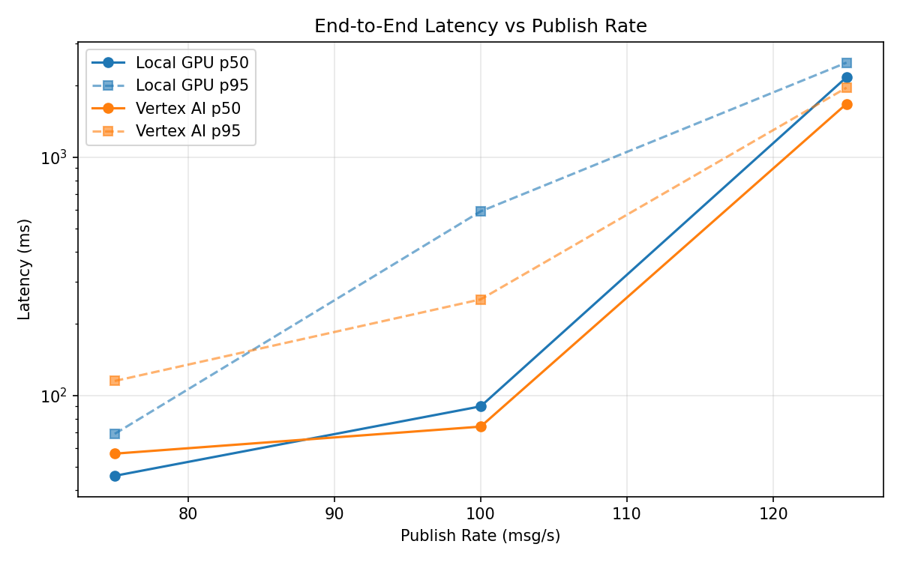
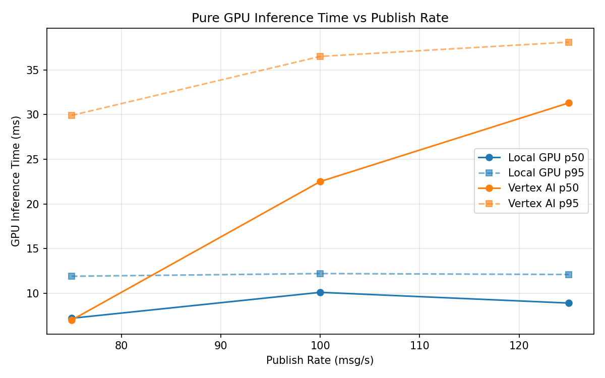
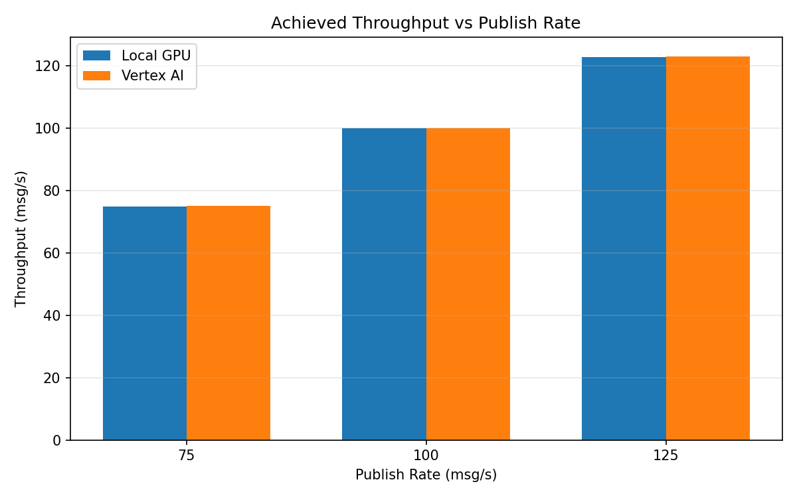

# Benchmark Report

Generated: 2026-03-08 00:43:24

## Configuration

| Parameter | Value |
|---|---|
| Messages per phase | 100s per phase |
| Rates (msg/s) | 75, 100, 125 |
| Experiments | Local GPU, Vertex AI |

## Throughput

| Rate (msg/s) | Local GPU | Vertex AI |
|---|---|---|
| 75 | 74.9 | 75.0 |
| 100 | 99.9 | 99.9 |
| 125 | 122.7 | 122.9 |

## End-to-End Latency (ms)

| Rate | Percentile | Local GPU | Vertex AI |
|---|---|---|---|
| 75 | p50 | 46.0 | 57.0 |
| 75 | p95 | 69.0 | 115.0 |
| 75 | p99 | 407.1 | 922.0 |
| 100 | p50 | 90.0 | 74.0 |
| 100 | p95 | 592.0 | 253.0 |
| 100 | p99 | 995.0 | 547.0 |
| 125 | p50 | 2164.0 | 1674.0 |
| 125 | p95 | 2492.0 | 1956.0 |
| 125 | p99 | 2545.0 | 2046.0 |

## GPU Inference Time (ms)

| Rate | Percentile | Local GPU | Vertex AI |
|---|---|---|---|
| 75 | p50 | 7.2 | 7.0 |
| 75 | p95 | 11.9 | 29.9 |
| 75 | p99 | 13.0 | 34.9 |
| 100 | p50 | 10.1 | 22.5 |
| 100 | p95 | 12.2 | 36.5 |
| 100 | p99 | 13.2 | 46.8 |
| 125 | p50 | 8.9 | 31.3 |
| 125 | p95 | 12.1 | 38.1 |
| 125 | p99 | 13.0 | 46.1 |

## Charts

### Latency vs Publish Rate

### GPU Inference Time vs Publish Rate

### Throughput vs Publish Rate

