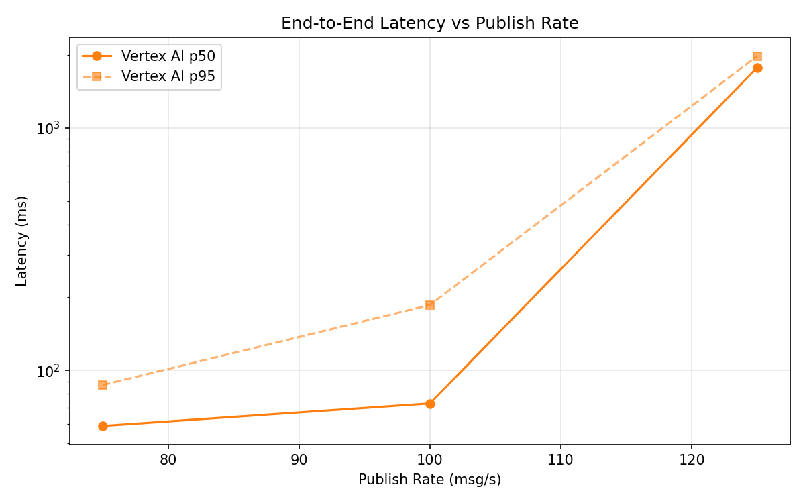
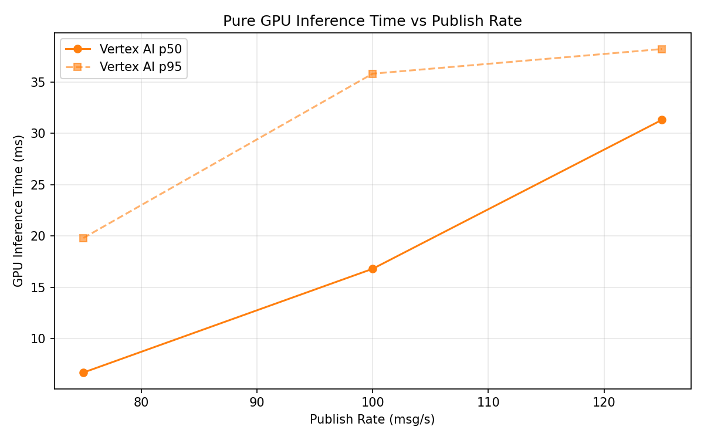
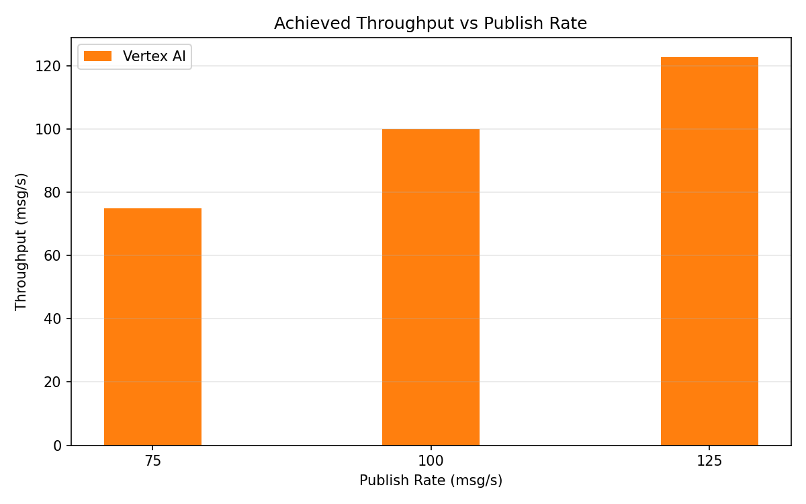

# Benchmark Report

Generated: 2026-03-08 03:12:38

## Configuration

| Parameter | Value |
|---|---|
| Messages per phase | 100s per phase |
| Rates (msg/s) | 75, 100, 125 |
| Experiments | Vertex AI |

## Throughput

| Rate (msg/s) | Vertex AI |
|---|---|
| 75 | 75.0 |
| 100 | 100.0 |
| 125 | 122.8 |

## End-to-End Latency (ms)

| Rate | Percentile | Vertex AI |
|---|---|---|
| 75 | p50 | 59.0 |
| 75 | p95 | 87.0 |
| 75 | p99 | 428.0 |
| 100 | p50 | 73.0 |
| 100 | p95 | 186.0 |
| 100 | p99 | 428.0 |
| 125 | p50 | 1775.0 |
| 125 | p95 | 1980.0 |
| 125 | p99 | 2037.0 |

## GPU Inference Time (ms)

| Rate | Percentile | Vertex AI |
|---|---|---|
| 75 | p50 | 6.7 |
| 75 | p95 | 19.8 |
| 75 | p99 | 33.4 |
| 100 | p50 | 16.8 |
| 100 | p95 | 35.8 |
| 100 | p99 | 45.1 |
| 125 | p50 | 31.3 |
| 125 | p95 | 38.2 |
| 125 | p99 | 47.2 |

## Charts

### Latency vs Publish Rate

### GPU Inference Time vs Publish Rate

### Throughput vs Publish Rate

