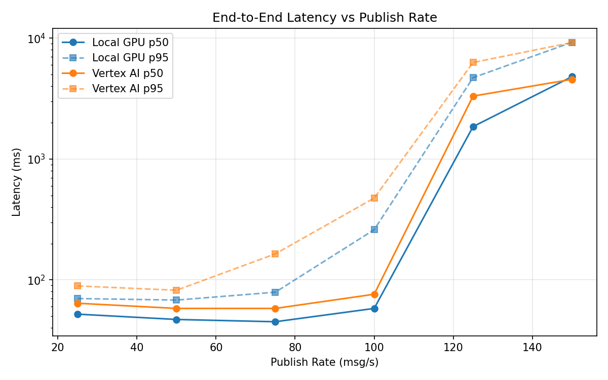
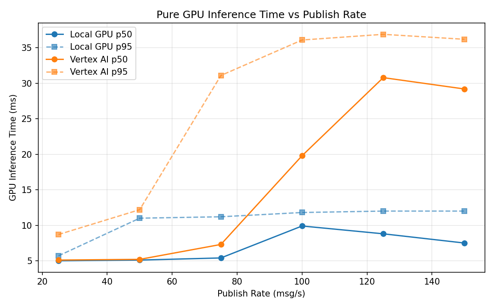
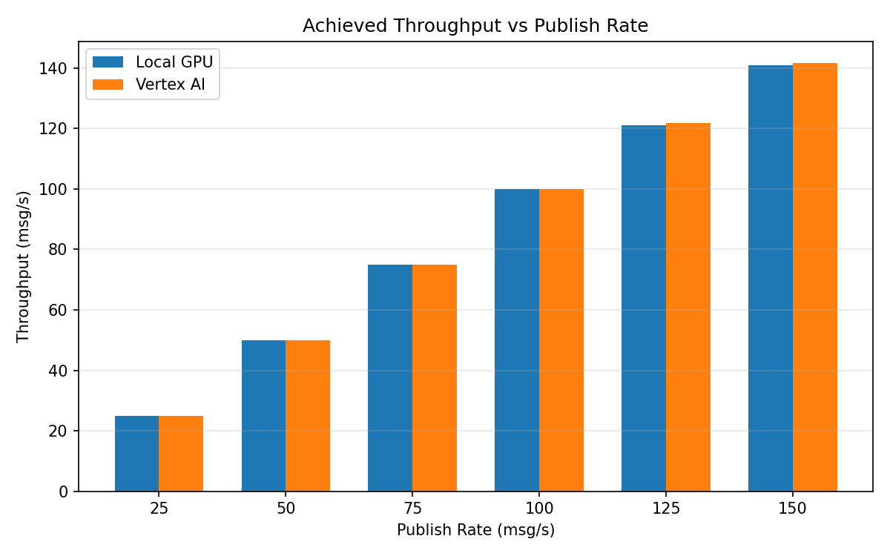

# Benchmark Report

Generated: 2026-03-08 02:41:51

## Configuration

| Parameter | Value |
|---|---|
| Messages per phase | 100s per phase |
| Rates (msg/s) | 25, 50, 75, 100, 125, 150 |
| Experiments | Local GPU, Vertex AI |

## Throughput

| Rate (msg/s) | Local GPU | Vertex AI |
|---|---|---|
| 25 | 25.0 | 25.0 |
| 50 | 50.0 | 50.0 |
| 75 | 75.0 | 75.0 |
| 100 | 99.9 | 99.9 |
| 125 | 121.1 | 121.7 |
| 150 | 140.9 | 141.7 |

## End-to-End Latency (ms)

| Rate | Percentile | Local GPU | Vertex AI |
|---|---|---|---|
| 25 | p50 | 52.0 | 64.0 |
| 25 | p95 | 70.0 | 89.0 |
| 25 | p99 | 100.1 | 141.0 |
| 50 | p50 | 47.0 | 58.0 |
| 50 | p95 | 68.0 | 82.0 |
| 50 | p99 | 225.1 | 204.1 |
| 75 | p50 | 45.0 | 58.0 |
| 75 | p95 | 79.0 | 164.0 |
| 75 | p99 | 613.0 | 876.0 |
| 100 | p50 | 58.0 | 76.0 |
| 100 | p95 | 260.0 | 475.0 |
| 100 | p99 | 617.0 | 942.0 |
| 125 | p50 | 1853.0 | 3314.5 |
| 125 | p95 | 4710.0 | 6288.2 |
| 125 | p99 | 5226.0 | 7003.0 |
| 150 | p50 | 4798.0 | 4561.0 |
| 150 | p95 | 9233.0 | 9198.0 |
| 150 | p99 | 9625.0 | 9553.0 |

## GPU Inference Time (ms)

| Rate | Percentile | Local GPU | Vertex AI |
|---|---|---|---|
| 25 | p50 | 5.0 | 5.1 |
| 25 | p95 | 5.7 | 8.7 |
| 25 | p99 | 10.4 | 13.4 |
| 50 | p50 | 5.1 | 5.2 |
| 50 | p95 | 11.0 | 12.2 |
| 50 | p99 | 11.7 | 29.4 |
| 75 | p50 | 5.4 | 7.3 |
| 75 | p95 | 11.2 | 31.1 |
| 75 | p99 | 12.0 | 34.5 |
| 100 | p50 | 9.9 | 19.8 |
| 100 | p95 | 11.8 | 36.1 |
| 100 | p99 | 12.6 | 45.1 |
| 125 | p50 | 8.8 | 30.8 |
| 125 | p95 | 12.0 | 36.9 |
| 125 | p99 | 13.0 | 46.0 |
| 150 | p50 | 7.5 | 29.2 |
| 150 | p95 | 12.0 | 36.2 |
| 150 | p99 | 13.0 | 44.4 |

## Charts

### Latency vs Publish Rate

### GPU Inference Time vs Publish Rate

### Throughput vs Publish Rate

