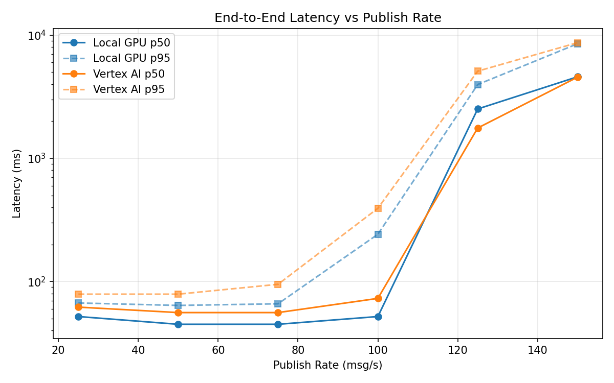
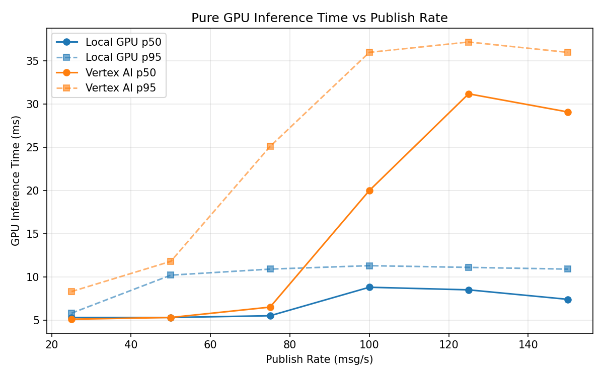
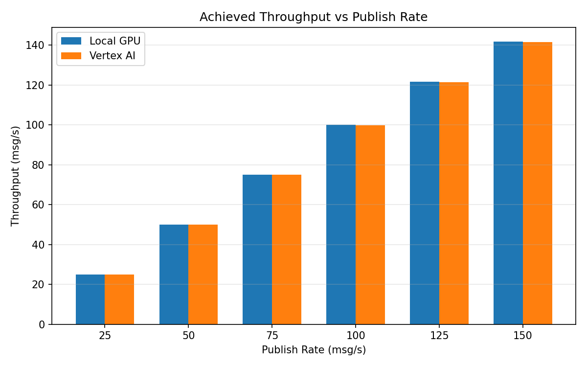

# Benchmark Report

Generated: 2026-03-08 03:00:19

## Configuration

| Parameter | Value |
|---|---|
| Messages per phase | 100s per phase |
| Rates (msg/s) | 25, 50, 75, 100, 125, 150 |
| Experiments | Local GPU, Vertex AI |

## Throughput

| Rate (msg/s) | Local GPU | Vertex AI |
|---|---|---|
| 25 | 25.0 | 25.0 |
| 50 | 50.0 | 50.0 |
| 75 | 75.0 | 75.0 |
| 100 | 100.0 | 99.9 |
| 125 | 121.7 | 121.5 |
| 150 | 141.8 | 141.6 |

## End-to-End Latency (ms)

| Rate | Percentile | Local GPU | Vertex AI |
|---|---|---|---|
| 25 | p50 | 52.0 | 62.0 |
| 25 | p95 | 67.0 | 79.0 |
| 25 | p99 | 86.0 | 112.0 |
| 50 | p50 | 45.0 | 56.0 |
| 50 | p95 | 64.0 | 79.0 |
| 50 | p99 | 303.0 | 115.0 |
| 75 | p50 | 45.0 | 56.0 |
| 75 | p95 | 66.0 | 95.0 |
| 75 | p99 | 418.0 | 750.0 |
| 100 | p50 | 52.0 | 73.0 |
| 100 | p95 | 242.0 | 393.0 |
| 100 | p99 | 677.0 | 796.0 |
| 125 | p50 | 2515.5 | 1762.0 |
| 125 | p95 | 3970.0 | 5098.0 |
| 125 | p99 | 4167.0 | 5613.0 |
| 150 | p50 | 4587.0 | 4557.0 |
| 150 | p95 | 8504.0 | 8679.0 |
| 150 | p99 | 8842.0 | 9087.0 |

## GPU Inference Time (ms)

| Rate | Percentile | Local GPU | Vertex AI |
|---|---|---|---|
| 25 | p50 | 5.3 | 5.1 |
| 25 | p95 | 5.8 | 8.3 |
| 25 | p99 | 8.8 | 10.7 |
| 50 | p50 | 5.3 | 5.3 |
| 50 | p95 | 10.2 | 11.8 |
| 50 | p99 | 11.6 | 20.3 |
| 75 | p50 | 5.5 | 6.5 |
| 75 | p95 | 10.9 | 25.1 |
| 75 | p99 | 11.7 | 33.8 |
| 100 | p50 | 8.8 | 20.0 |
| 100 | p95 | 11.3 | 36.0 |
| 100 | p99 | 12.1 | 46.0 |
| 125 | p50 | 8.5 | 31.2 |
| 125 | p95 | 11.1 | 37.2 |
| 125 | p99 | 12.0 | 46.2 |
| 150 | p50 | 7.4 | 29.1 |
| 150 | p95 | 10.9 | 36.0 |
| 150 | p99 | 11.7 | 44.5 |

## Charts

### Latency vs Publish Rate

### GPU Inference Time vs Publish Rate

### Throughput vs Publish Rate

