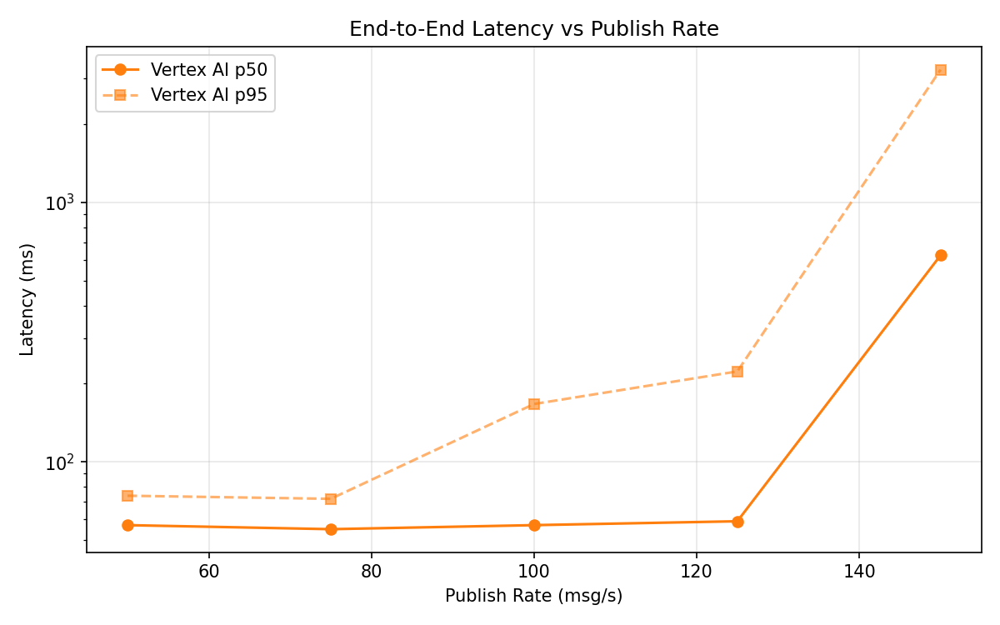
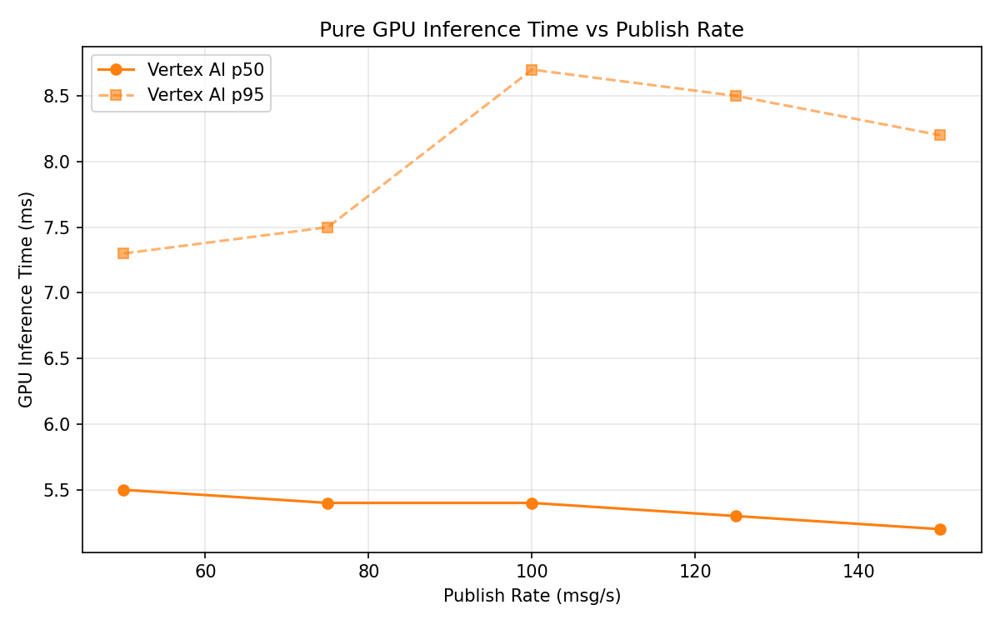
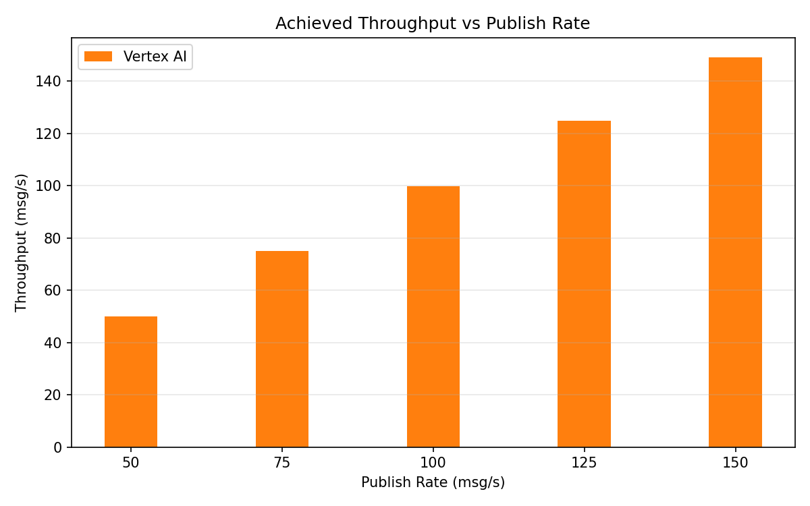

# Benchmark Report

Generated: 2026-03-09 12:27:39

## Configuration

| Parameter | Value |
|---|---|
| Messages per phase | 100s per phase |
| Rates (msg/s) | 50, 75, 100, 125, 150 |
| Experiments | Vertex AI |

## Throughput

| Rate (msg/s) | Vertex AI |
|---|---|
| 50 | 50.0 |
| 75 | 75.0 |
| 100 | 99.9 |
| 125 | 124.9 |
| 150 | 149.1 |

## End-to-End Latency (ms)

| Rate | Percentile | Vertex AI |
|---|---|---|
| 50 | p50 | 57.0 |
| 50 | p95 | 74.0 |
| 50 | p99 | 113.0 |
| 75 | p50 | 55.0 |
| 75 | p95 | 72.0 |
| 75 | p99 | 100.0 |
| 100 | p50 | 57.0 |
| 100 | p95 | 167.0 |
| 100 | p99 | 482.0 |
| 125 | p50 | 59.0 |
| 125 | p95 | 223.0 |
| 125 | p99 | 516.0 |
| 150 | p50 | 625.0 |
| 150 | p95 | 3245.0 |
| 150 | p99 | 3966.7 |

## GPU Inference Time (ms)

| Rate | Percentile | Vertex AI |
|---|---|---|
| 50 | p50 | 5.5 |
| 50 | p95 | 7.3 |
| 50 | p99 | 9.1 |
| 75 | p50 | 5.4 |
| 75 | p95 | 7.5 |
| 75 | p99 | 9.1 |
| 100 | p50 | 5.4 |
| 100 | p95 | 8.7 |
| 100 | p99 | 11.5 |
| 125 | p50 | 5.3 |
| 125 | p95 | 8.5 |
| 125 | p99 | 10.9 |
| 150 | p50 | 5.2 |
| 150 | p95 | 8.2 |
| 150 | p99 | 10.8 |

## Charts

### Latency vs Publish Rate

### GPU Inference Time vs Publish Rate

### Throughput vs Publish Rate

