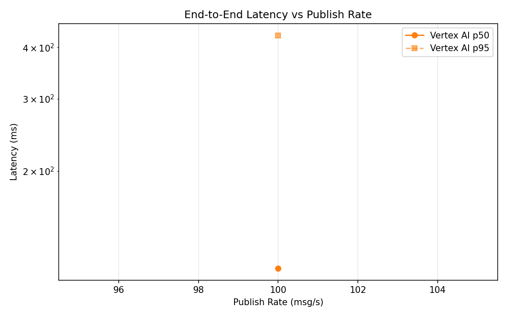
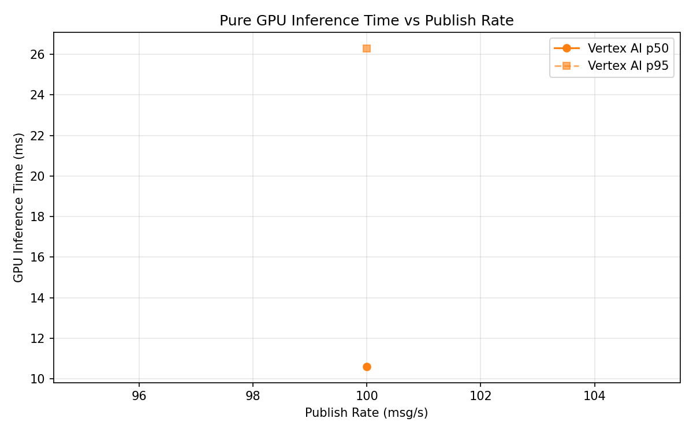
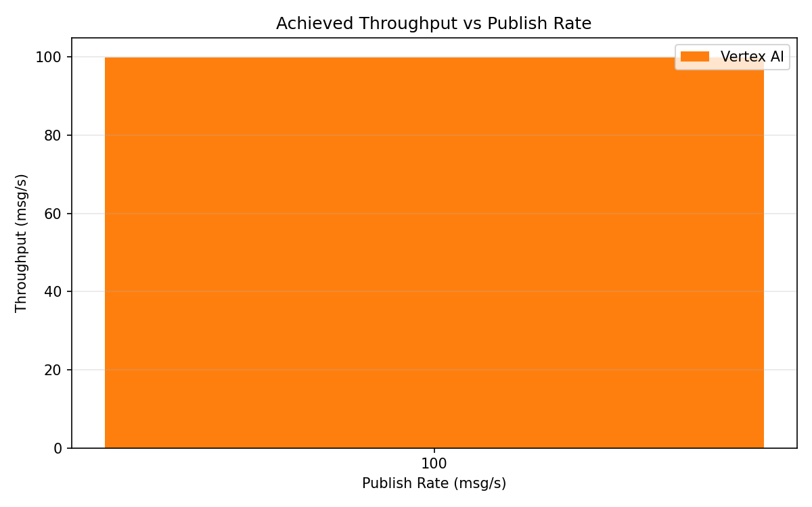

# Benchmark Report

Generated: 2026-03-09 18:46:41

## Configuration

| Parameter | Value |
|---|---|
| Messages per phase | 100s per phase |
| Rates (msg/s) | 100 |
| Experiments | Vertex AI |

## Throughput

| Rate (msg/s) | Vertex AI |
|---|---|
| 100 | 99.9 |

## End-to-End Latency (ms)

| Rate | Percentile | Vertex AI |
|---|---|---|
| 100 | p50 | 116.0 |
| 100 | p95 | 428.0 |
| 100 | p99 | 859.1 |

## GPU Inference Time (ms)

| Rate | Percentile | Vertex AI |
|---|---|---|
| 100 | p50 | 10.6 |
| 100 | p95 | 26.3 |
| 100 | p99 | 32.3 |

## Charts

### Latency vs Publish Rate

### GPU Inference Time vs Publish Rate

### Throughput vs Publish Rate

