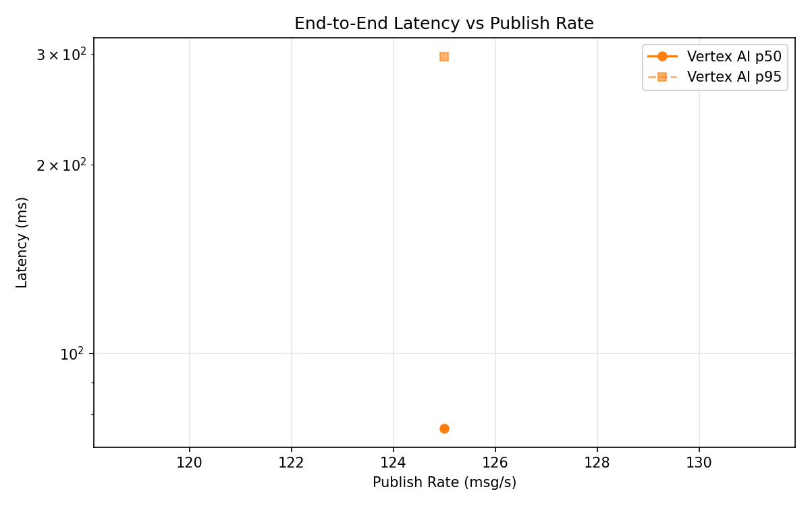
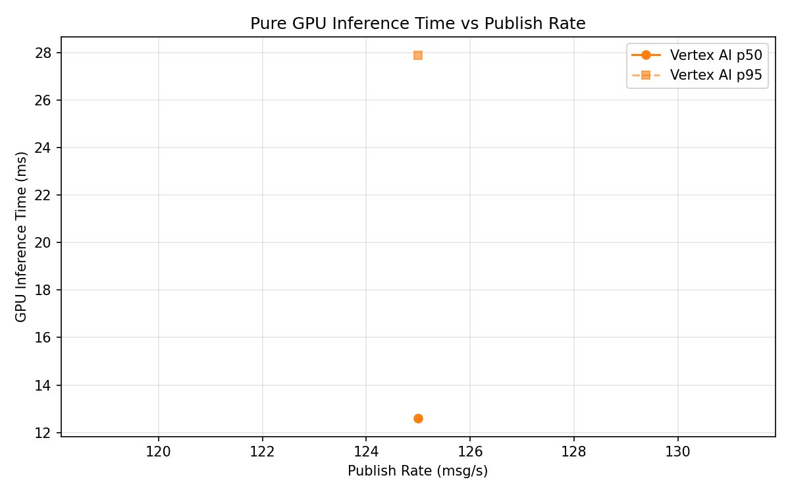

# Benchmark Report

Generated: 2026-03-09 18:55:21

## Configuration

| Parameter | Value |
|---|---|
| Messages per phase | 100s per phase |
| Rates (msg/s) | 125 |
| Experiments | Vertex AI |

## Throughput

| Rate (msg/s) | Vertex AI |
|---|---|
| 125 | 124.9 |

## End-to-End Latency (ms)

| Rate | Percentile | Vertex AI |
|---|---|---|
| 125 | p50 | 76.0 |
| 125 | p95 | 297.0 |
| 125 | p99 | 505.0 |

## GPU Inference Time (ms)

| Rate | Percentile | Vertex AI |
|---|---|---|
| 125 | p50 | 12.6 |
| 125 | p95 | 27.9 |
| 125 | p99 | 35.2 |

## Charts

### Latency vs Publish Rate

### GPU Inference Time vs Publish Rate

### Throughput vs Publish Rate

