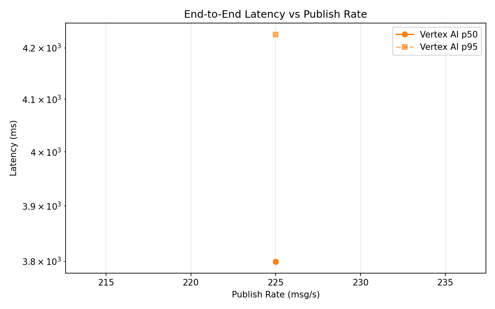
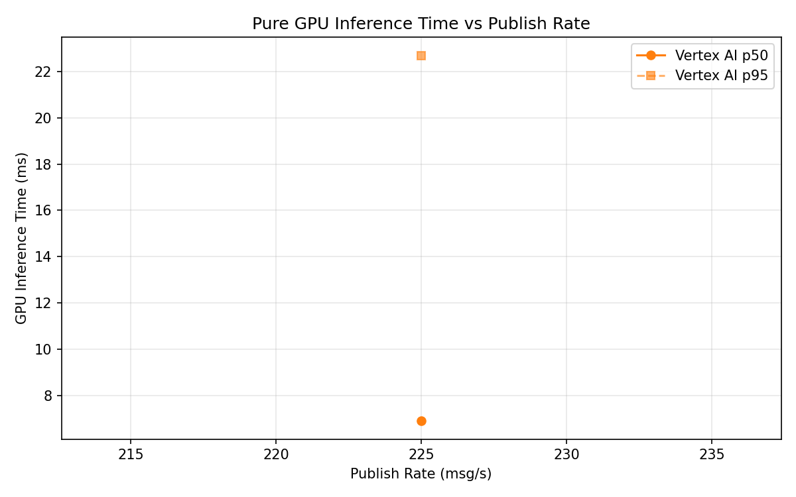
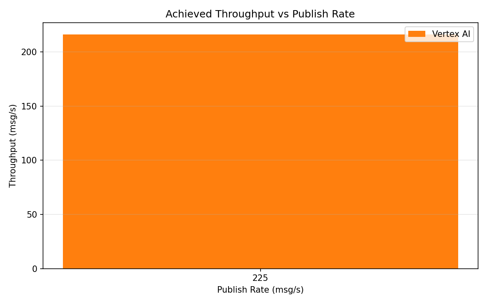

# Benchmark Report

Generated: 2026-03-09 19:29:25

## Configuration

| Parameter | Value |
|---|---|
| Messages per phase | 100s per phase |
| Rates (msg/s) | 225 |
| Experiments | Vertex AI |

## Throughput

| Rate (msg/s) | Vertex AI |
|---|---|
| 225 | 216.1 |

## End-to-End Latency (ms)

| Rate | Percentile | Vertex AI |
|---|---|---|
| 225 | p50 | 3799.0 |
| 225 | p95 | 4226.0 |
| 225 | p99 | 4284.0 |

## GPU Inference Time (ms)

| Rate | Percentile | Vertex AI |
|---|---|---|
| 225 | p50 | 6.9 |
| 225 | p95 | 22.7 |
| 225 | p99 | 29.2 |

## Charts

### Latency vs Publish Rate

### GPU Inference Time vs Publish Rate

### Throughput vs Publish Rate

