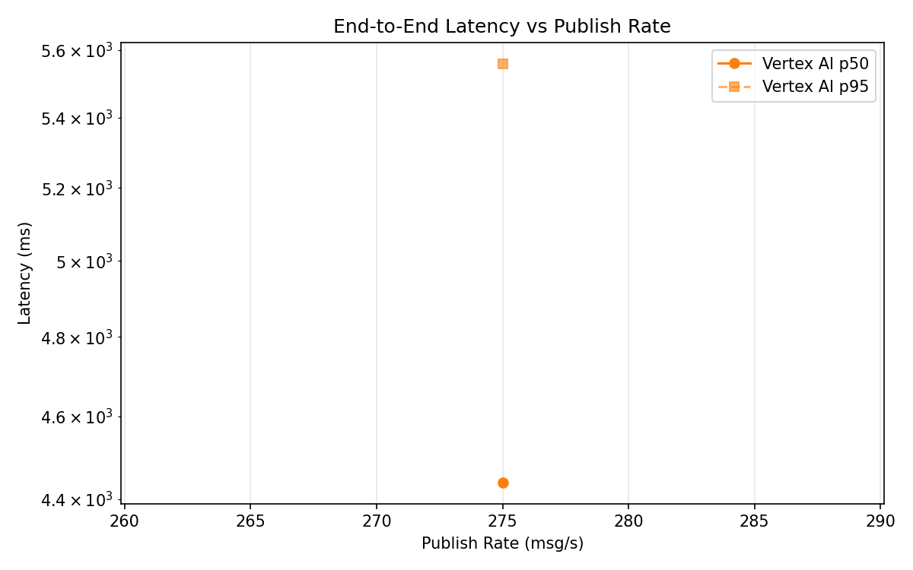
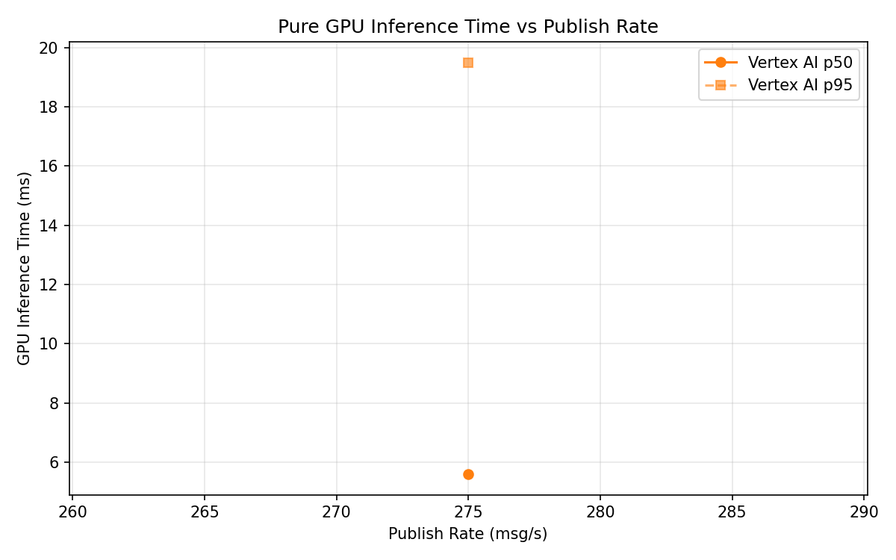
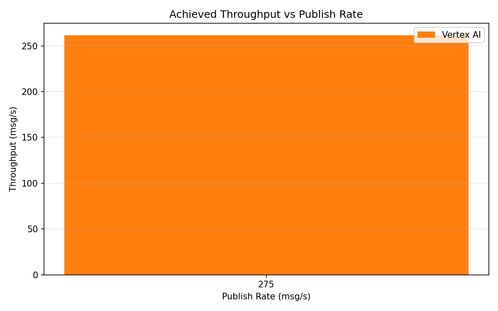

# Benchmark Report

Generated: 2026-03-09 19:46:25

## Configuration

| Parameter | Value |
|---|---|
| Messages per phase | 100s per phase |
| Rates (msg/s) | 275 |
| Experiments | Vertex AI |

## Throughput

| Rate (msg/s) | Vertex AI |
|---|---|
| 275 | 261.7 |

## End-to-End Latency (ms)

| Rate | Percentile | Vertex AI |
|---|---|---|
| 275 | p50 | 4439.0 |
| 275 | p95 | 5559.0 |
| 275 | p99 | 5642.0 |

## GPU Inference Time (ms)

| Rate | Percentile | Vertex AI |
|---|---|---|
| 275 | p50 | 5.6 |
| 275 | p95 | 19.5 |
| 275 | p99 | 27.3 |

## Charts

### Latency vs Publish Rate

### GPU Inference Time vs Publish Rate

### Throughput vs Publish Rate

