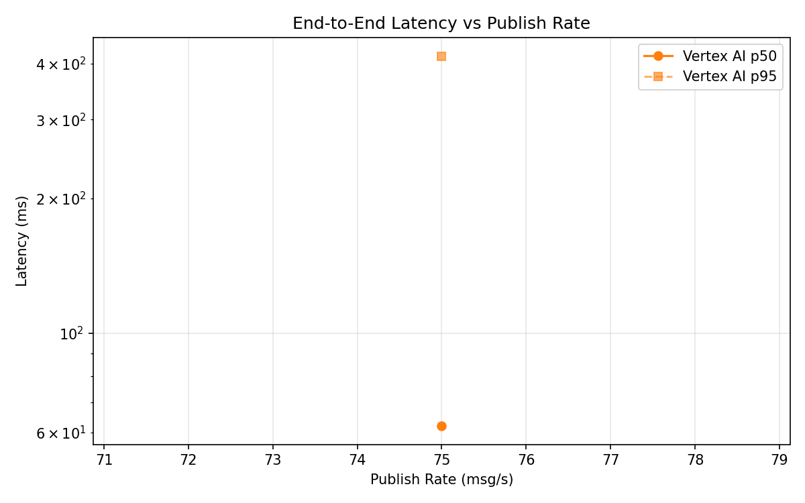
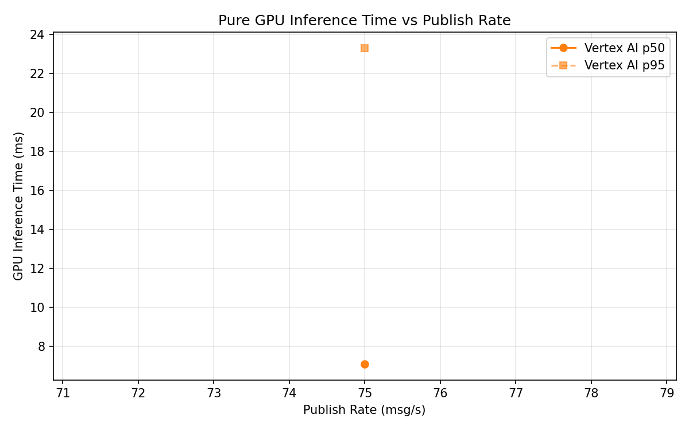

# Benchmark Report

Generated: 2026-03-09 18:38:02

## Configuration

| Parameter | Value |
|---|---|
| Messages per phase | 100s per phase |
| Rates (msg/s) | 75 |
| Experiments | Vertex AI |

## Throughput

| Rate (msg/s) | Vertex AI |
|---|---|
| 75 | 74.9 |

## End-to-End Latency (ms)

| Rate | Percentile | Vertex AI |
|---|---|---|
| 75 | p50 | 62.0 |
| 75 | p95 | 416.0 |
| 75 | p99 | 885.1 |

## GPU Inference Time (ms)

| Rate | Percentile | Vertex AI |
|---|---|---|
| 75 | p50 | 7.1 |
| 75 | p95 | 23.3 |
| 75 | p99 | 30.0 |

## Charts

### Latency vs Publish Rate

### GPU Inference Time vs Publish Rate

### Throughput vs Publish Rate

