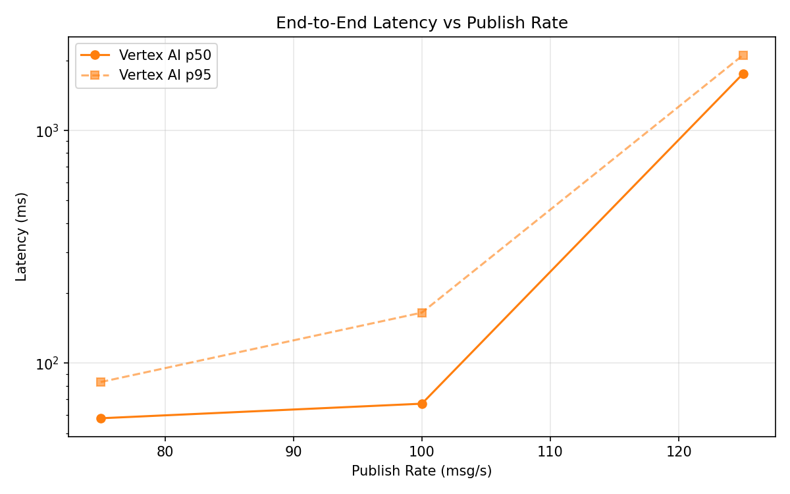
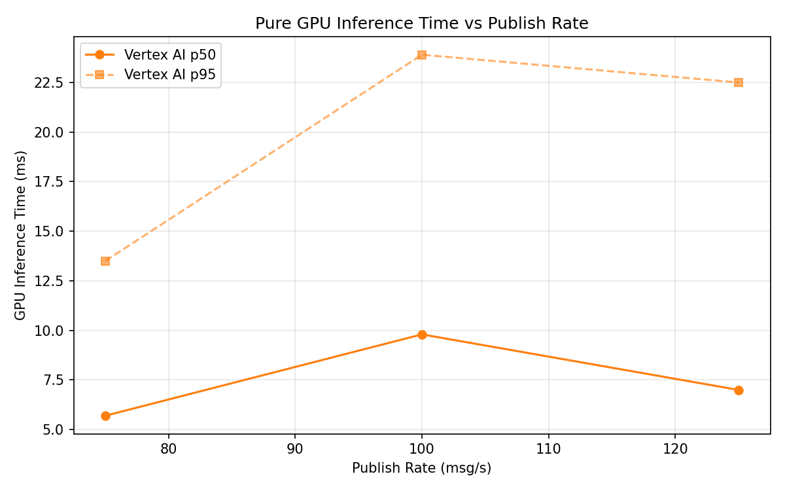
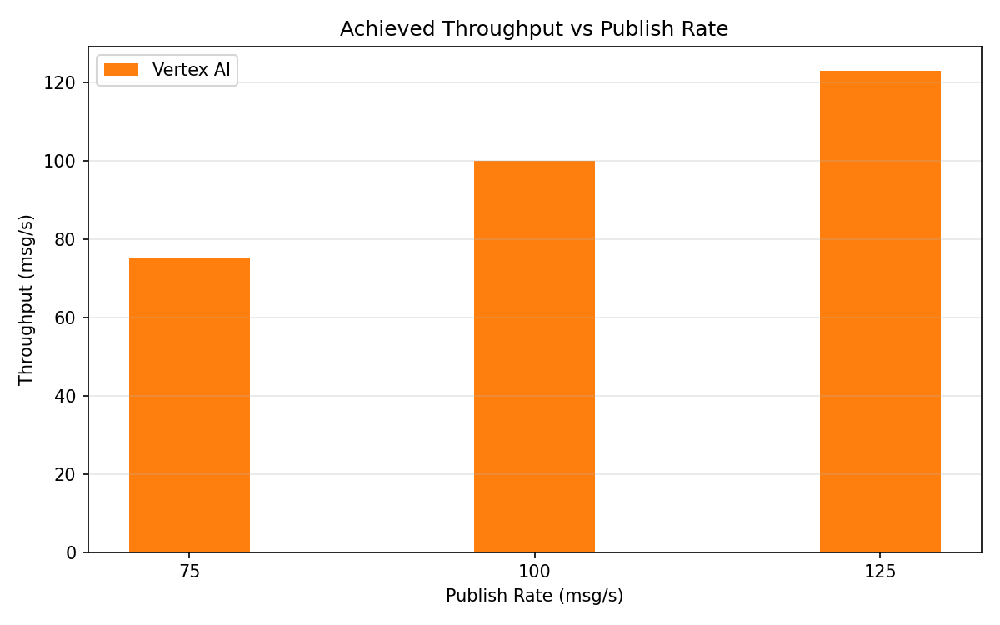

# Benchmark Report

Generated: 2026-03-09 16:27:37

## Configuration

| Parameter | Value |
|---|---|
| Messages per phase | 100s per phase |
| Rates (msg/s) | 75, 100, 125 |
| Experiments | Vertex AI |

## Throughput

| Rate (msg/s) | Vertex AI |
|---|---|
| 75 | 75.0 |
| 100 | 99.9 |
| 125 | 122.9 |

## End-to-End Latency (ms)

| Rate | Percentile | Vertex AI |
|---|---|---|
| 75 | p50 | 58.0 |
| 75 | p95 | 83.0 |
| 75 | p99 | 408.1 |
| 100 | p50 | 67.0 |
| 100 | p95 | 165.0 |
| 100 | p99 | 645.1 |
| 125 | p50 | 1755.0 |
| 125 | p95 | 2110.0 |
| 125 | p99 | 2185.0 |

## GPU Inference Time (ms)

| Rate | Percentile | Vertex AI |
|---|---|---|
| 75 | p50 | 5.7 |
| 75 | p95 | 13.5 |
| 75 | p99 | 20.1 |
| 100 | p50 | 9.8 |
| 100 | p95 | 23.9 |
| 100 | p99 | 29.5 |
| 125 | p50 | 7.0 |
| 125 | p95 | 22.5 |
| 125 | p99 | 29.5 |

## Charts

### Latency vs Publish Rate

### GPU Inference Time vs Publish Rate

### Throughput vs Publish Rate

