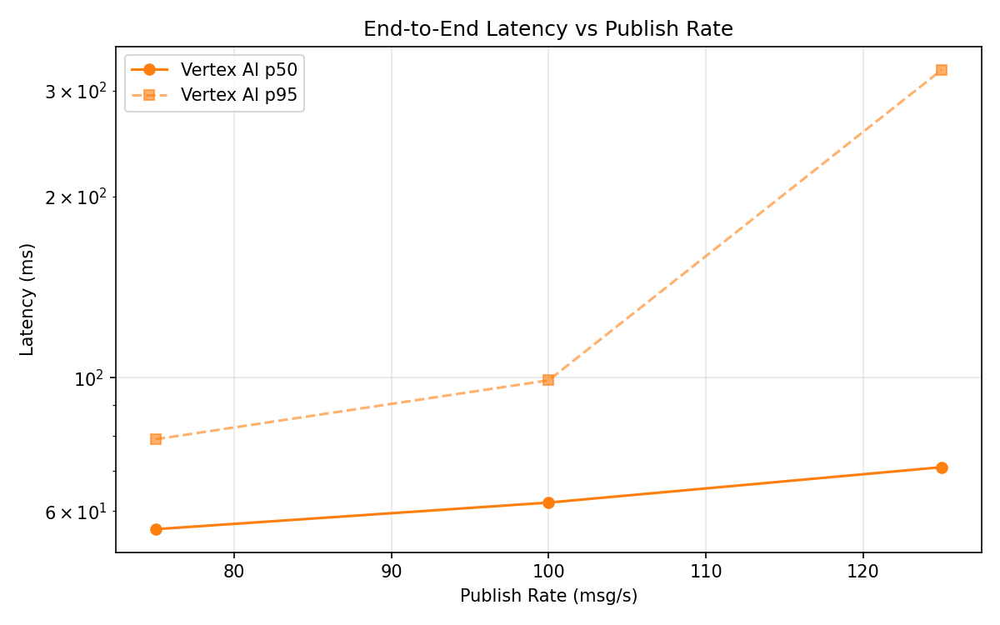
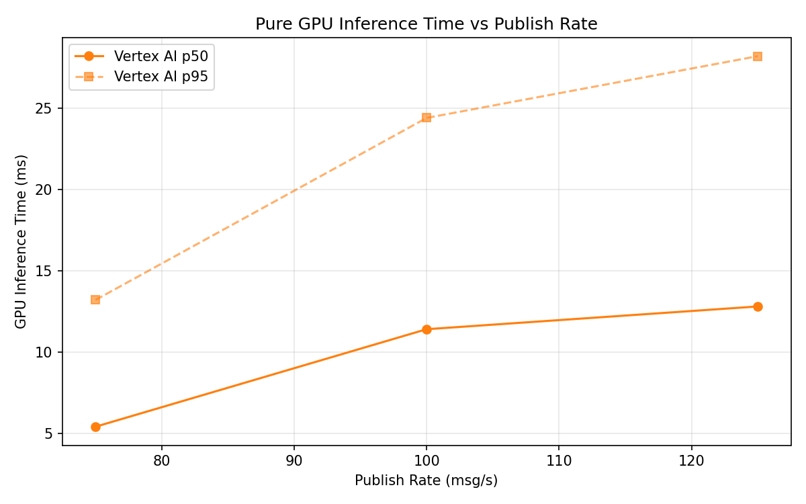

# Benchmark Report

Generated: 2026-03-09 15:12:08

## Configuration

| Parameter | Value |
|---|---|
| Messages per phase | 100s per phase |
| Rates (msg/s) | 75, 100, 125 |
| Experiments | Vertex AI |

## Throughput

| Rate (msg/s) | Vertex AI |
|---|---|
| 75 | 75.0 |
| 100 | 99.8 |
| 125 | 124.9 |

## End-to-End Latency (ms)

| Rate | Percentile | Vertex AI |
|---|---|---|
| 75 | p50 | 56.0 |
| 75 | p95 | 79.0 |
| 75 | p99 | 311.0 |
| 100 | p50 | 62.0 |
| 100 | p95 | 99.0 |
| 100 | p99 | 532.0 |
| 125 | p50 | 71.0 |
| 125 | p95 | 325.0 |
| 125 | p99 | 702.0 |

## GPU Inference Time (ms)

| Rate | Percentile | Vertex AI |
|---|---|---|
| 75 | p50 | 5.4 |
| 75 | p95 | 13.2 |
| 75 | p99 | 21.1 |
| 100 | p50 | 11.4 |
| 100 | p95 | 24.4 |
| 100 | p99 | 30.4 |
| 125 | p50 | 12.8 |
| 125 | p95 | 28.2 |
| 125 | p99 | 34.5 |

## Charts

### Latency vs Publish Rate

### GPU Inference Time vs Publish Rate

### Throughput vs Publish Rate

