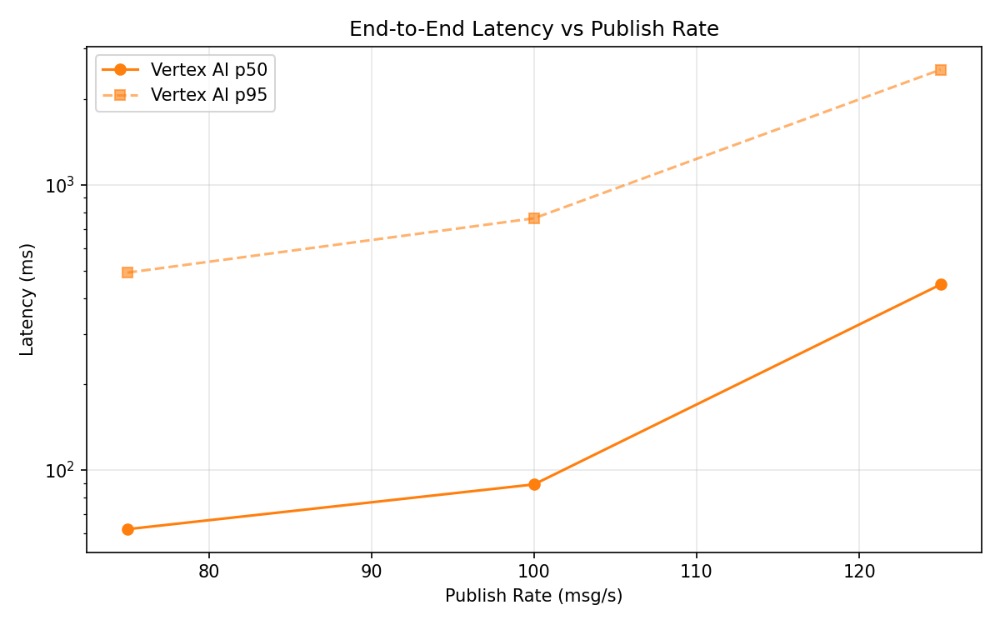
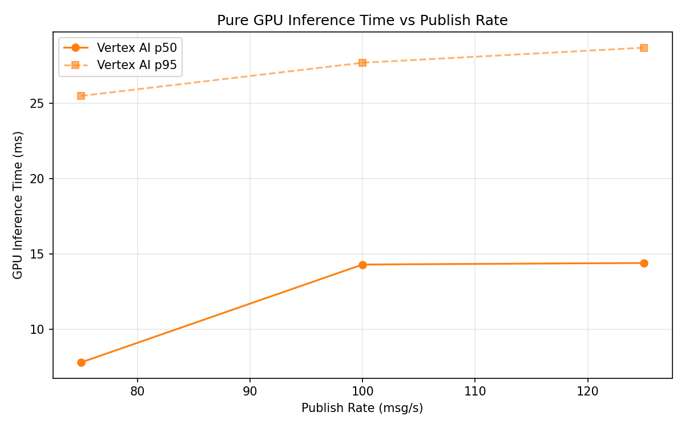
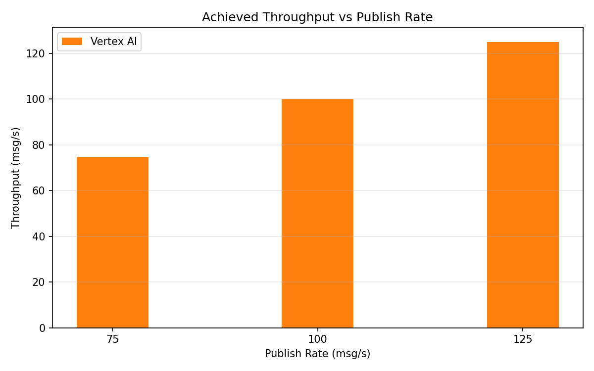

# Benchmark Report

Generated: 2026-03-09 16:39:47

## Configuration

| Parameter | Value |
|---|---|
| Messages per phase | 100s per phase |
| Rates (msg/s) | 75, 100, 125 |
| Experiments | Vertex AI |

## Throughput

| Rate (msg/s) | Vertex AI |
|---|---|
| 75 | 74.7 |
| 100 | 100.0 |
| 125 | 124.9 |

## End-to-End Latency (ms)

| Rate | Percentile | Vertex AI |
|---|---|---|
| 75 | p50 | 62.0 |
| 75 | p95 | 492.1 |
| 75 | p99 | 827.0 |
| 100 | p50 | 89.0 |
| 100 | p95 | 763.0 |
| 100 | p99 | 1193.0 |
| 125 | p50 | 447.0 |
| 125 | p95 | 2534.0 |
| 125 | p99 | 3758.0 |

## GPU Inference Time (ms)

| Rate | Percentile | Vertex AI |
|---|---|---|
| 75 | p50 | 7.8 |
| 75 | p95 | 25.5 |
| 75 | p99 | 30.7 |
| 100 | p50 | 14.3 |
| 100 | p95 | 27.7 |
| 100 | p99 | 32.3 |
| 125 | p50 | 14.4 |
| 125 | p95 | 28.7 |
| 125 | p99 | 34.2 |

## Charts

### Latency vs Publish Rate

### GPU Inference Time vs Publish Rate

### Throughput vs Publish Rate

