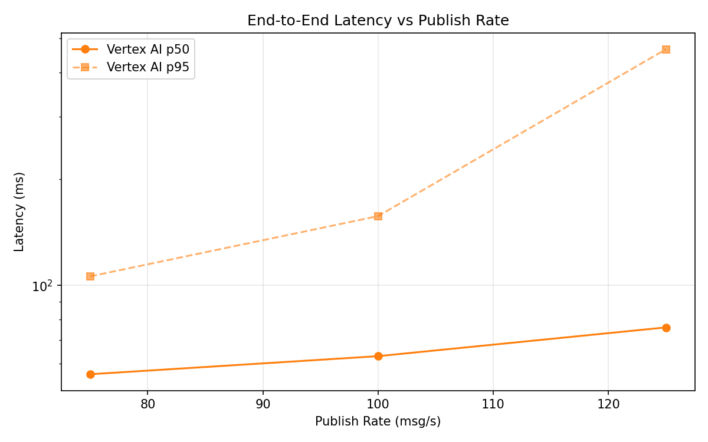
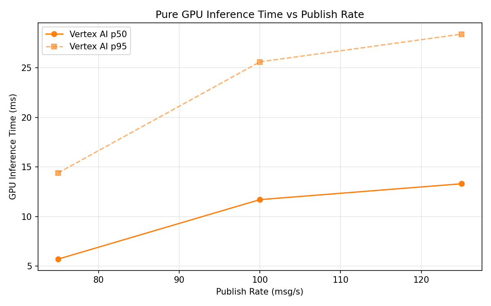

# Benchmark Report

Generated: 2026-03-09 18:21:22

## Configuration

| Parameter | Value |
|---|---|
| Messages per phase | 100s per phase |
| Rates (msg/s) | 75, 100, 125 |
| Experiments | Vertex AI |

## Throughput

| Rate (msg/s) | Vertex AI |
|---|---|
| 75 | 74.8 |
| 100 | 100.0 |
| 125 | 124.9 |

## End-to-End Latency (ms)

| Rate | Percentile | Vertex AI |
|---|---|---|
| 75 | p50 | 56.0 |
| 75 | p95 | 106.0 |
| 75 | p99 | 582.1 |
| 100 | p50 | 63.0 |
| 100 | p95 | 157.0 |
| 100 | p99 | 377.0 |
| 125 | p50 | 76.0 |
| 125 | p95 | 466.0 |
| 125 | p99 | 992.0 |

## GPU Inference Time (ms)

| Rate | Percentile | Vertex AI |
|---|---|---|
| 75 | p50 | 5.7 |
| 75 | p95 | 14.4 |
| 75 | p99 | 23.1 |
| 100 | p50 | 11.7 |
| 100 | p95 | 25.6 |
| 100 | p99 | 31.8 |
| 125 | p50 | 13.3 |
| 125 | p95 | 28.4 |
| 125 | p99 | 34.6 |

## Charts

### Latency vs Publish Rate

### GPU Inference Time vs Publish Rate

### Throughput vs Publish Rate

