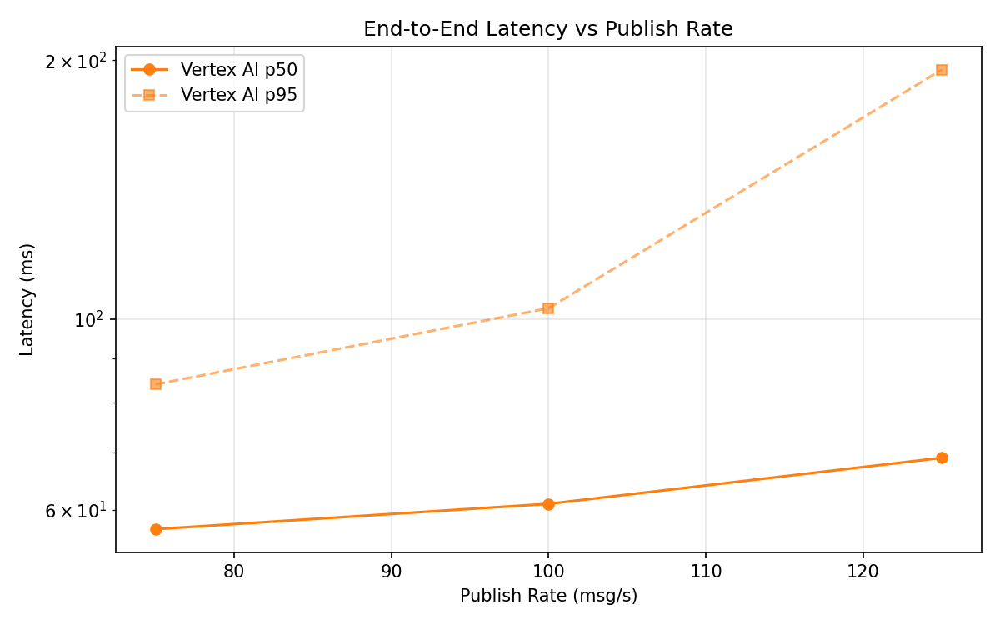
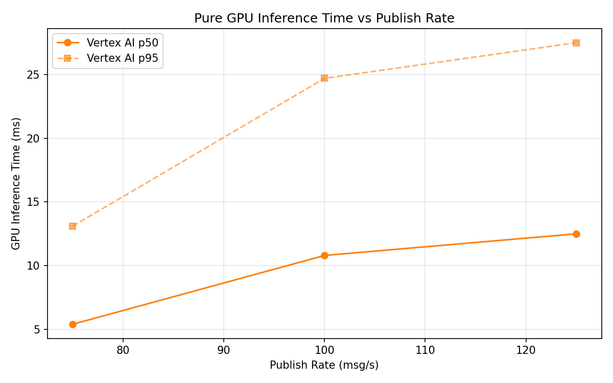

# Benchmark Report

Generated: 2026-03-09 17:30:15

## Configuration

| Parameter | Value |
|---|---|
| Messages per phase | 100s per phase |
| Rates (msg/s) | 75, 100, 125 |
| Experiments | Vertex AI |

## Throughput

| Rate (msg/s) | Vertex AI |
|---|---|
| 75 | 75.0 |
| 100 | 99.9 |
| 125 | 124.9 |

## End-to-End Latency (ms)

| Rate | Percentile | Vertex AI |
|---|---|---|
| 75 | p50 | 57.0 |
| 75 | p95 | 84.0 |
| 75 | p99 | 444.0 |
| 100 | p50 | 61.0 |
| 100 | p95 | 103.0 |
| 100 | p99 | 332.0 |
| 125 | p50 | 69.0 |
| 125 | p95 | 195.0 |
| 125 | p99 | 435.0 |

## GPU Inference Time (ms)

| Rate | Percentile | Vertex AI |
|---|---|---|
| 75 | p50 | 5.4 |
| 75 | p95 | 13.1 |
| 75 | p99 | 21.9 |
| 100 | p50 | 10.8 |
| 100 | p95 | 24.7 |
| 100 | p99 | 30.3 |
| 125 | p50 | 12.5 |
| 125 | p95 | 27.5 |
| 125 | p99 | 34.3 |

## Charts

### Latency vs Publish Rate

### GPU Inference Time vs Publish Rate

### Throughput vs Publish Rate

