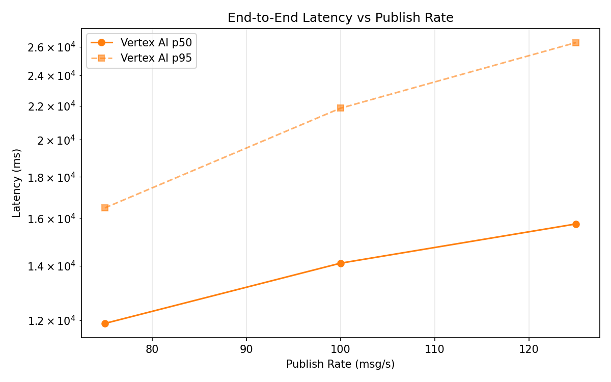
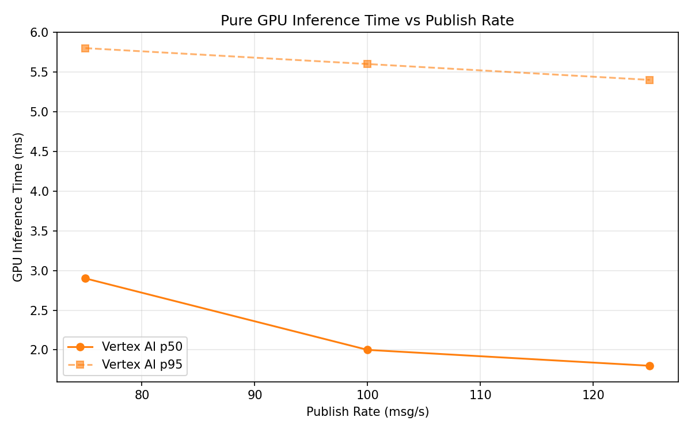
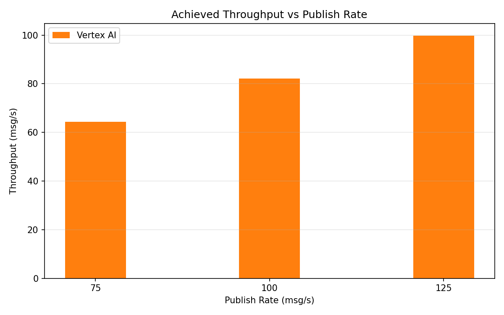

# Benchmark Report

Generated: 2026-03-09 12:41:15

## Configuration

| Parameter | Value |
|---|---|
| Messages per phase | 100s per phase |
| Rates (msg/s) | 75, 100, 125 |
| Experiments | Vertex AI |

## Throughput

| Rate (msg/s) | Vertex AI |
|---|---|
| 75 | 64.3 |
| 100 | 82.1 |
| 125 | 99.8 |

## End-to-End Latency (ms)

| Rate | Percentile | Vertex AI |
|---|---|---|
| 75 | p50 | 11890.5 |
| 75 | p95 | 16488.0 |
| 75 | p99 | 16738.0 |
| 100 | p50 | 14099.5 |
| 100 | p95 | 21857.0 |
| 100 | p99 | 22244.0 |
| 125 | p50 | 15755.0 |
| 125 | p95 | 26318.0 |
| 125 | p99 | 26597.0 |

## GPU Inference Time (ms)

| Rate | Percentile | Vertex AI |
|---|---|---|
| 75 | p50 | 2.9 |
| 75 | p95 | 5.8 |
| 75 | p99 | 7.0 |
| 100 | p50 | 2.0 |
| 100 | p95 | 5.6 |
| 100 | p99 | 6.7 |
| 125 | p50 | 1.8 |
| 125 | p95 | 5.4 |
| 125 | p99 | 6.0 |

## Charts

### Latency vs Publish Rate

### GPU Inference Time vs Publish Rate

### Throughput vs Publish Rate

