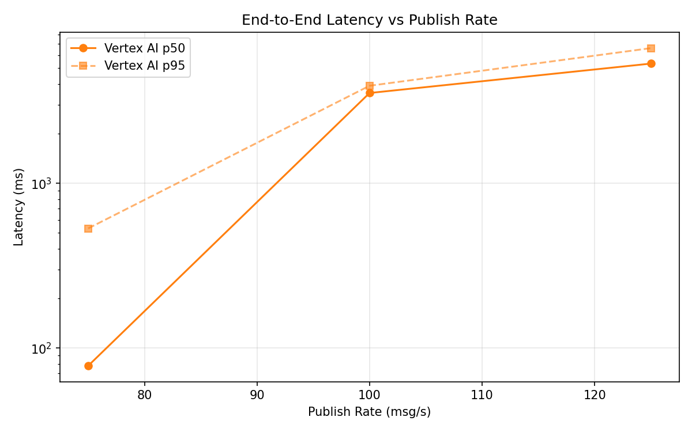
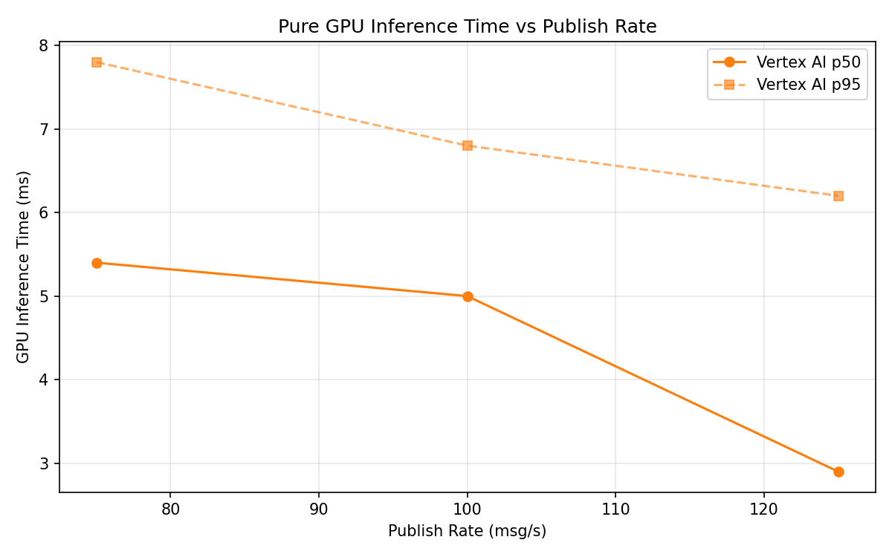
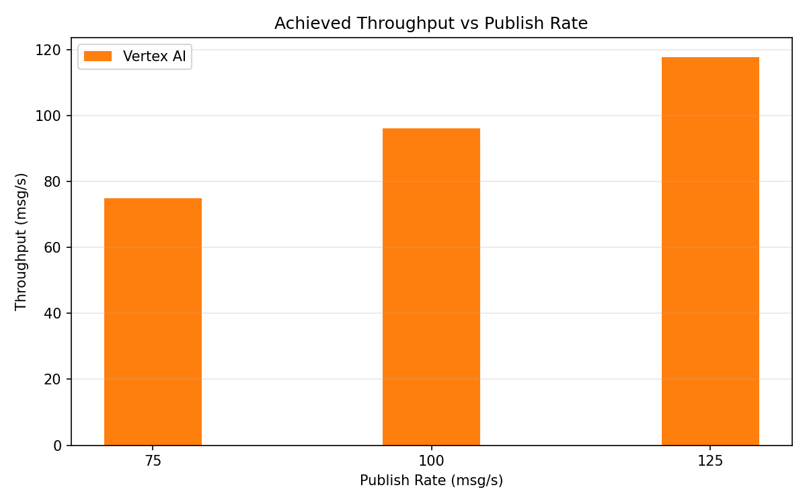

# Benchmark Report

Generated: 2026-03-09 12:53:38

## Configuration

| Parameter | Value |
|---|---|
| Messages per phase | 100s per phase |
| Rates (msg/s) | 75, 100, 125 |
| Experiments | Vertex AI |

## Throughput

| Rate (msg/s) | Vertex AI |
|---|---|
| 75 | 74.9 |
| 100 | 96.1 |
| 125 | 117.7 |

## End-to-End Latency (ms)

| Rate | Percentile | Vertex AI |
|---|---|---|
| 75 | p50 | 78.0 |
| 75 | p95 | 532.0 |
| 75 | p99 | 1185.0 |
| 100 | p50 | 3530.0 |
| 100 | p95 | 3906.0 |
| 100 | p99 | 4060.0 |
| 125 | p50 | 5324.0 |
| 125 | p95 | 6608.0 |
| 125 | p99 | 6751.0 |

## GPU Inference Time (ms)

| Rate | Percentile | Vertex AI |
|---|---|---|
| 75 | p50 | 5.4 |
| 75 | p95 | 7.8 |
| 75 | p99 | 9.4 |
| 100 | p50 | 5.0 |
| 100 | p95 | 6.8 |
| 100 | p99 | 9.0 |
| 125 | p50 | 2.9 |
| 125 | p95 | 6.2 |
| 125 | p99 | 8.7 |

## Charts

### Latency vs Publish Rate

### GPU Inference Time vs Publish Rate

### Throughput vs Publish Rate

