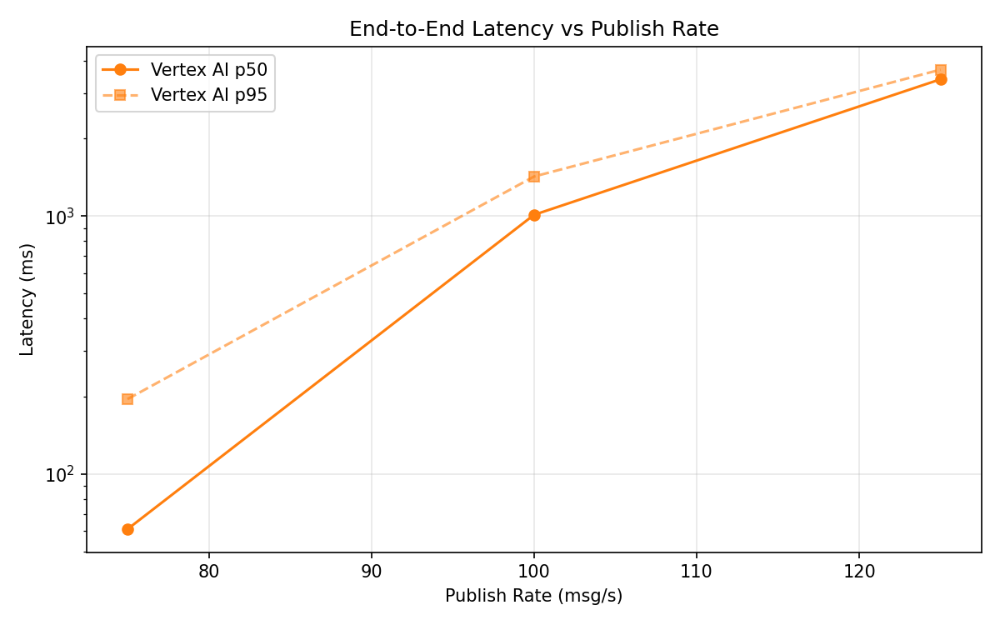
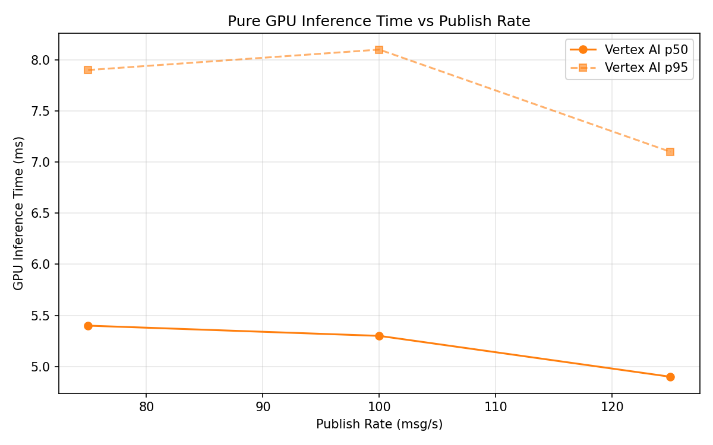
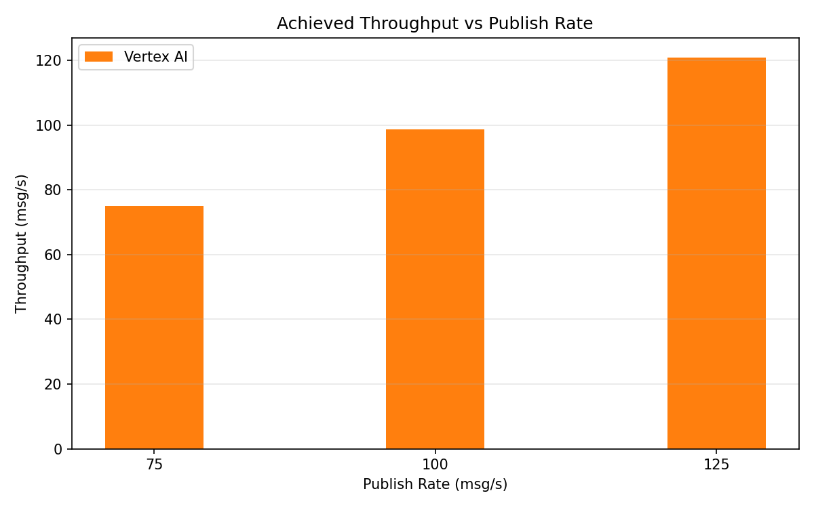

# Benchmark Report

Generated: 2026-03-09 13:07:19

## Configuration

| Parameter | Value |
|---|---|
| Messages per phase | 100s per phase |
| Rates (msg/s) | 75, 100, 125 |
| Experiments | Vertex AI |

## Throughput

| Rate (msg/s) | Vertex AI |
|---|---|
| 75 | 75.0 |
| 100 | 98.7 |
| 125 | 120.9 |

## End-to-End Latency (ms)

| Rate | Percentile | Vertex AI |
|---|---|---|
| 75 | p50 | 61.0 |
| 75 | p95 | 195.0 |
| 75 | p99 | 865.0 |
| 100 | p50 | 1012.0 |
| 100 | p95 | 1425.0 |
| 100 | p99 | 1482.0 |
| 125 | p50 | 3398.0 |
| 125 | p95 | 3703.0 |
| 125 | p99 | 3786.0 |

## GPU Inference Time (ms)

| Rate | Percentile | Vertex AI |
|---|---|---|
| 75 | p50 | 5.4 |
| 75 | p95 | 7.9 |
| 75 | p99 | 9.6 |
| 100 | p50 | 5.3 |
| 100 | p95 | 8.1 |
| 100 | p99 | 9.9 |
| 125 | p50 | 4.9 |
| 125 | p95 | 7.1 |
| 125 | p99 | 9.4 |

## Charts

### Latency vs Publish Rate

### GPU Inference Time vs Publish Rate

### Throughput vs Publish Rate

