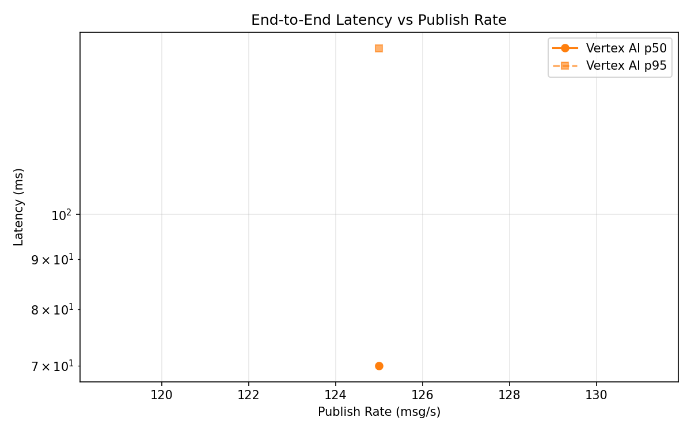
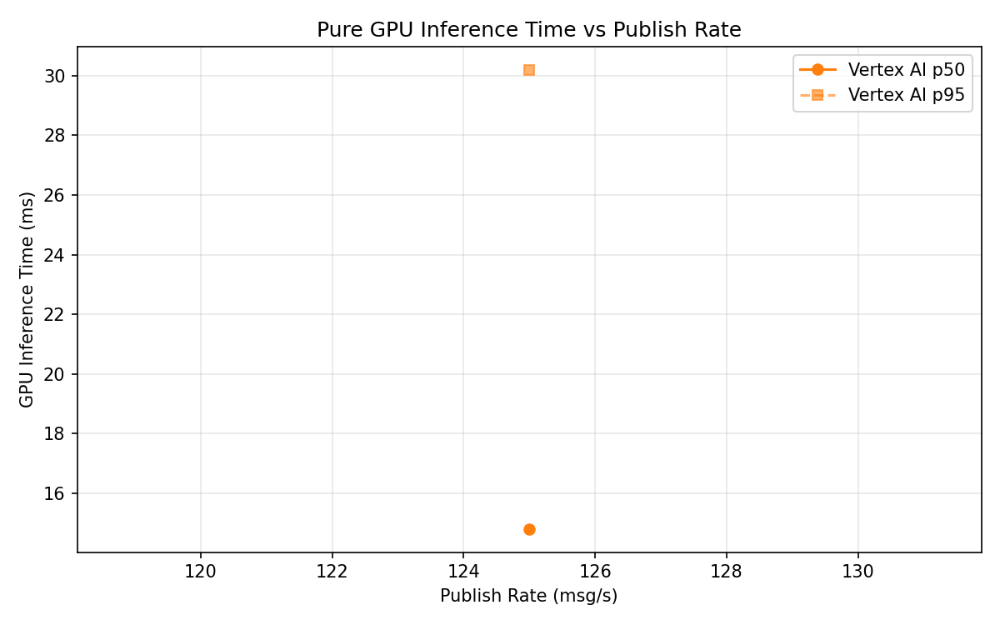
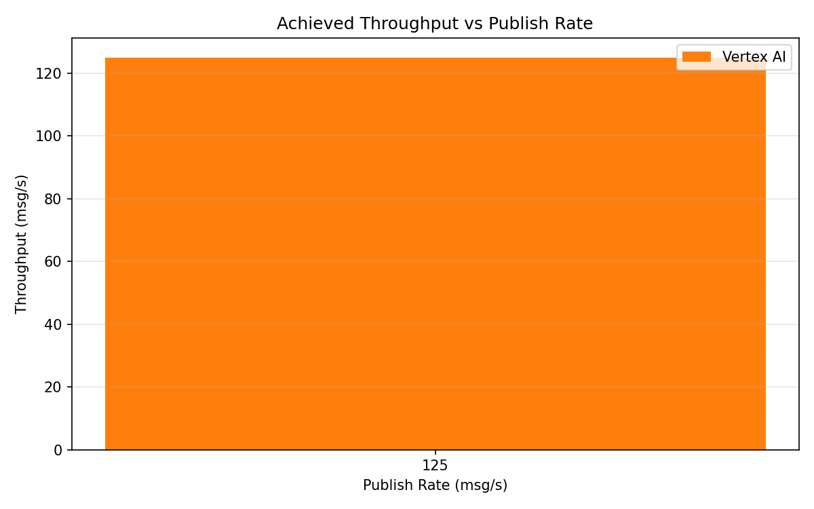

# Benchmark Report

Generated: 2026-03-10 02:31:52

## Configuration

| Parameter | Value |
|---|---|
| Messages per phase | 100s per phase |
| Rates (msg/s) | 125 |
| Experiments | Vertex AI |

## Throughput

| Rate (msg/s) | Vertex AI |
|---|---|
| 125 | 124.9 |

## End-to-End Latency (ms)

| Rate | Percentile | Vertex AI |
|---|---|---|
| 125 | p50 | 70.0 |
| 125 | p95 | 148.0 |
| 125 | p99 | 317.0 |

## GPU Inference Time (ms)

| Rate | Percentile | Vertex AI |
|---|---|---|
| 125 | p50 | 14.8 |
| 125 | p95 | 30.2 |
| 125 | p99 | 35.6 |

## Charts

### Latency vs Publish Rate

### GPU Inference Time vs Publish Rate

### Throughput vs Publish Rate

