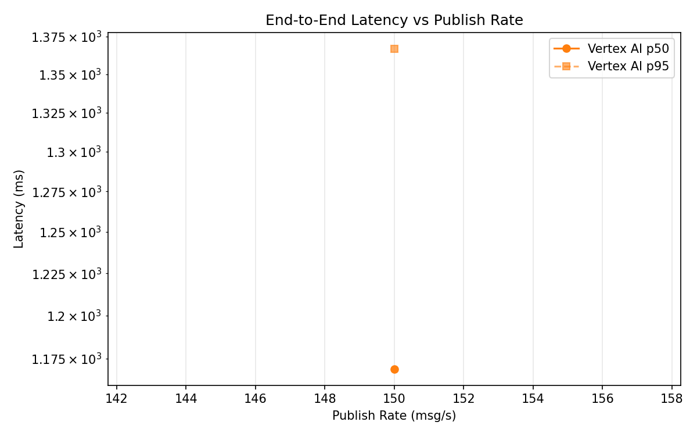
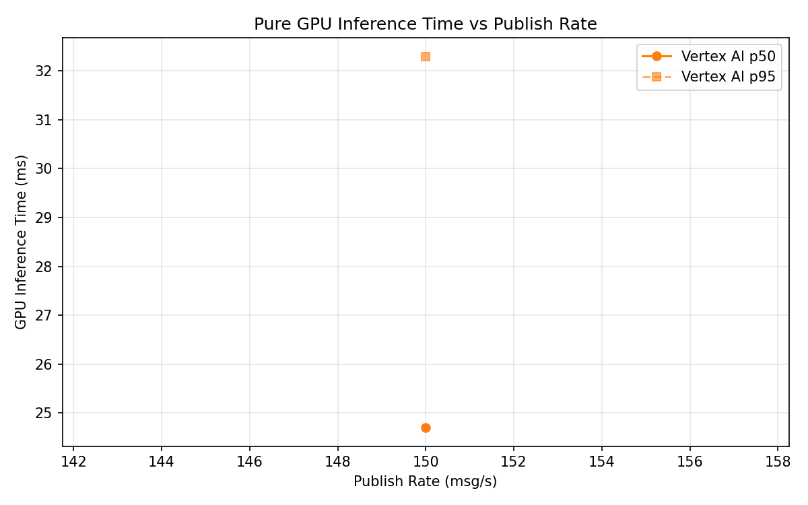
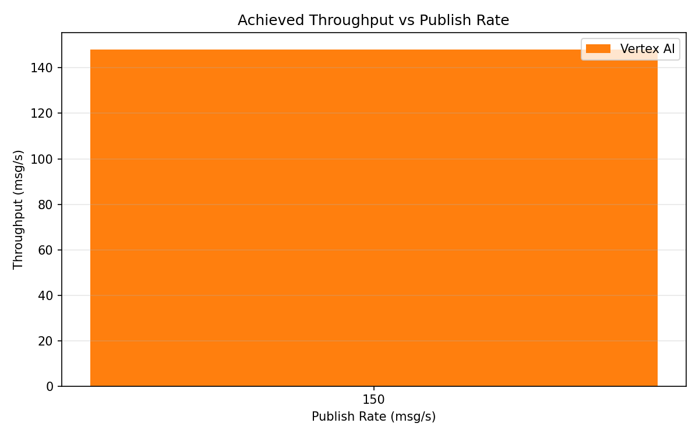

# Benchmark Report

Generated: 2026-03-10 02:40:17

## Configuration

| Parameter | Value |
|---|---|
| Messages per phase | 100s per phase |
| Rates (msg/s) | 150 |
| Experiments | Vertex AI |

## Throughput

| Rate (msg/s) | Vertex AI |
|---|---|
| 150 | 148.1 |

## End-to-End Latency (ms)

| Rate | Percentile | Vertex AI |
|---|---|---|
| 150 | p50 | 1169.0 |
| 150 | p95 | 1367.0 |
| 150 | p99 | 1439.0 |

## GPU Inference Time (ms)

| Rate | Percentile | Vertex AI |
|---|---|---|
| 150 | p50 | 24.7 |
| 150 | p95 | 32.3 |
| 150 | p99 | 36.4 |

## Charts

### Latency vs Publish Rate

### GPU Inference Time vs Publish Rate

### Throughput vs Publish Rate

