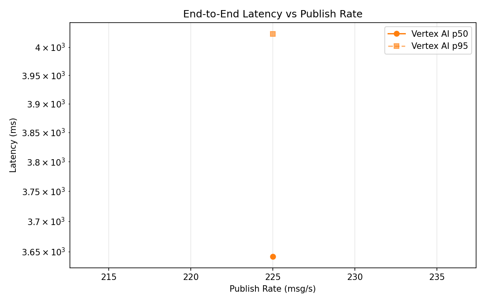
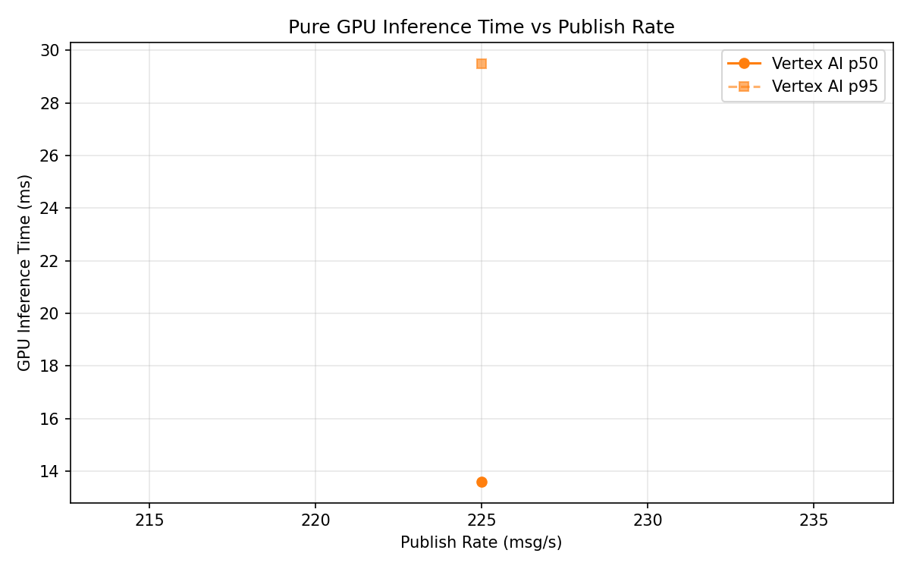
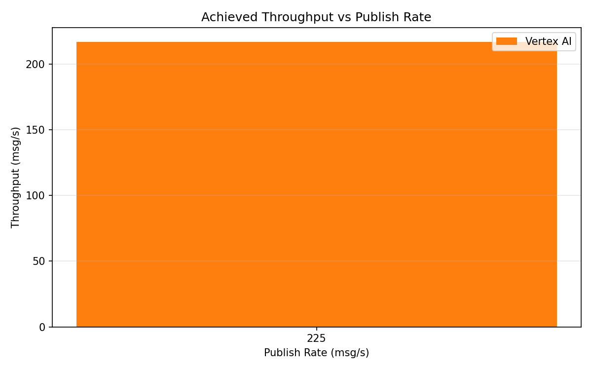

# Benchmark Report

Generated: 2026-03-10 03:05:49

## Configuration

| Parameter | Value |
|---|---|
| Messages per phase | 100s per phase |
| Rates (msg/s) | 225 |
| Experiments | Vertex AI |

## Throughput

| Rate (msg/s) | Vertex AI |
|---|---|
| 225 | 216.9 |

## End-to-End Latency (ms)

| Rate | Percentile | Vertex AI |
|---|---|---|
| 225 | p50 | 3642.0 |
| 225 | p95 | 4024.0 |
| 225 | p99 | 4157.0 |

## GPU Inference Time (ms)

| Rate | Percentile | Vertex AI |
|---|---|---|
| 225 | p50 | 13.6 |
| 225 | p95 | 29.5 |
| 225 | p99 | 33.3 |

## Charts

### Latency vs Publish Rate

### GPU Inference Time vs Publish Rate

### Throughput vs Publish Rate

