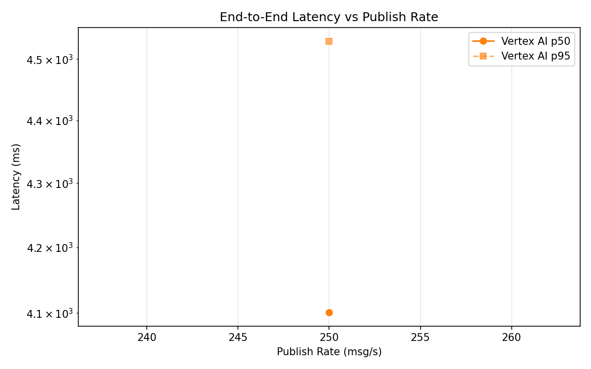
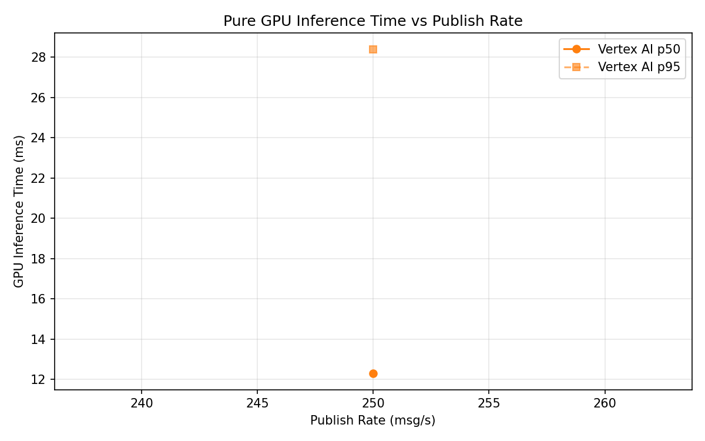
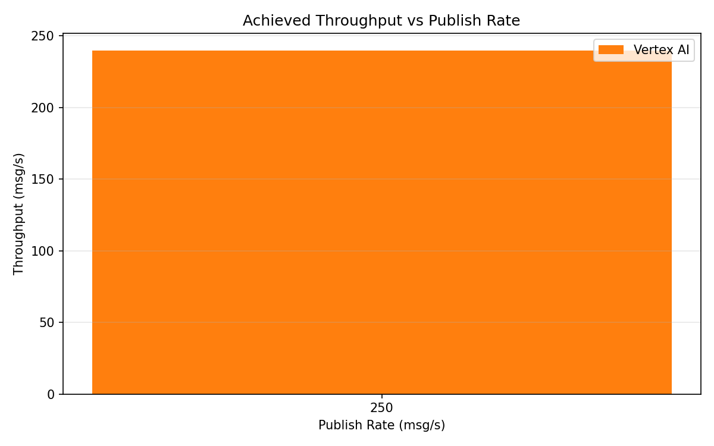

# Benchmark Report

Generated: 2026-03-10 03:14:46

## Configuration

| Parameter | Value |
|---|---|
| Messages per phase | 100s per phase |
| Rates (msg/s) | 250 |
| Experiments | Vertex AI |

## Throughput

| Rate (msg/s) | Vertex AI |
|---|---|
| 250 | 239.7 |

## End-to-End Latency (ms)

| Rate | Percentile | Vertex AI |
|---|---|---|
| 250 | p50 | 4101.0 |
| 250 | p95 | 4530.0 |
| 250 | p99 | 4623.0 |

## GPU Inference Time (ms)

| Rate | Percentile | Vertex AI |
|---|---|---|
| 250 | p50 | 12.3 |
| 250 | p95 | 28.4 |
| 250 | p99 | 32.0 |

## Charts

### Latency vs Publish Rate

### GPU Inference Time vs Publish Rate

### Throughput vs Publish Rate

