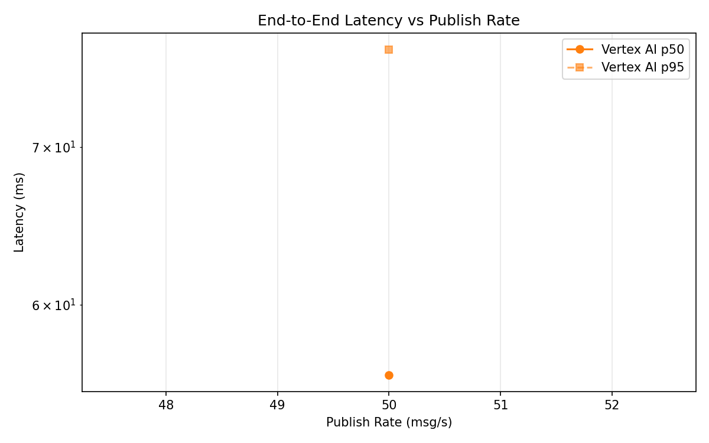
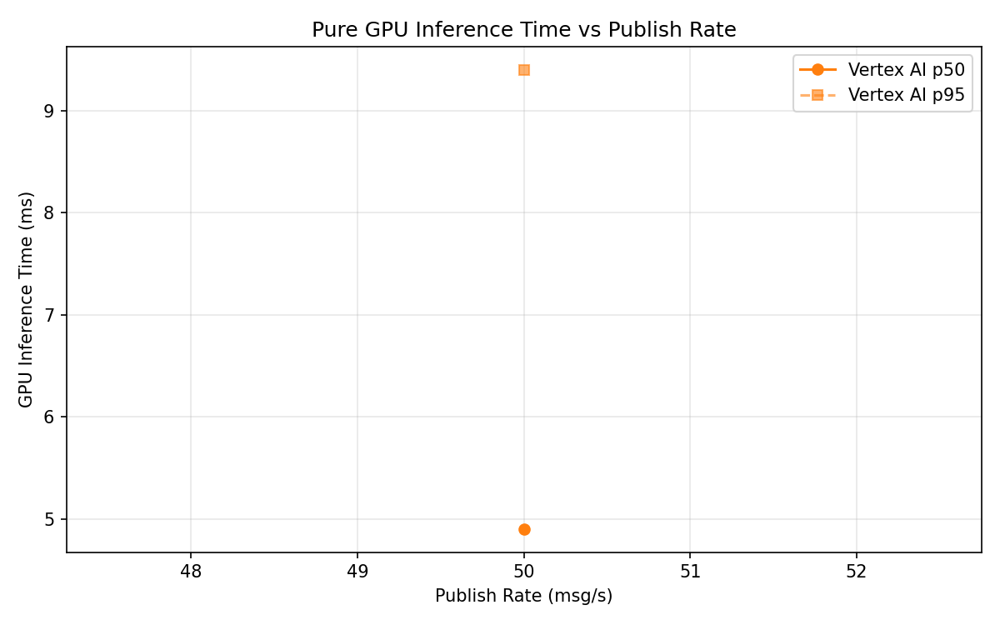
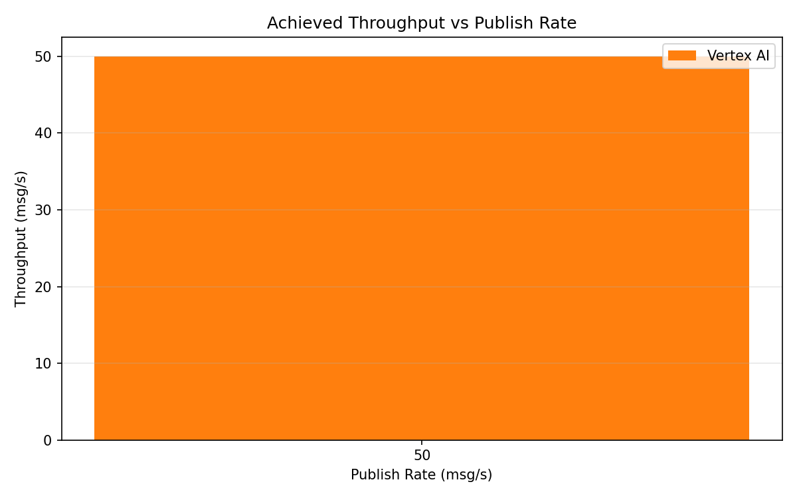

# Benchmark Report

Generated: 2026-03-10 02:06:20

## Configuration

| Parameter | Value |
|---|---|
| Messages per phase | 100s per phase |
| Rates (msg/s) | 50 |
| Experiments | Vertex AI |

## Throughput

| Rate (msg/s) | Vertex AI |
|---|---|
| 50 | 50.0 |

## End-to-End Latency (ms)

| Rate | Percentile | Vertex AI |
|---|---|---|
| 50 | p50 | 56.0 |
| 50 | p95 | 77.0 |
| 50 | p99 | 391.0 |

## GPU Inference Time (ms)

| Rate | Percentile | Vertex AI |
|---|---|---|
| 50 | p50 | 4.9 |
| 50 | p95 | 9.4 |
| 50 | p99 | 21.0 |

## Charts

### Latency vs Publish Rate

### GPU Inference Time vs Publish Rate

### Throughput vs Publish Rate

