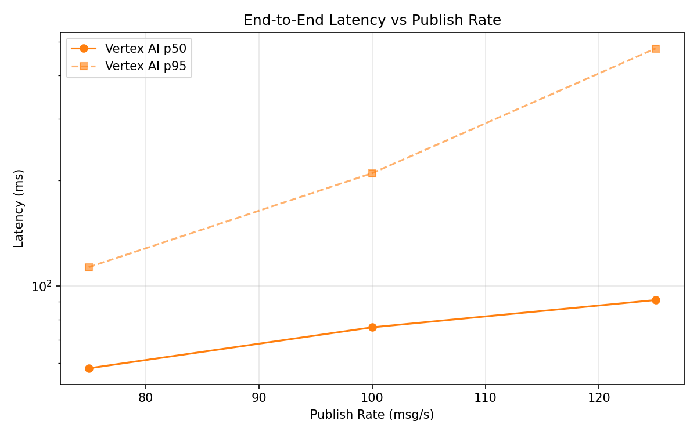
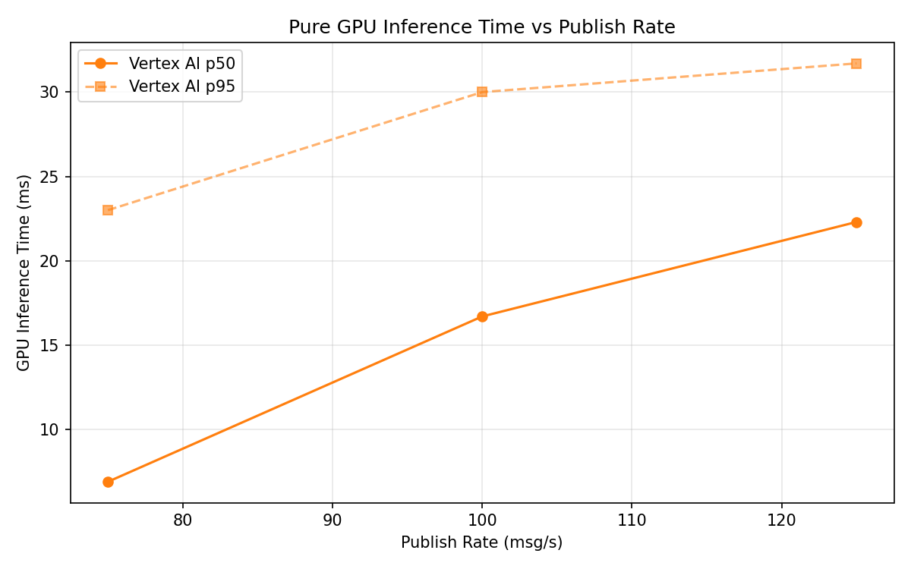

# Benchmark Report

Generated: 2026-03-09 23:12:03

## Configuration

| Parameter | Value |
|---|---|
| Messages per phase | 100s per phase |
| Rates (msg/s) | 75, 100, 125 |
| Experiments | Vertex AI |

## Throughput

| Rate (msg/s) | Vertex AI |
|---|---|
| 75 | 75.0 |
| 100 | 99.9 |
| 125 | 124.8 |

## End-to-End Latency (ms)

| Rate | Percentile | Vertex AI |
|---|---|---|
| 75 | p50 | 58.0 |
| 75 | p95 | 113.0 |
| 75 | p99 | 244.0 |
| 100 | p50 | 76.0 |
| 100 | p95 | 210.0 |
| 100 | p99 | 658.0 |
| 125 | p50 | 91.0 |
| 125 | p95 | 478.0 |
| 125 | p99 | 864.0 |

## GPU Inference Time (ms)

| Rate | Percentile | Vertex AI |
|---|---|---|
| 75 | p50 | 6.9 |
| 75 | p95 | 23.0 |
| 75 | p99 | 29.1 |
| 100 | p50 | 16.7 |
| 100 | p95 | 30.0 |
| 100 | p99 | 35.5 |
| 125 | p50 | 22.3 |
| 125 | p95 | 31.7 |
| 125 | p99 | 36.4 |

## Charts

### Latency vs Publish Rate

### GPU Inference Time vs Publish Rate

### Throughput vs Publish Rate

