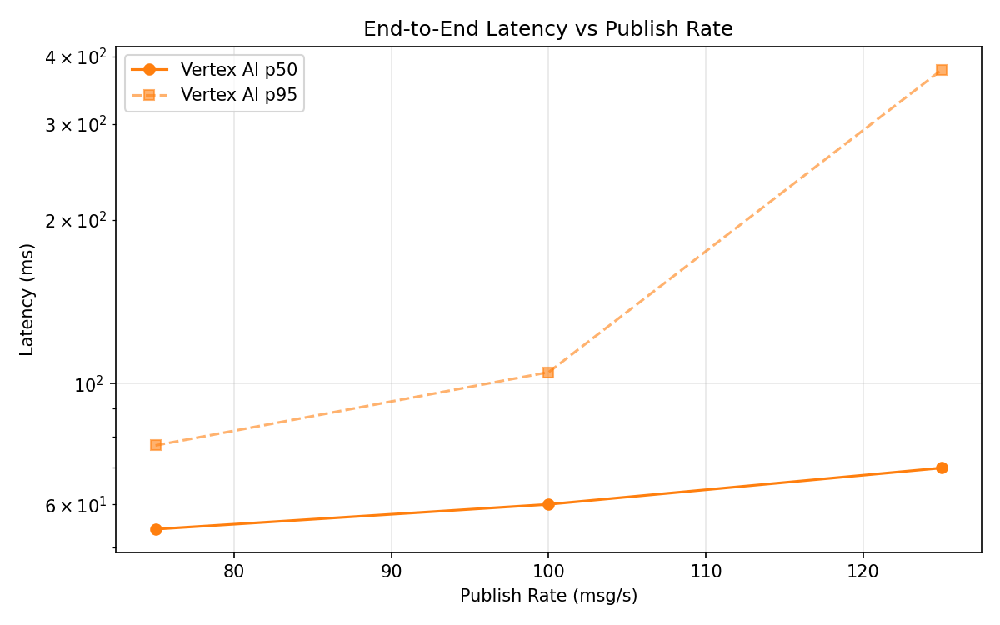
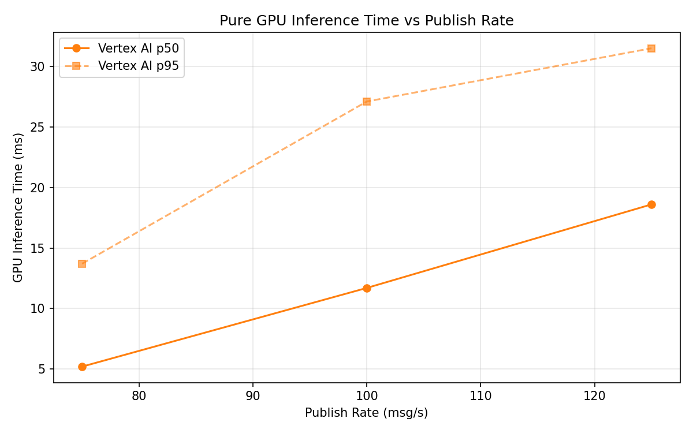

# Benchmark Report

Generated: 2026-03-09 23:24:23

## Configuration

| Parameter | Value |
|---|---|
| Messages per phase | 100s per phase |
| Rates (msg/s) | 75, 100, 125 |
| Experiments | Vertex AI |

## Throughput

| Rate (msg/s) | Vertex AI |
|---|---|
| 75 | 75.0 |
| 100 | 99.9 |
| 125 | 124.9 |

## End-to-End Latency (ms)

| Rate | Percentile | Vertex AI |
|---|---|---|
| 75 | p50 | 54.0 |
| 75 | p95 | 77.0 |
| 75 | p99 | 283.2 |
| 100 | p50 | 60.0 |
| 100 | p95 | 105.0 |
| 100 | p99 | 424.1 |
| 125 | p50 | 70.0 |
| 125 | p95 | 378.0 |
| 125 | p99 | 743.0 |

## GPU Inference Time (ms)

| Rate | Percentile | Vertex AI |
|---|---|---|
| 75 | p50 | 5.2 |
| 75 | p95 | 13.7 |
| 75 | p99 | 25.1 |
| 100 | p50 | 11.7 |
| 100 | p95 | 27.1 |
| 100 | p99 | 33.7 |
| 125 | p50 | 18.6 |
| 125 | p95 | 31.5 |
| 125 | p99 | 36.9 |

## Charts

### Latency vs Publish Rate

### GPU Inference Time vs Publish Rate

### Throughput vs Publish Rate

