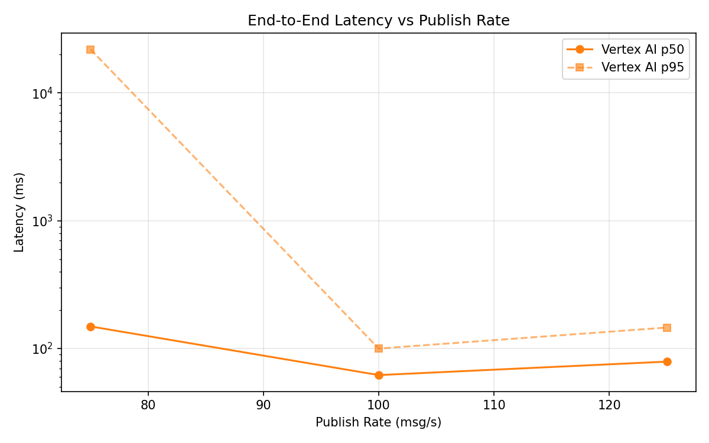
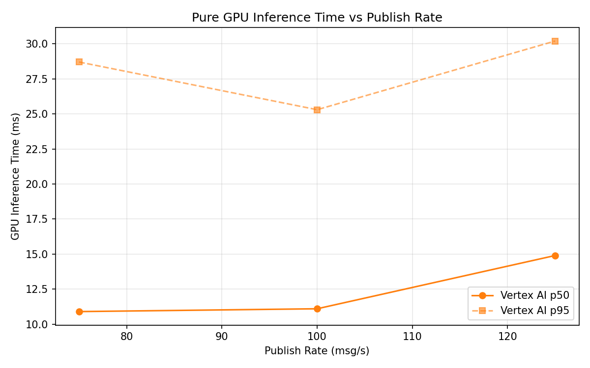

# Benchmark Report

Generated: 2026-03-09 23:49:21

## Configuration

| Parameter | Value |
|---|---|
| Messages per phase | 100s per phase |
| Rates (msg/s) | 75, 100, 125 |
| Experiments | Vertex AI |

## Throughput

| Rate (msg/s) | Vertex AI |
|---|---|
| 75 | 75.0 |
| 100 | 99.9 |
| 125 | 124.9 |

## End-to-End Latency (ms)

| Rate | Percentile | Vertex AI |
|---|---|---|
| 75 | p50 | 149.0 |
| 75 | p95 | 21918.2 |
| 75 | p99 | 25255.0 |
| 100 | p50 | 62.0 |
| 100 | p95 | 100.0 |
| 100 | p99 | 206.0 |
| 125 | p50 | 79.0 |
| 125 | p95 | 146.0 |
| 125 | p99 | 206.0 |

## GPU Inference Time (ms)

| Rate | Percentile | Vertex AI |
|---|---|---|
| 75 | p50 | 10.9 |
| 75 | p95 | 28.7 |
| 75 | p99 | 33.1 |
| 100 | p50 | 11.1 |
| 100 | p95 | 25.3 |
| 100 | p99 | 32.5 |
| 125 | p50 | 14.9 |
| 125 | p95 | 30.2 |
| 125 | p99 | 35.4 |

## Charts

### Latency vs Publish Rate

### GPU Inference Time vs Publish Rate

### Throughput vs Publish Rate

