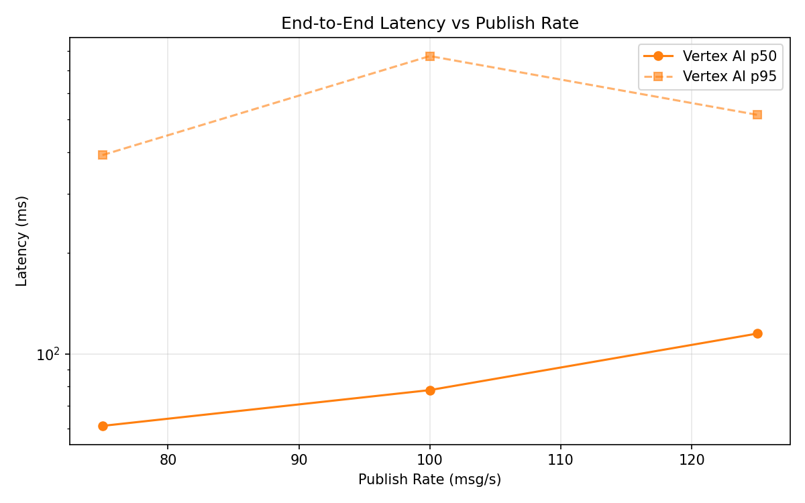
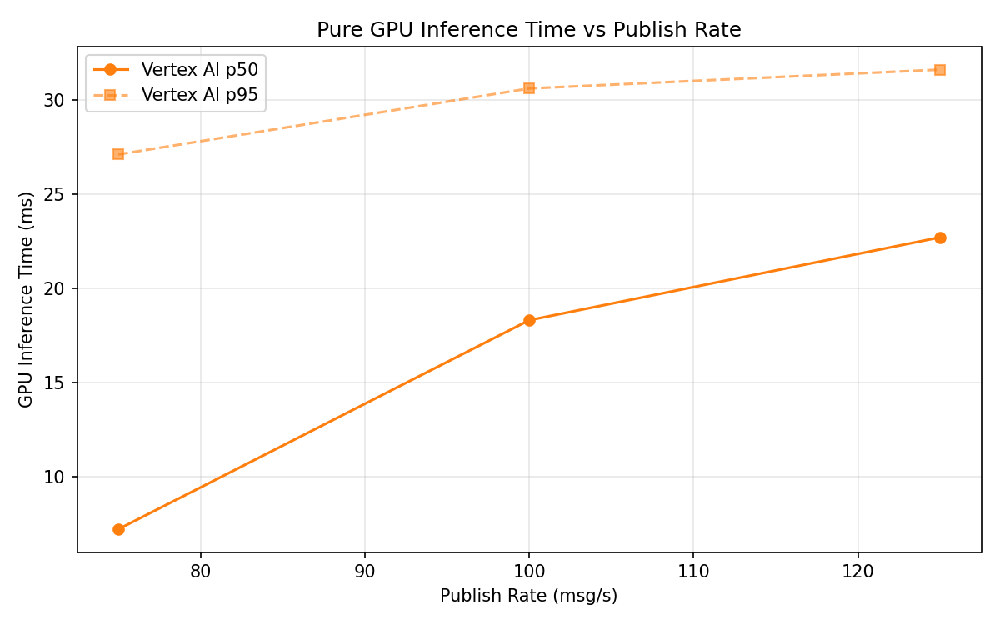

# Benchmark Report

Generated: 2026-03-10 01:46:12

## Configuration

| Parameter | Value |
|---|---|
| Messages per phase | 100s per phase |
| Rates (msg/s) | 75, 100, 125 |
| Experiments | Vertex AI |

## Throughput

| Rate (msg/s) | Vertex AI |
|---|---|
| 75 | 75.0 |
| 100 | 99.9 |
| 125 | 124.9 |

## End-to-End Latency (ms)

| Rate | Percentile | Vertex AI |
|---|---|---|
| 75 | p50 | 61.0 |
| 75 | p95 | 392.0 |
| 75 | p99 | 762.1 |
| 100 | p50 | 78.0 |
| 100 | p95 | 774.1 |
| 100 | p99 | 1132.0 |
| 125 | p50 | 115.0 |
| 125 | p95 | 517.0 |
| 125 | p99 | 768.0 |

## GPU Inference Time (ms)

| Rate | Percentile | Vertex AI |
|---|---|---|
| 75 | p50 | 7.2 |
| 75 | p95 | 27.1 |
| 75 | p99 | 33.0 |
| 100 | p50 | 18.3 |
| 100 | p95 | 30.6 |
| 100 | p99 | 35.0 |
| 125 | p50 | 22.7 |
| 125 | p95 | 31.6 |
| 125 | p99 | 36.8 |

## Charts

### Latency vs Publish Rate

### GPU Inference Time vs Publish Rate

### Throughput vs Publish Rate

