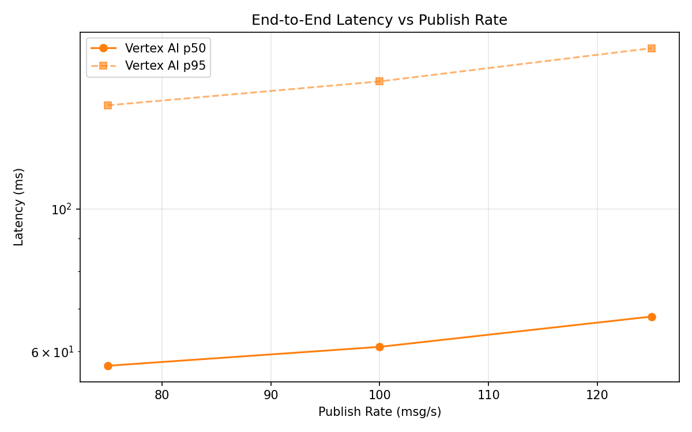
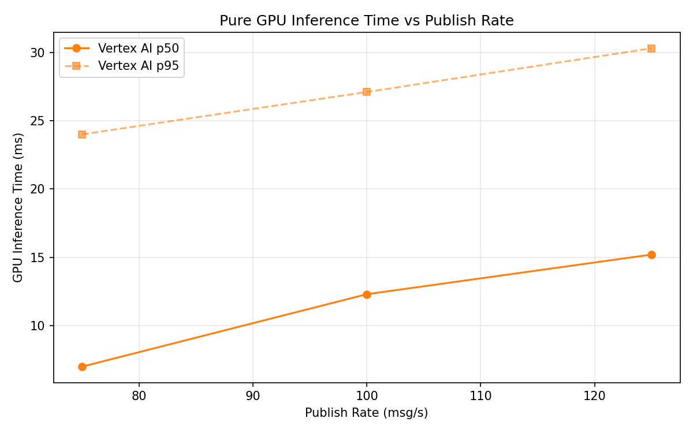

# Benchmark Report

Generated: 2026-03-10 01:58:20

## Configuration

| Parameter | Value |
|---|---|
| Messages per phase | 100s per phase |
| Rates (msg/s) | 75, 100, 125 |
| Experiments | Vertex AI |

## Throughput

| Rate (msg/s) | Vertex AI |
|---|---|
| 75 | 75.0 |
| 100 | 100.0 |
| 125 | 125.0 |

## End-to-End Latency (ms)

| Rate | Percentile | Vertex AI |
|---|---|---|
| 75 | p50 | 57.0 |
| 75 | p95 | 145.0 |
| 75 | p99 | 472.0 |
| 100 | p50 | 61.0 |
| 100 | p95 | 158.0 |
| 100 | p99 | 746.0 |
| 125 | p50 | 68.0 |
| 125 | p95 | 178.0 |
| 125 | p99 | 397.0 |

## GPU Inference Time (ms)

| Rate | Percentile | Vertex AI |
|---|---|---|
| 75 | p50 | 7.0 |
| 75 | p95 | 24.0 |
| 75 | p99 | 30.0 |
| 100 | p50 | 12.3 |
| 100 | p95 | 27.1 |
| 100 | p99 | 33.1 |
| 125 | p50 | 15.2 |
| 125 | p95 | 30.3 |
| 125 | p99 | 35.9 |

## Charts

### Latency vs Publish Rate

### GPU Inference Time vs Publish Rate

### Throughput vs Publish Rate

