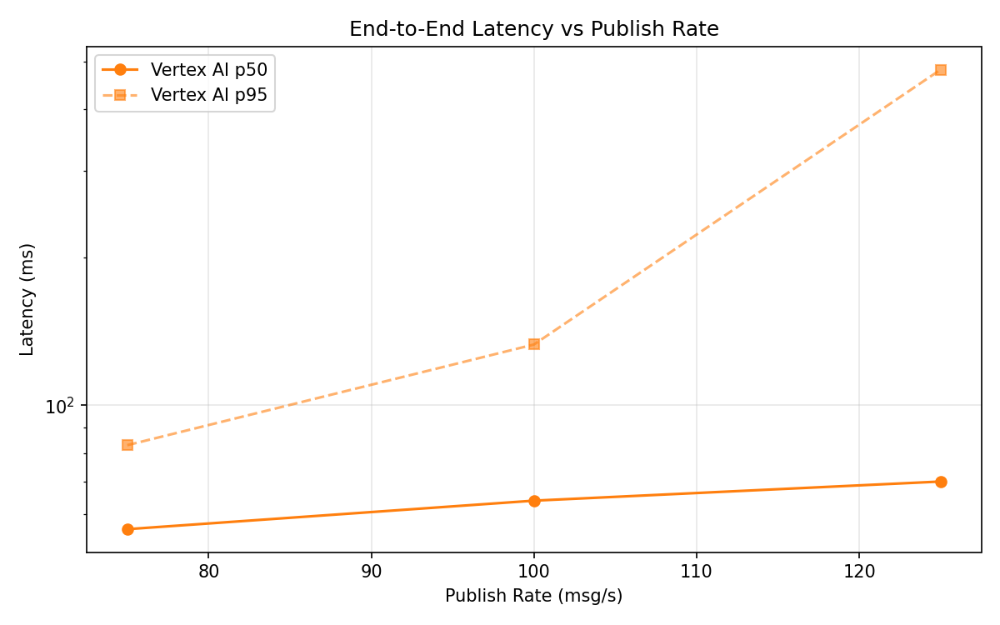
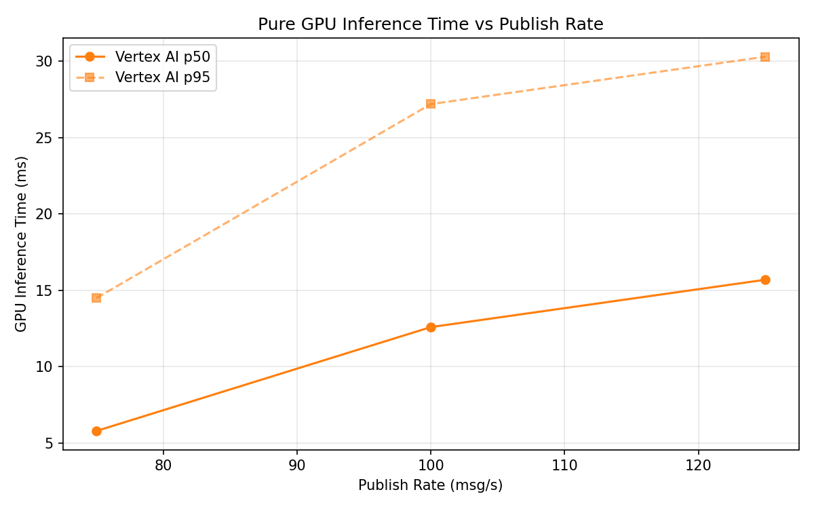

# Benchmark Report

Generated: 2026-03-10 01:17:04

## Configuration

| Parameter | Value |
|---|---|
| Messages per phase | 100s per phase |
| Rates (msg/s) | 75, 100, 125 |
| Experiments | Vertex AI |

## Throughput

| Rate (msg/s) | Vertex AI |
|---|---|
| 75 | 75.0 |
| 100 | 100.0 |
| 125 | 124.9 |

## End-to-End Latency (ms)

| Rate | Percentile | Vertex AI |
|---|---|---|
| 75 | p50 | 56.0 |
| 75 | p95 | 83.0 |
| 75 | p99 | 331.0 |
| 100 | p50 | 64.0 |
| 100 | p95 | 133.0 |
| 100 | p99 | 822.0 |
| 125 | p50 | 70.0 |
| 125 | p95 | 482.0 |
| 125 | p99 | 1001.1 |

## GPU Inference Time (ms)

| Rate | Percentile | Vertex AI |
|---|---|---|
| 75 | p50 | 5.8 |
| 75 | p95 | 14.5 |
| 75 | p99 | 28.1 |
| 100 | p50 | 12.6 |
| 100 | p95 | 27.2 |
| 100 | p99 | 32.2 |
| 125 | p50 | 15.7 |
| 125 | p95 | 30.3 |
| 125 | p99 | 35.6 |

## Charts

### Latency vs Publish Rate

### GPU Inference Time vs Publish Rate

### Throughput vs Publish Rate

