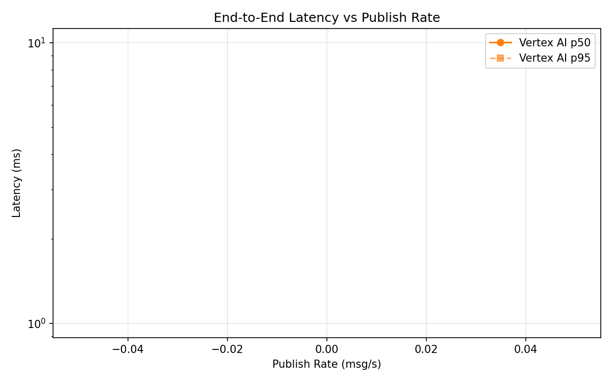
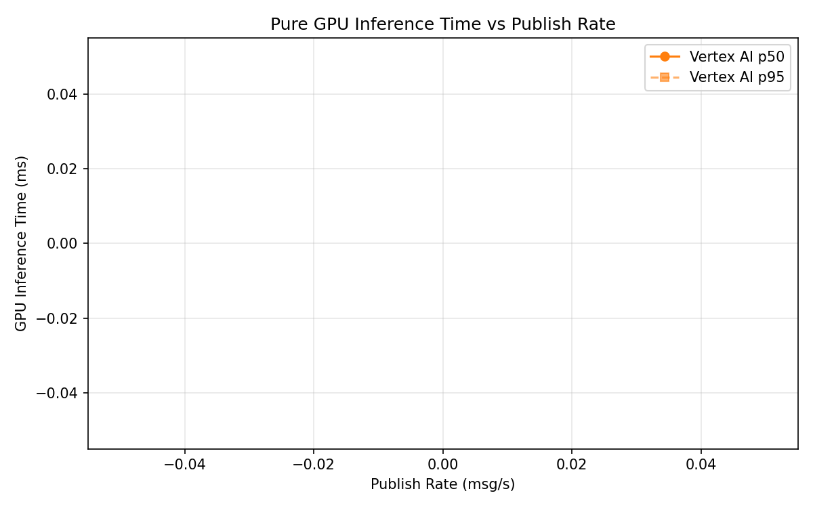
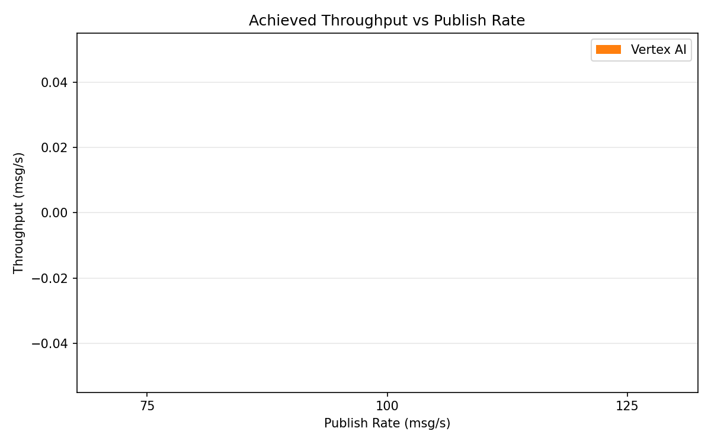

# Benchmark Report

Generated: 2026-03-10 01:22:23

## Configuration

| Parameter | Value |
|---|---|
| Messages per phase | 100s per phase |
| Rates (msg/s) | 75, 100, 125 |
| Experiments | Vertex AI |

## Throughput

| Rate (msg/s) | Vertex AI |
|---|---|
| 75 | — |
| 100 | — |
| 125 | — |

## End-to-End Latency (ms)

| Rate | Percentile | Vertex AI |
|---|---|---|
| 75 | p50 | — |
| 75 | p95 | — |
| 75 | p99 | — |
| 100 | p50 | — |
| 100 | p95 | — |
| 100 | p99 | — |
| 125 | p50 | — |
| 125 | p95 | — |
| 125 | p99 | — |

## GPU Inference Time (ms)

| Rate | Percentile | Vertex AI |
|---|---|---|
| 75 | p50 | — |
| 75 | p95 | — |
| 75 | p99 | — |
| 100 | p50 | — |
| 100 | p95 | — |
| 100 | p99 | — |
| 125 | p50 | — |
| 125 | p95 | — |
| 125 | p99 | — |

## Charts

### Latency vs Publish Rate

### GPU Inference Time vs Publish Rate

### Throughput vs Publish Rate

