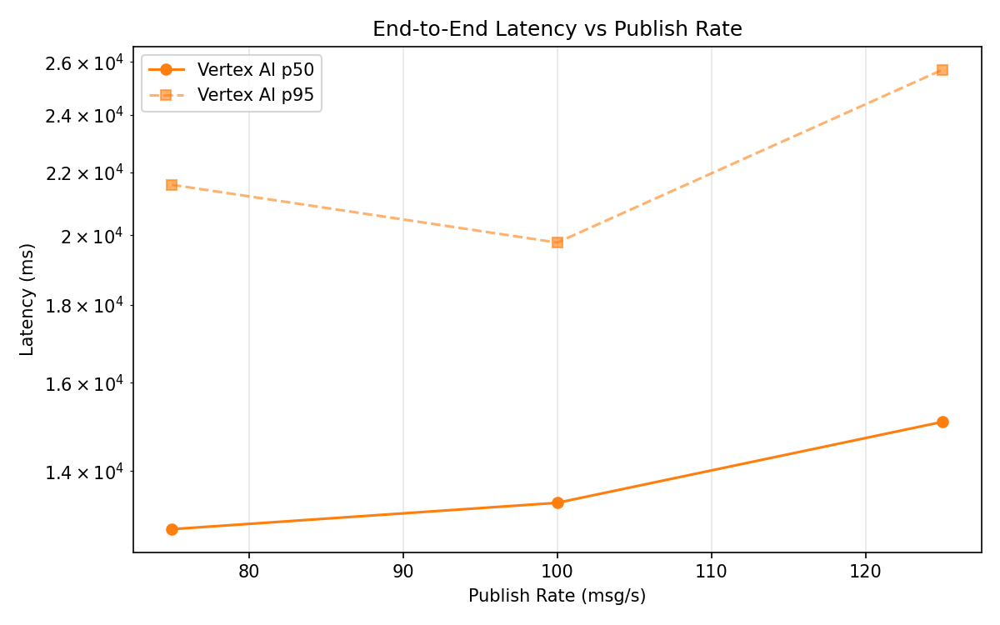
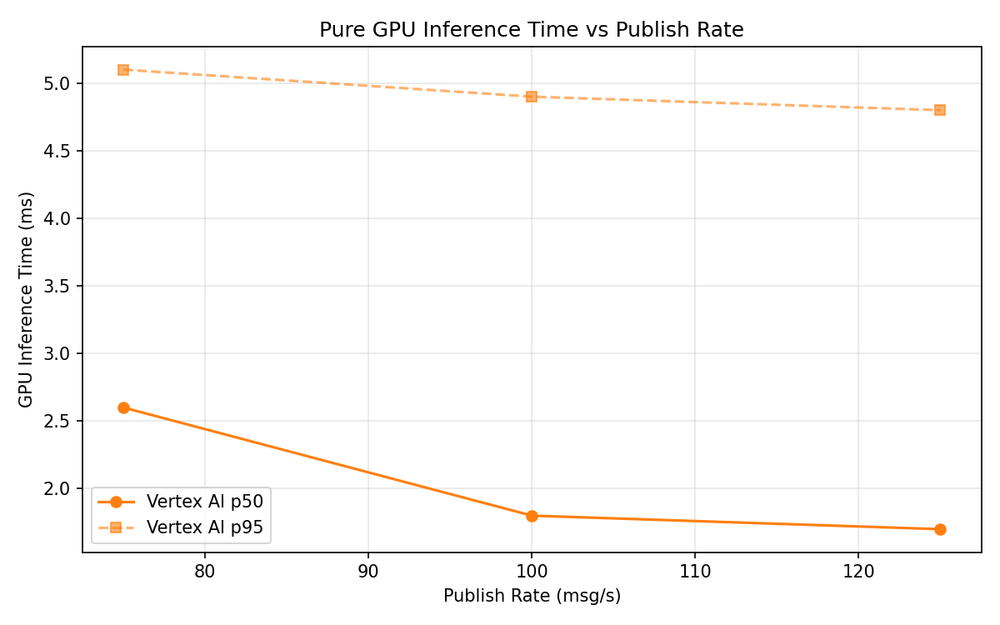
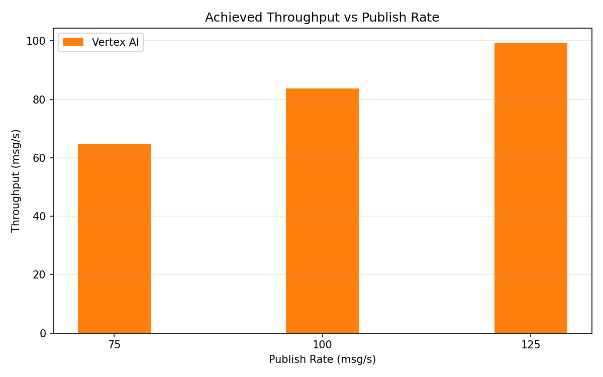

# Benchmark Report

Generated: 2026-03-09 20:18:35

## Configuration

| Parameter | Value |
|---|---|
| Messages per phase | 100s per phase |
| Rates (msg/s) | 75, 100, 125 |
| Experiments | Vertex AI |

## Throughput

| Rate (msg/s) | Vertex AI |
|---|---|
| 75 | 64.8 |
| 100 | 83.7 |
| 125 | 99.4 |

## End-to-End Latency (ms)

| Rate | Percentile | Vertex AI |
|---|---|---|
| 75 | p50 | 12821.5 |
| 75 | p95 | 21593.0 |
| 75 | p99 | 22309.0 |
| 100 | p50 | 13343.0 |
| 100 | p95 | 19785.0 |
| 100 | p99 | 20134.0 |
| 125 | p50 | 15083.5 |
| 125 | p95 | 25703.0 |
| 125 | p99 | 26108.0 |

## GPU Inference Time (ms)

| Rate | Percentile | Vertex AI |
|---|---|---|
| 75 | p50 | 2.6 |
| 75 | p95 | 5.1 |
| 75 | p99 | 6.6 |
| 100 | p50 | 1.8 |
| 100 | p95 | 4.9 |
| 100 | p99 | 5.6 |
| 125 | p50 | 1.7 |
| 125 | p95 | 4.8 |
| 125 | p99 | 5.2 |

## Charts

### Latency vs Publish Rate

### GPU Inference Time vs Publish Rate

### Throughput vs Publish Rate

