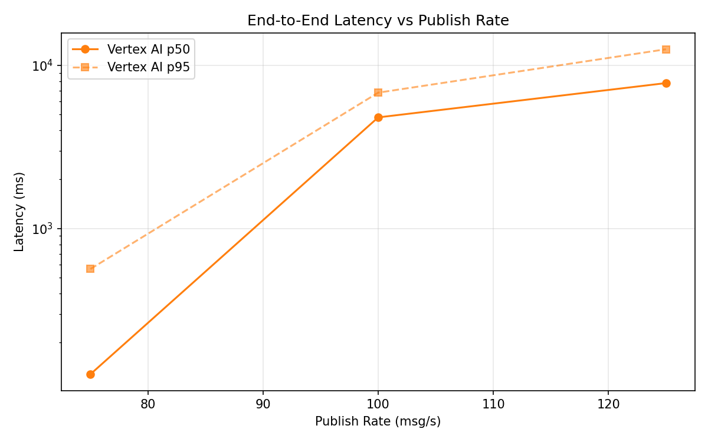
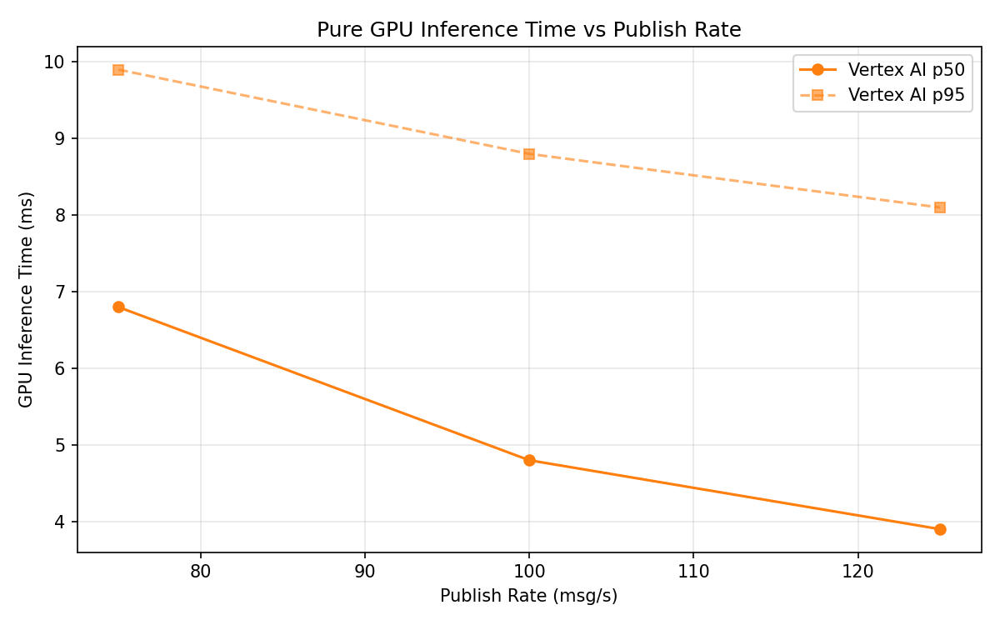
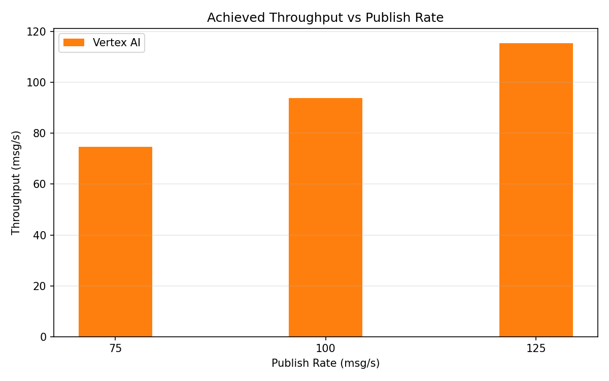

# Benchmark Report

Generated: 2026-03-09 20:30:41

## Configuration

| Parameter | Value |
|---|---|
| Messages per phase | 100s per phase |
| Rates (msg/s) | 75, 100, 125 |
| Experiments | Vertex AI |

## Throughput

| Rate (msg/s) | Vertex AI |
|---|---|
| 75 | 74.7 |
| 100 | 93.9 |
| 125 | 115.5 |

## End-to-End Latency (ms)

| Rate | Percentile | Vertex AI |
|---|---|---|
| 75 | p50 | 128.0 |
| 75 | p95 | 565.0 |
| 75 | p99 | 808.0 |
| 100 | p50 | 4797.0 |
| 100 | p95 | 6800.0 |
| 100 | p99 | 7018.0 |
| 125 | p50 | 7782.5 |
| 125 | p95 | 12545.0 |
| 125 | p99 | 12885.0 |

## GPU Inference Time (ms)

| Rate | Percentile | Vertex AI |
|---|---|---|
| 75 | p50 | 6.8 |
| 75 | p95 | 9.9 |
| 75 | p99 | 11.4 |
| 100 | p50 | 4.8 |
| 100 | p95 | 8.8 |
| 100 | p99 | 10.9 |
| 125 | p50 | 3.9 |
| 125 | p95 | 8.1 |
| 125 | p99 | 10.5 |

## Charts

### Latency vs Publish Rate

### GPU Inference Time vs Publish Rate

### Throughput vs Publish Rate

