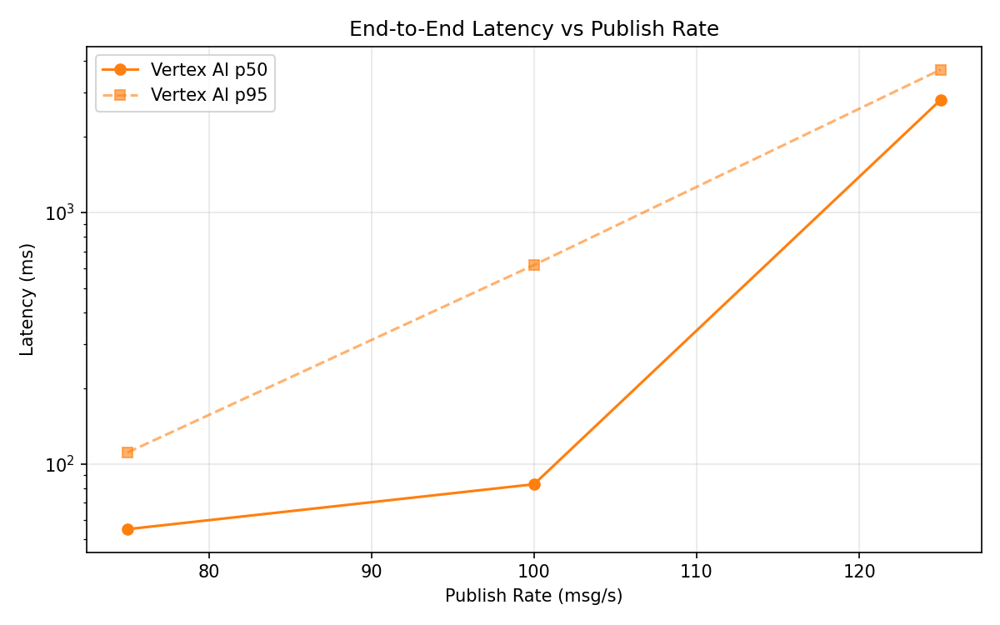
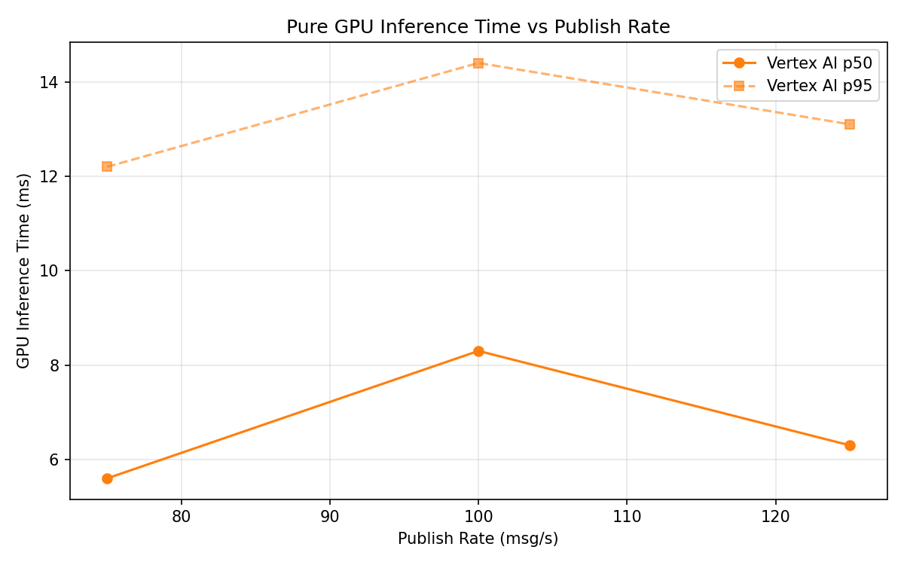
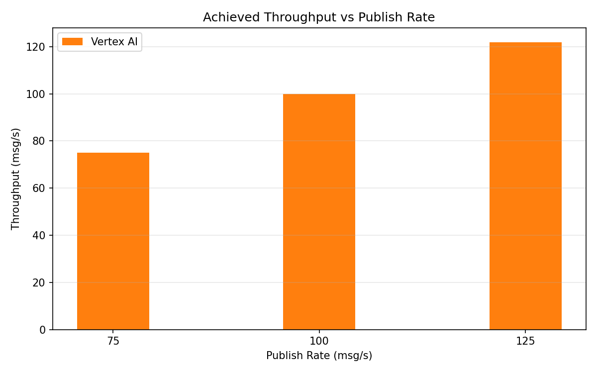

# Benchmark Report

Generated: 2026-03-09 20:42:40

## Configuration

| Parameter | Value |
|---|---|
| Messages per phase | 100s per phase |
| Rates (msg/s) | 75, 100, 125 |
| Experiments | Vertex AI |

## Throughput

| Rate (msg/s) | Vertex AI |
|---|---|
| 75 | 75.0 |
| 100 | 99.9 |
| 125 | 121.9 |

## End-to-End Latency (ms)

| Rate | Percentile | Vertex AI |
|---|---|---|
| 75 | p50 | 55.0 |
| 75 | p95 | 111.0 |
| 75 | p99 | 699.1 |
| 100 | p50 | 83.0 |
| 100 | p95 | 618.0 |
| 100 | p99 | 1033.0 |
| 125 | p50 | 2804.0 |
| 125 | p95 | 3699.0 |
| 125 | p99 | 3952.0 |

## GPU Inference Time (ms)

| Rate | Percentile | Vertex AI |
|---|---|---|
| 75 | p50 | 5.6 |
| 75 | p95 | 12.2 |
| 75 | p99 | 15.3 |
| 100 | p50 | 8.3 |
| 100 | p95 | 14.4 |
| 100 | p99 | 16.7 |
| 125 | p50 | 6.3 |
| 125 | p95 | 13.1 |
| 125 | p99 | 15.9 |

## Charts

### Latency vs Publish Rate

### GPU Inference Time vs Publish Rate

### Throughput vs Publish Rate

