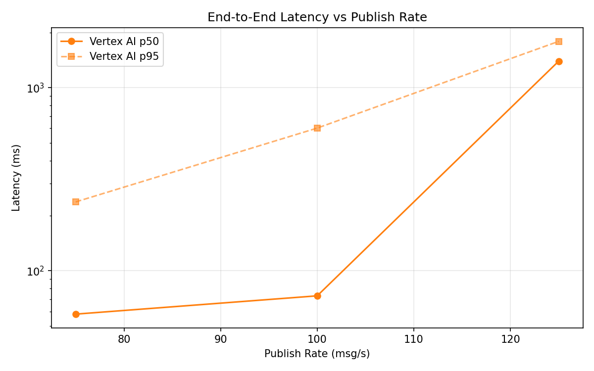
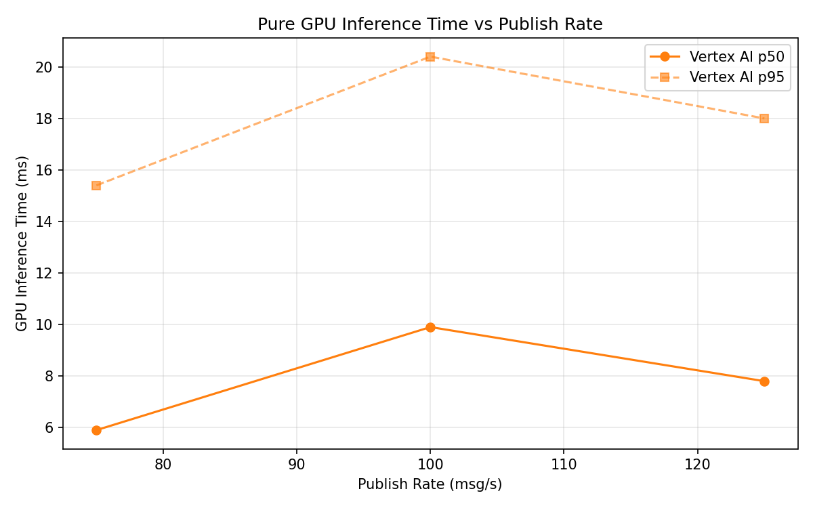
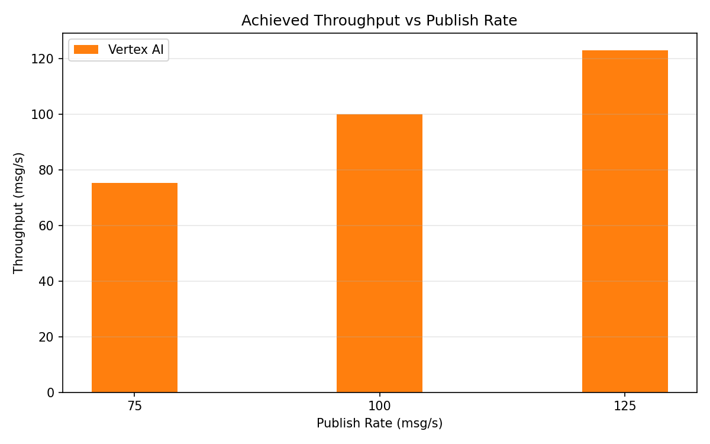

# Benchmark Report

Generated: 2026-03-09 20:57:07

## Configuration

| Parameter | Value |
|---|---|
| Messages per phase | 100s per phase |
| Rates (msg/s) | 75, 100, 125 |
| Experiments | Vertex AI |

## Throughput

| Rate (msg/s) | Vertex AI |
|---|---|
| 75 | 75.3 |
| 100 | 99.9 |
| 125 | 122.9 |

## End-to-End Latency (ms)

| Rate | Percentile | Vertex AI |
|---|---|---|
| 75 | p50 | 58.0 |
| 75 | p95 | 237.9 |
| 75 | p99 | 554.0 |
| 100 | p50 | 73.0 |
| 100 | p95 | 602.0 |
| 100 | p99 | 1101.0 |
| 125 | p50 | 1397.0 |
| 125 | p95 | 1792.0 |
| 125 | p99 | 1857.0 |

## GPU Inference Time (ms)

| Rate | Percentile | Vertex AI |
|---|---|---|
| 75 | p50 | 5.9 |
| 75 | p95 | 15.4 |
| 75 | p99 | 20.7 |
| 100 | p50 | 9.9 |
| 100 | p95 | 20.4 |
| 100 | p99 | 25.3 |
| 125 | p50 | 7.8 |
| 125 | p95 | 18.0 |
| 125 | p99 | 22.6 |

## Charts

### Latency vs Publish Rate

### GPU Inference Time vs Publish Rate

### Throughput vs Publish Rate

