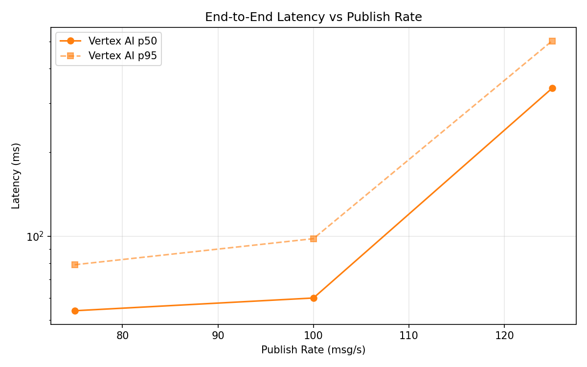
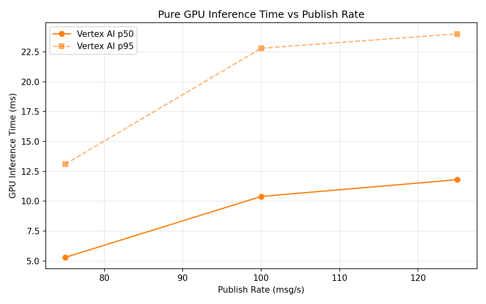
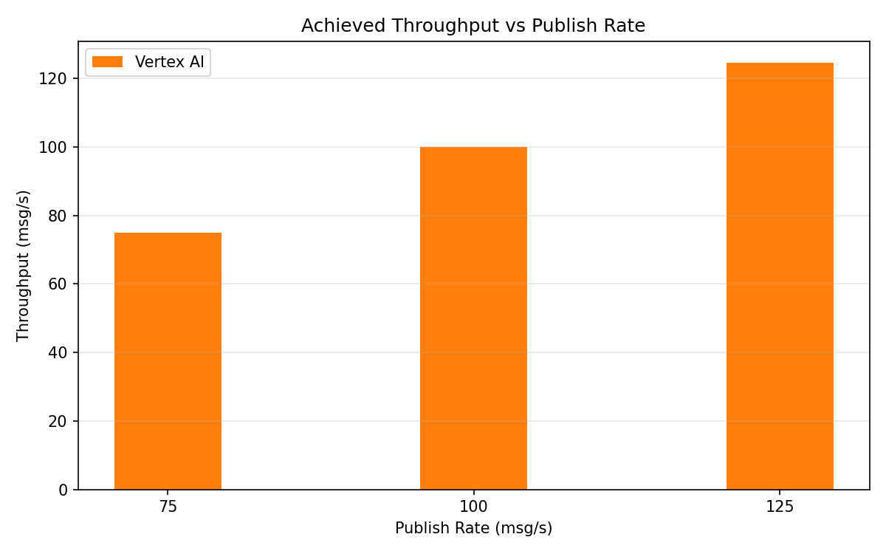

# Benchmark Report

Generated: 2026-03-09 21:08:56

## Configuration

| Parameter | Value |
|---|---|
| Messages per phase | 100s per phase |
| Rates (msg/s) | 75, 100, 125 |
| Experiments | Vertex AI |

## Throughput

| Rate (msg/s) | Vertex AI |
|---|---|
| 75 | 75.0 |
| 100 | 100.0 |
| 125 | 124.6 |

## End-to-End Latency (ms)

| Rate | Percentile | Vertex AI |
|---|---|---|
| 75 | p50 | 54.0 |
| 75 | p95 | 79.0 |
| 75 | p99 | 557.1 |
| 100 | p50 | 60.0 |
| 100 | p95 | 98.0 |
| 100 | p99 | 252.0 |
| 125 | p50 | 340.0 |
| 125 | p95 | 503.0 |
| 125 | p99 | 539.0 |

## GPU Inference Time (ms)

| Rate | Percentile | Vertex AI |
|---|---|---|
| 75 | p50 | 5.3 |
| 75 | p95 | 13.1 |
| 75 | p99 | 19.6 |
| 100 | p50 | 10.4 |
| 100 | p95 | 22.8 |
| 100 | p99 | 27.9 |
| 125 | p50 | 11.8 |
| 125 | p95 | 24.0 |
| 125 | p99 | 29.0 |

## Charts

### Latency vs Publish Rate

### GPU Inference Time vs Publish Rate

### Throughput vs Publish Rate

