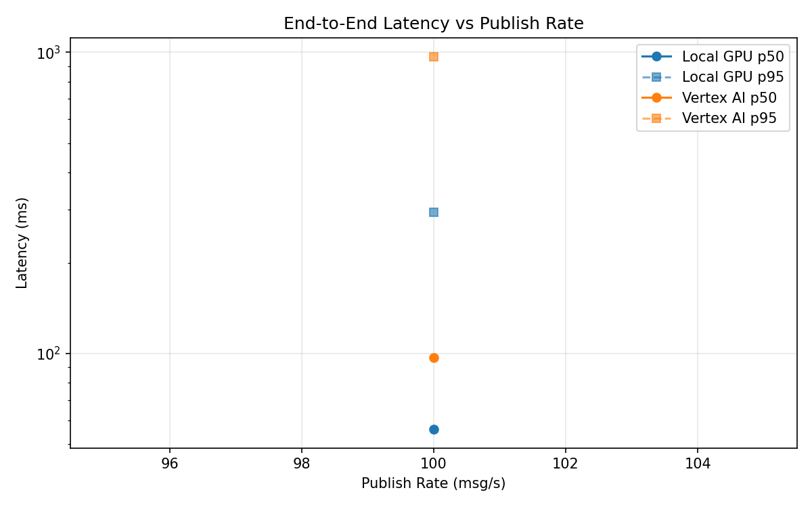
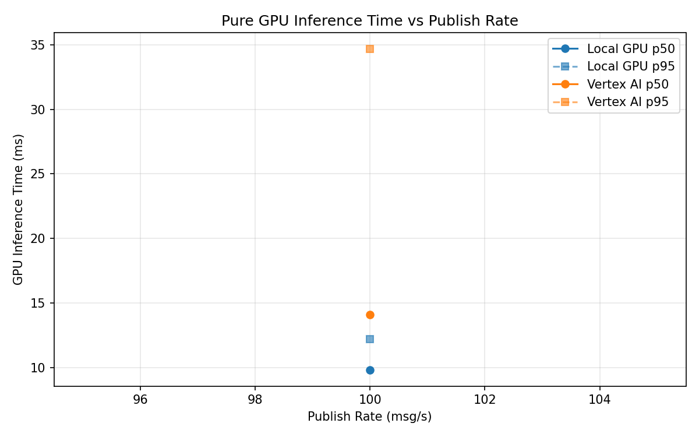
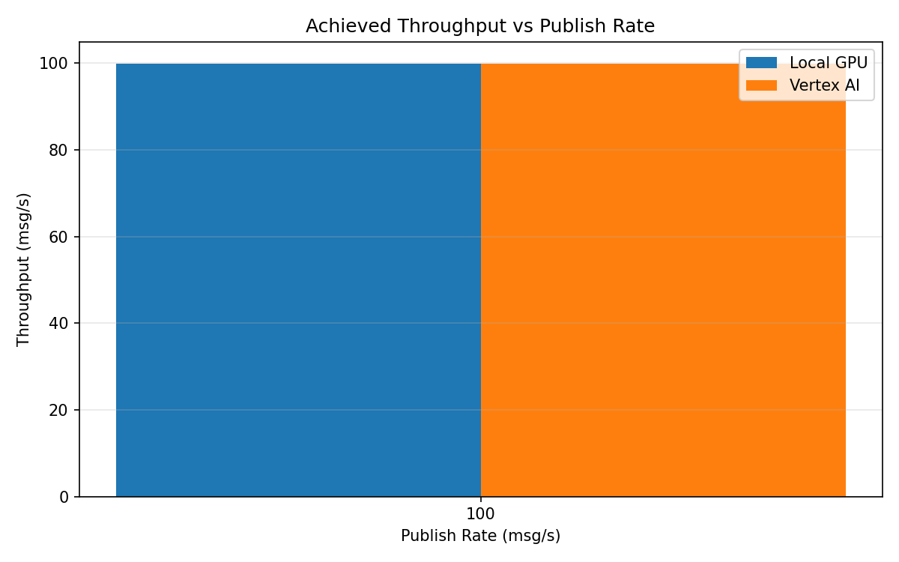

# Benchmark Report

Generated: 2026-03-08 10:25:24

## Configuration

| Parameter | Value |
|---|---|
| Messages per phase | 100s per phase |
| Rates (msg/s) | 100 |
| Experiments | Local GPU, Vertex AI |

## Throughput

| Rate (msg/s) | Local GPU | Vertex AI |
|---|---|---|
| 100 | 99.9 | 99.9 |

## End-to-End Latency (ms)

| Rate | Percentile | Local GPU | Vertex AI |
|---|---|---|---|
| 100 | p50 | 56.0 | 97.0 |
| 100 | p95 | 294.0 | 969.0 |
| 100 | p99 | 564.0 | 1095.0 |

## GPU Inference Time (ms)

| Rate | Percentile | Local GPU | Vertex AI |
|---|---|---|---|
| 100 | p50 | 9.8 | 14.1 |
| 100 | p95 | 12.2 | 34.7 |
| 100 | p99 | 13.2 | 46.5 |

## Charts

### Latency vs Publish Rate

### GPU Inference Time vs Publish Rate

### Throughput vs Publish Rate

