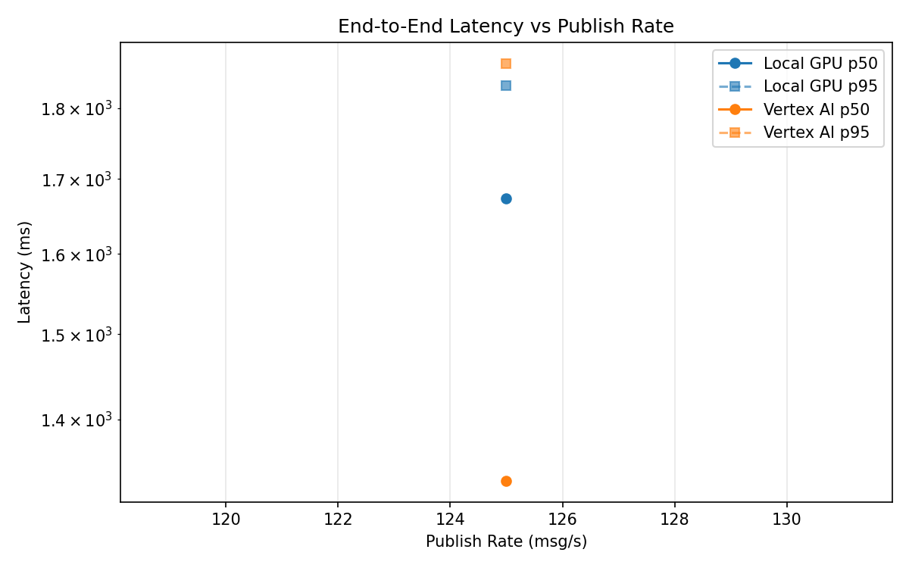
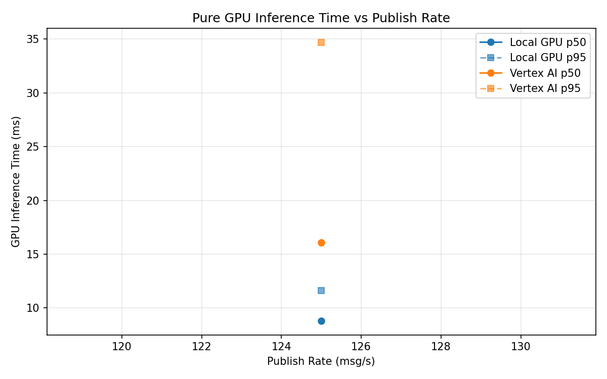
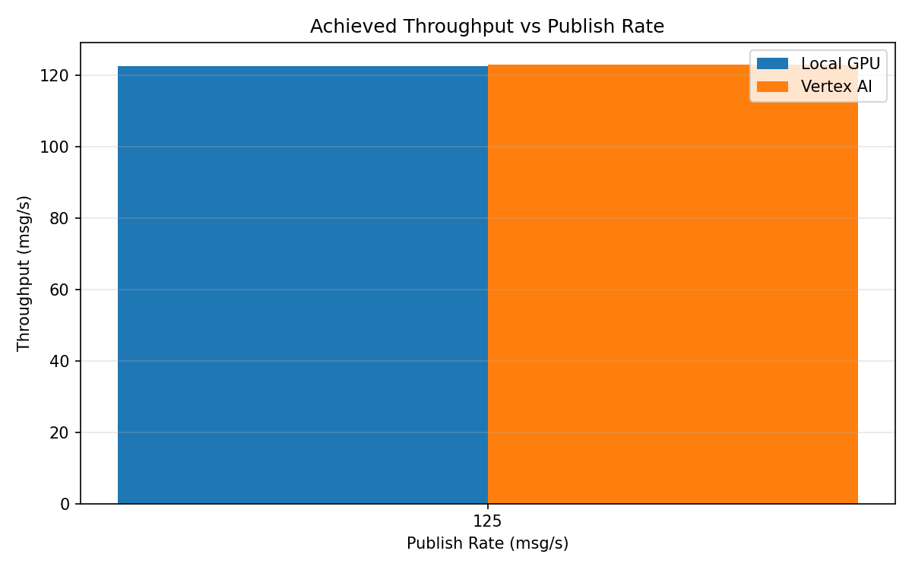

# Benchmark Report

Generated: 2026-03-08 10:33:41

## Configuration

| Parameter | Value |
|---|---|
| Messages per phase | 100s per phase |
| Rates (msg/s) | 125 |
| Experiments | Local GPU, Vertex AI |

## Throughput

| Rate (msg/s) | Local GPU | Vertex AI |
|---|---|---|
| 125 | 122.7 | 123.1 |

## End-to-End Latency (ms)

| Rate | Percentile | Local GPU | Vertex AI |
|---|---|---|---|
| 125 | p50 | 1673.0 | 1332.5 |
| 125 | p95 | 1833.0 | 1866.0 |
| 125 | p99 | 1919.0 | 2055.0 |

## GPU Inference Time (ms)

| Rate | Percentile | Local GPU | Vertex AI |
|---|---|---|---|
| 125 | p50 | 8.8 | 16.1 |
| 125 | p95 | 11.6 | 34.7 |
| 125 | p99 | 12.6 | 45.3 |

## Charts

### Latency vs Publish Rate

### GPU Inference Time vs Publish Rate

### Throughput vs Publish Rate

