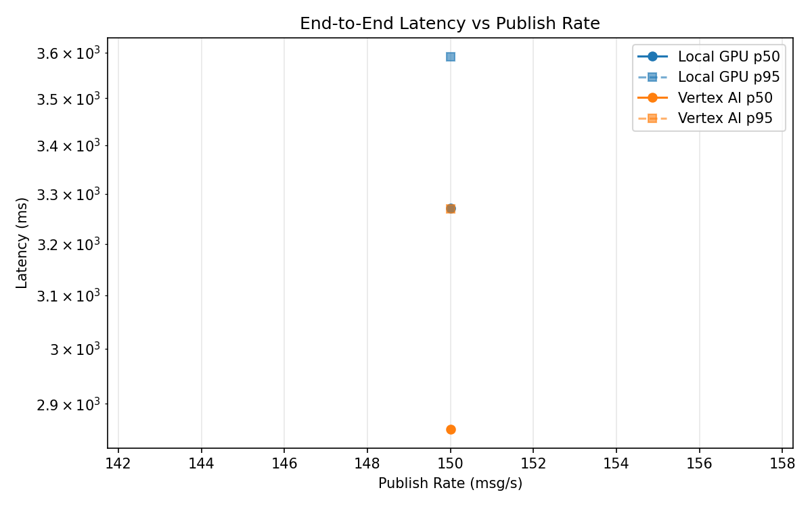
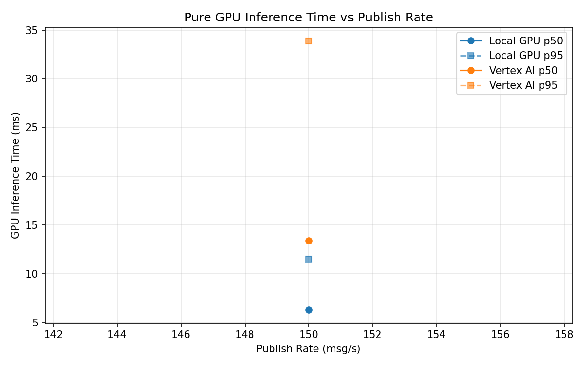
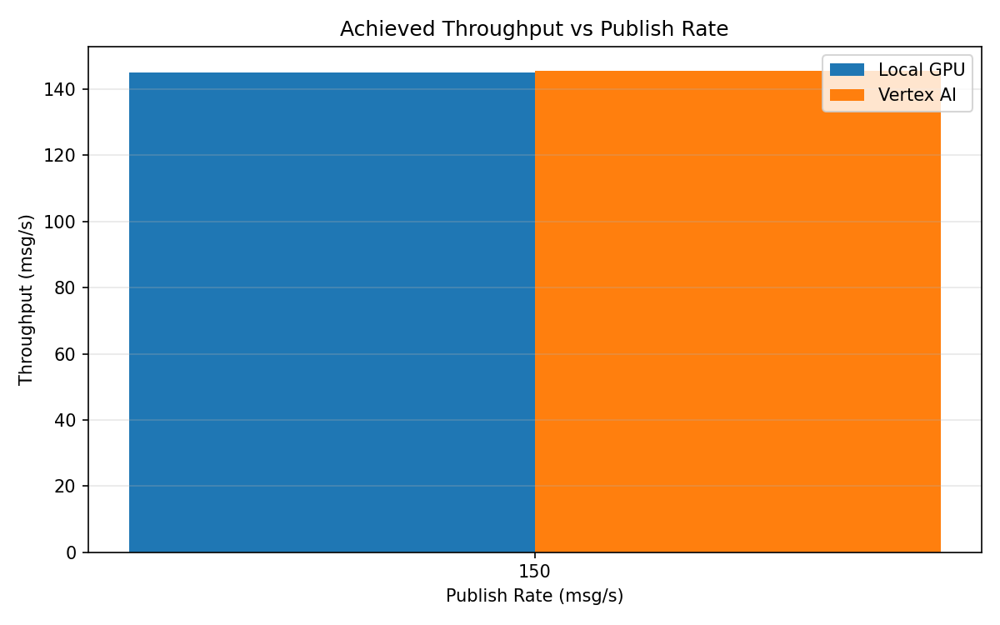

# Benchmark Report

Generated: 2026-03-08 10:42:28

## Configuration

| Parameter | Value |
|---|---|
| Messages per phase | 100s per phase |
| Rates (msg/s) | 150 |
| Experiments | Local GPU, Vertex AI |

## Throughput

| Rate (msg/s) | Local GPU | Vertex AI |
|---|---|---|
| 150 | 145.1 | 145.6 |

## End-to-End Latency (ms)

| Rate | Percentile | Local GPU | Vertex AI |
|---|---|---|---|
| 150 | p50 | 3271.0 | 2855.0 |
| 150 | p95 | 3591.0 | 3269.0 |
| 150 | p99 | 3670.0 | 3356.0 |

## GPU Inference Time (ms)

| Rate | Percentile | Local GPU | Vertex AI |
|---|---|---|---|
| 150 | p50 | 6.3 | 13.4 |
| 150 | p95 | 11.5 | 33.9 |
| 150 | p99 | 12.6 | 42.0 |

## Charts

### Latency vs Publish Rate

### GPU Inference Time vs Publish Rate

### Throughput vs Publish Rate

