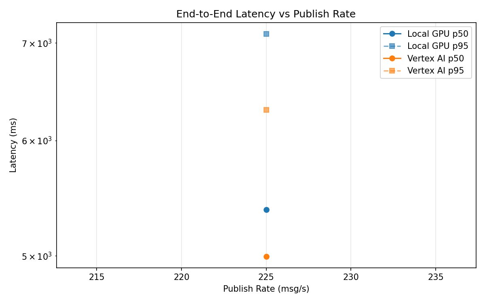
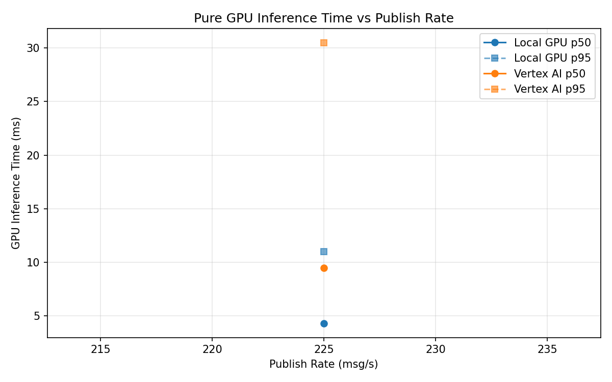
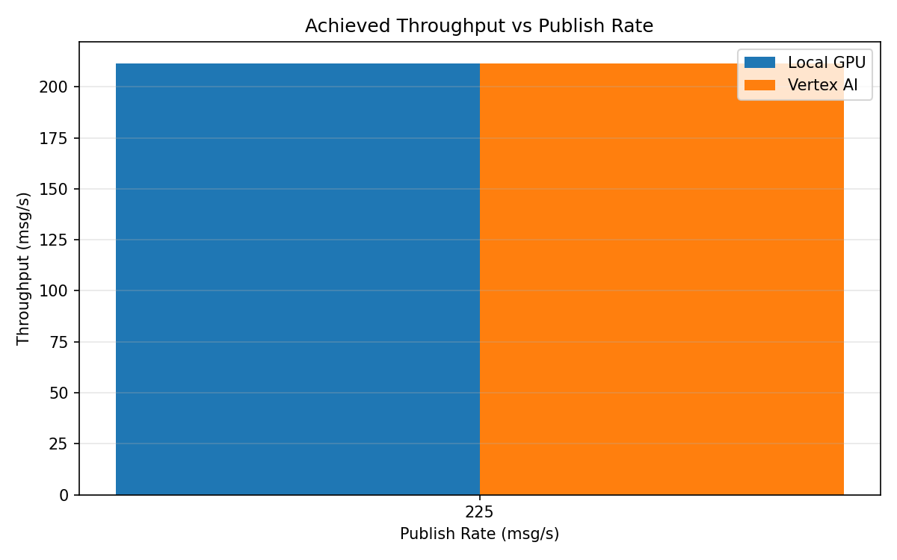

# Benchmark Report

Generated: 2026-03-08 11:07:24

## Configuration

| Parameter | Value |
|---|---|
| Messages per phase | 100s per phase |
| Rates (msg/s) | 225 |
| Experiments | Local GPU, Vertex AI |

## Throughput

| Rate (msg/s) | Local GPU | Vertex AI |
|---|---|---|
| 225 | 211.5 | 211.5 |

## End-to-End Latency (ms)

| Rate | Percentile | Local GPU | Vertex AI |
|---|---|---|---|
| 225 | p50 | 5380.0 | 4995.0 |
| 225 | p95 | 7102.0 | 6298.0 |
| 225 | p99 | 7200.0 | 6538.0 |

## GPU Inference Time (ms)

| Rate | Percentile | Local GPU | Vertex AI |
|---|---|---|---|
| 225 | p50 | 4.3 | 9.5 |
| 225 | p95 | 11.0 | 30.5 |
| 225 | p99 | 12.4 | 36.3 |

## Charts

### Latency vs Publish Rate

### GPU Inference Time vs Publish Rate

### Throughput vs Publish Rate

