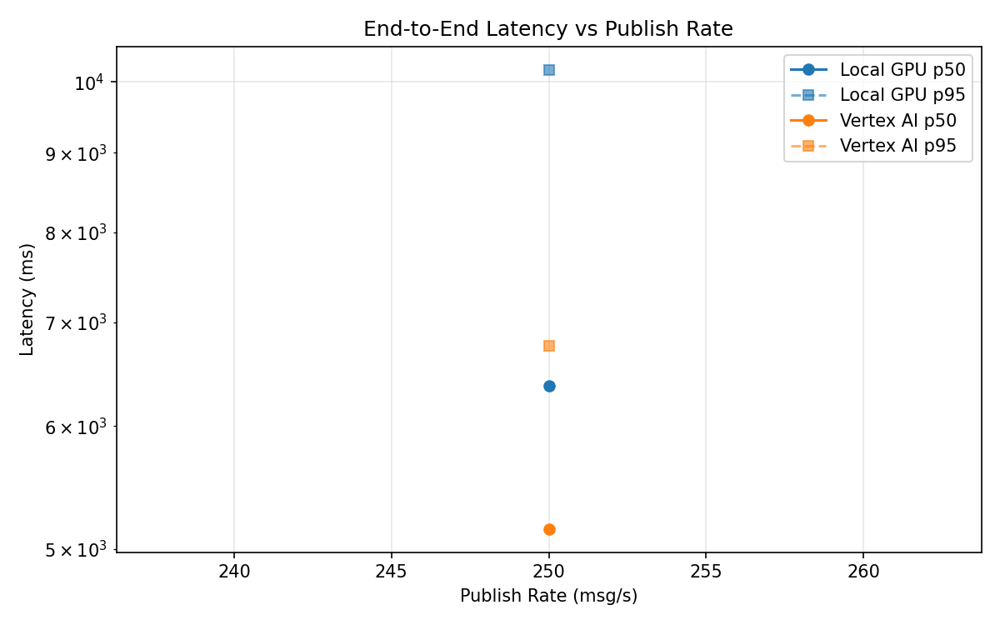
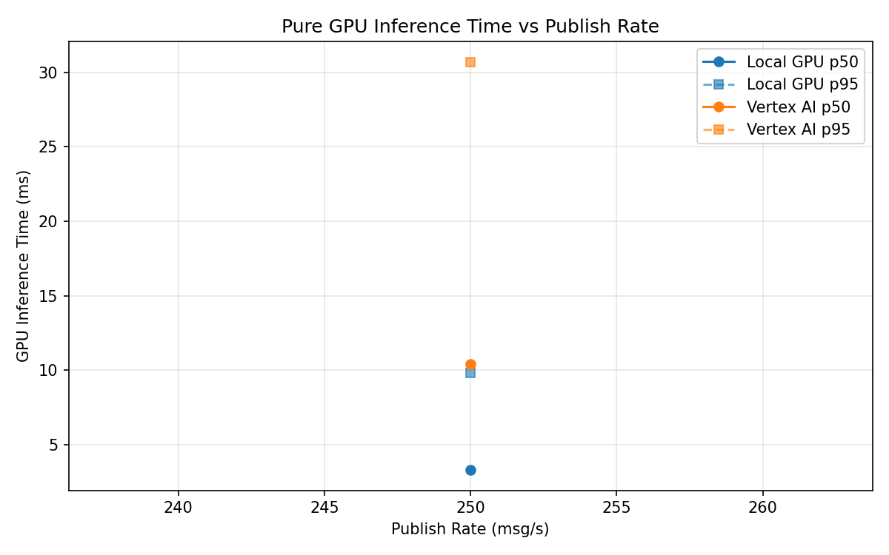
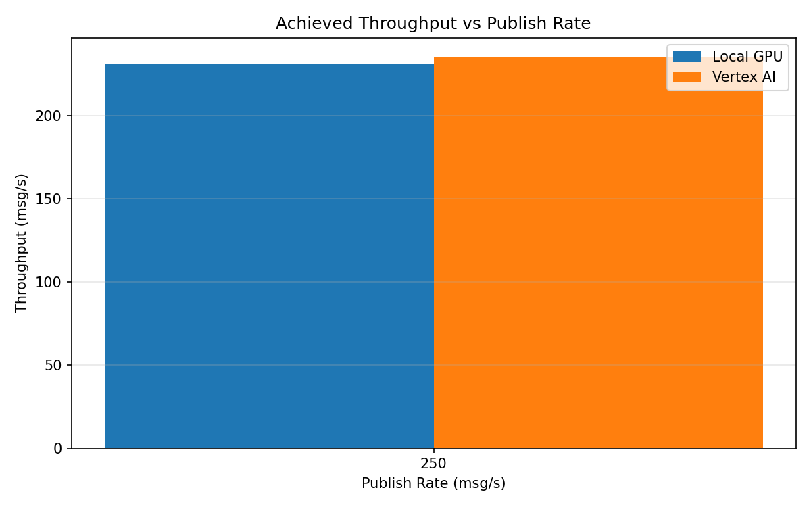

# Benchmark Report

Generated: 2026-03-08 11:15:28

## Configuration

| Parameter | Value |
|---|---|
| Messages per phase | 100s per phase |
| Rates (msg/s) | 250 |
| Experiments | Local GPU, Vertex AI |

## Throughput

| Rate (msg/s) | Local GPU | Vertex AI |
|---|---|---|
| 250 | 230.8 | 235.0 |

## End-to-End Latency (ms)

| Rate | Percentile | Local GPU | Vertex AI |
|---|---|---|---|
| 250 | p50 | 6370.5 | 5150.0 |
| 250 | p95 | 10183.1 | 6760.0 |
| 250 | p99 | 10503.0 | 6838.0 |

## GPU Inference Time (ms)

| Rate | Percentile | Local GPU | Vertex AI |
|---|---|---|---|
| 250 | p50 | 3.3 | 10.4 |
| 250 | p95 | 9.8 | 30.7 |
| 250 | p99 | 11.8 | 36.7 |

## Charts

### Latency vs Publish Rate

### GPU Inference Time vs Publish Rate

### Throughput vs Publish Rate

