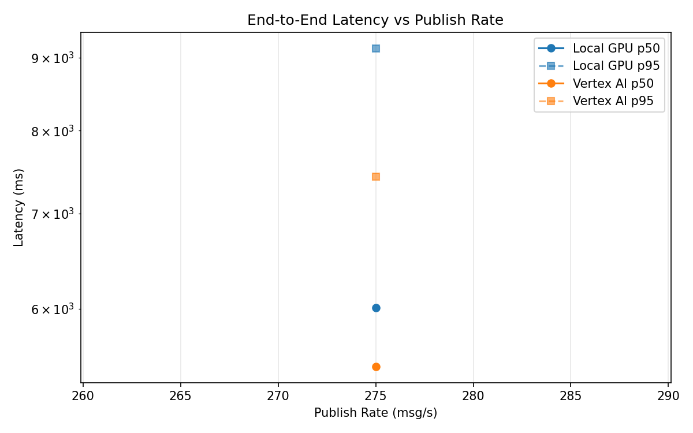
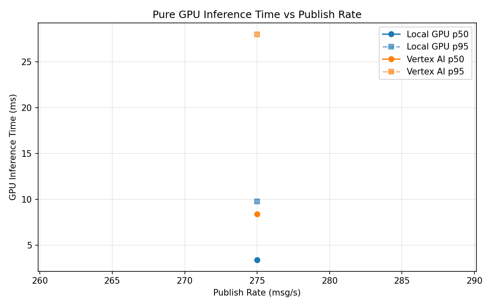
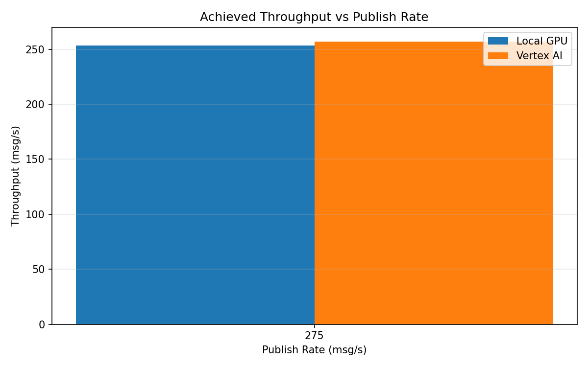

# Benchmark Report

Generated: 2026-03-08 11:24:34

## Configuration

| Parameter | Value |
|---|---|
| Messages per phase | 100s per phase |
| Rates (msg/s) | 275 |
| Experiments | Local GPU, Vertex AI |

## Throughput

| Rate (msg/s) | Local GPU | Vertex AI |
|---|---|---|
| 275 | 253.3 | 257.0 |

## End-to-End Latency (ms)

| Rate | Percentile | Local GPU | Vertex AI |
|---|---|---|---|
| 275 | p50 | 6010.0 | 5465.0 |
| 275 | p95 | 9139.0 | 7424.0 |
| 275 | p99 | 9267.0 | 7576.0 |

## GPU Inference Time (ms)

| Rate | Percentile | Local GPU | Vertex AI |
|---|---|---|---|
| 275 | p50 | 3.4 | 8.4 |
| 275 | p95 | 9.8 | 28.0 |
| 275 | p99 | 12.0 | 34.4 |

## Charts

### Latency vs Publish Rate

### GPU Inference Time vs Publish Rate

### Throughput vs Publish Rate

