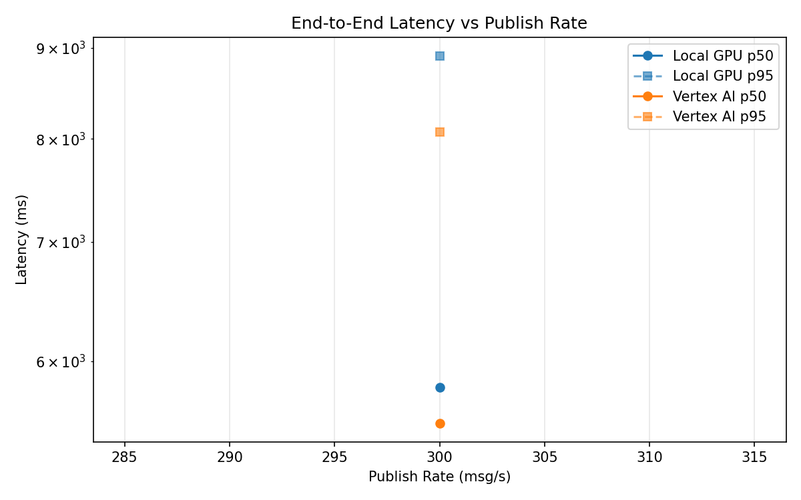
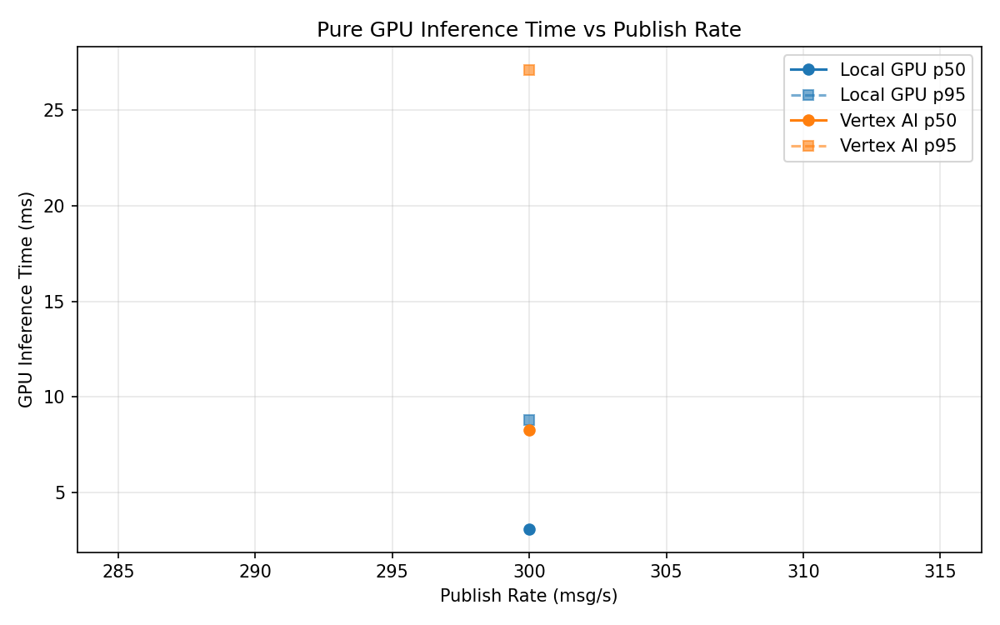
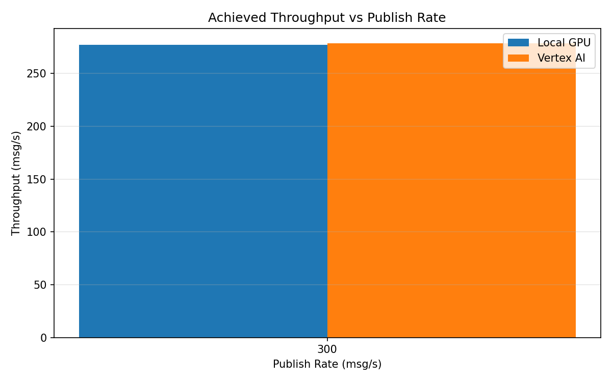

# Benchmark Report

Generated: 2026-03-08 11:32:56

## Configuration

| Parameter | Value |
|---|---|
| Messages per phase | 100s per phase |
| Rates (msg/s) | 300 |
| Experiments | Local GPU, Vertex AI |

## Throughput

| Rate (msg/s) | Local GPU | Vertex AI |
|---|---|---|
| 300 | 277.1 | 278.6 |

## End-to-End Latency (ms)

| Rate | Percentile | Local GPU | Vertex AI |
|---|---|---|---|
| 300 | p50 | 5802.0 | 5537.0 |
| 300 | p95 | 8907.0 | 8071.0 |
| 300 | p99 | 9275.0 | 8303.0 |

## GPU Inference Time (ms)

| Rate | Percentile | Local GPU | Vertex AI |
|---|---|---|---|
| 300 | p50 | 3.1 | 8.3 |
| 300 | p95 | 8.8 | 27.1 |
| 300 | p99 | 11.4 | 34.1 |

## Charts

### Latency vs Publish Rate

### GPU Inference Time vs Publish Rate

### Throughput vs Publish Rate

