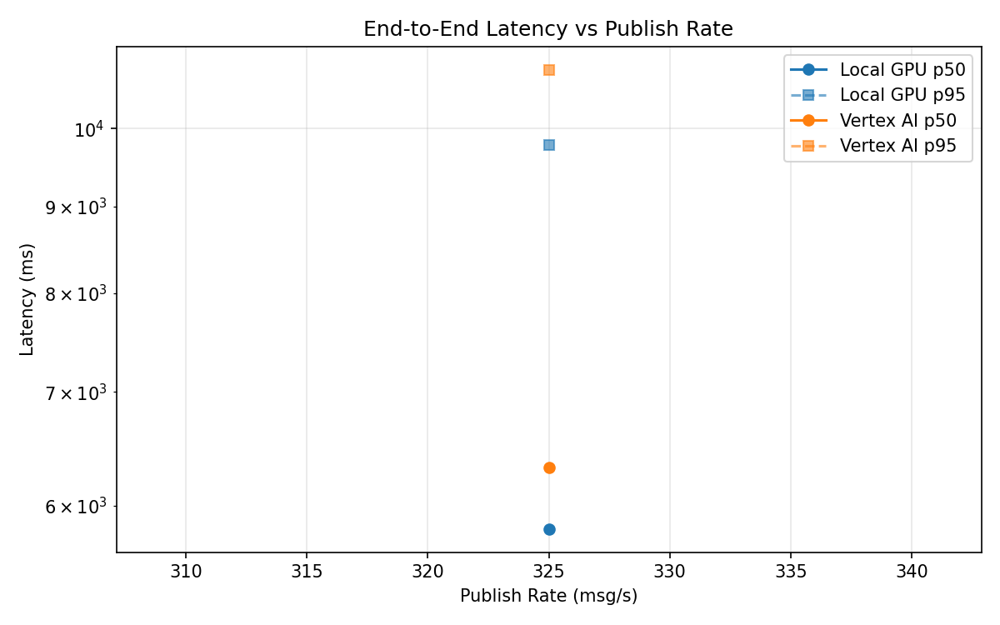
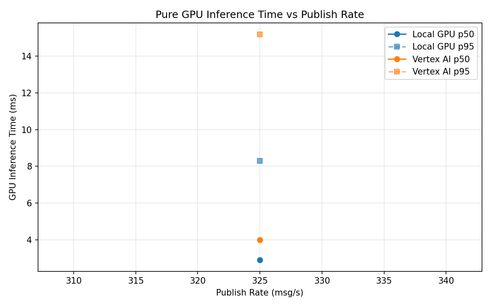
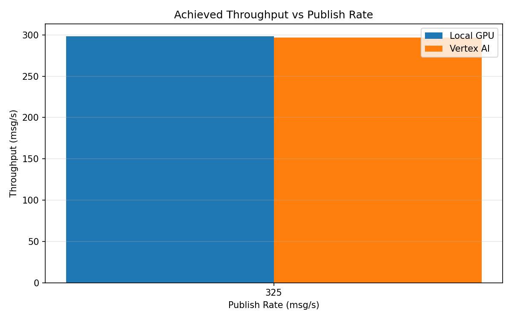

# Benchmark Report

Generated: 2026-03-08 11:41:56

## Configuration

| Parameter | Value |
|---|---|
| Messages per phase | 100s per phase |
| Rates (msg/s) | 325 |
| Experiments | Local GPU, Vertex AI |

## Throughput

| Rate (msg/s) | Local GPU | Vertex AI |
|---|---|---|
| 325 | 298.4 | 297.0 |

## End-to-End Latency (ms)

| Rate | Percentile | Local GPU | Vertex AI |
|---|---|---|---|
| 325 | p50 | 5813.0 | 6320.0 |
| 325 | p95 | 9774.0 | 10829.0 |
| 325 | p99 | 10000.0 | 11261.0 |

## GPU Inference Time (ms)

| Rate | Percentile | Local GPU | Vertex AI |
|---|---|---|---|
| 325 | p50 | 2.9 | 4.0 |
| 325 | p95 | 8.3 | 15.2 |
| 325 | p99 | 11.4 | 28.5 |

## Charts

### Latency vs Publish Rate

### GPU Inference Time vs Publish Rate

### Throughput vs Publish Rate

