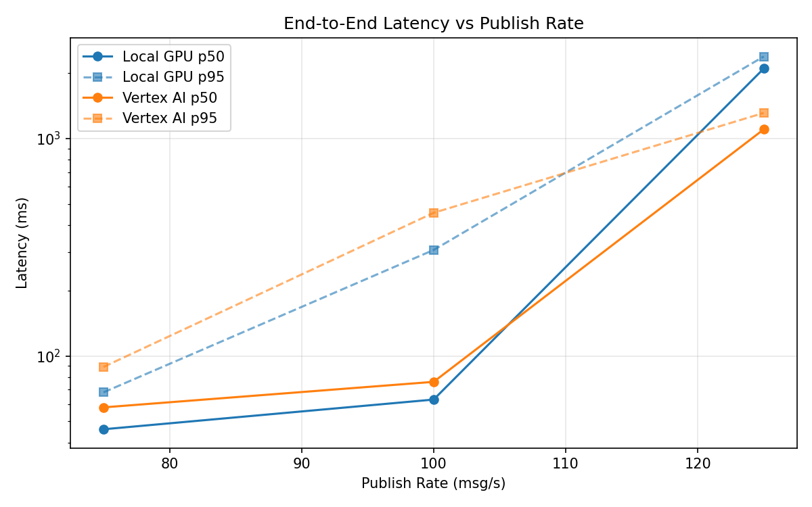
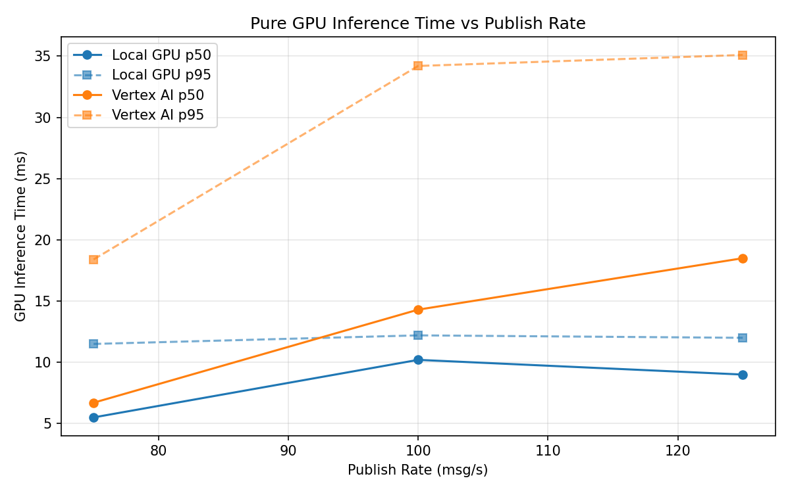
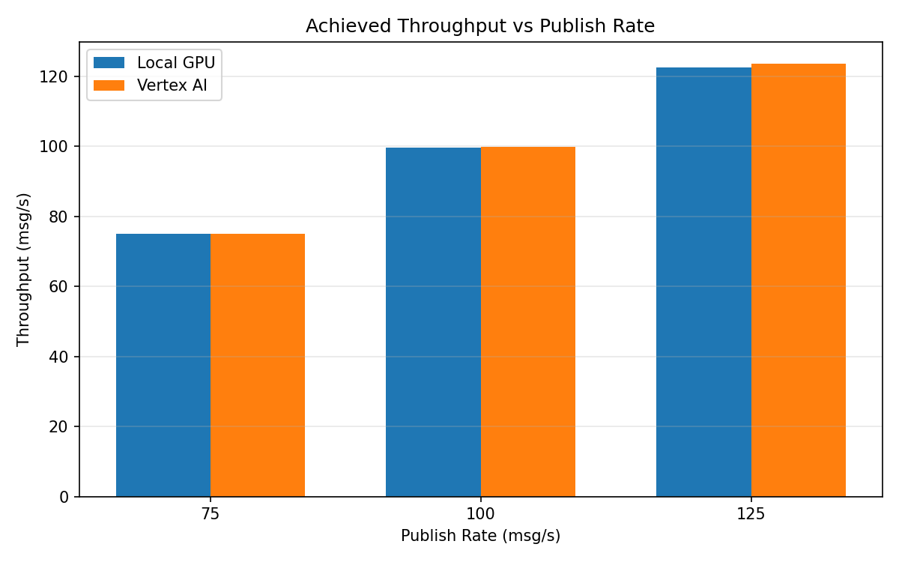

# Benchmark Report

Generated: 2026-03-08 06:47:08

## Configuration

| Parameter | Value |
|---|---|
| Messages per phase | 100s per phase |
| Rates (msg/s) | 75, 100, 125 |
| Experiments | Local GPU, Vertex AI |

## Throughput

| Rate (msg/s) | Local GPU | Vertex AI |
|---|---|---|
| 75 | 75.0 | 75.0 |
| 100 | 99.7 | 99.9 |
| 125 | 122.4 | 123.6 |

## End-to-End Latency (ms)

| Rate | Percentile | Local GPU | Vertex AI |
|---|---|---|---|
| 75 | p50 | 46.0 | 58.0 |
| 75 | p95 | 68.0 | 89.0 |
| 75 | p99 | 411.1 | 306.0 |
| 100 | p50 | 63.0 | 76.0 |
| 100 | p95 | 307.0 | 455.0 |
| 100 | p99 | 579.0 | 1014.0 |
| 125 | p50 | 2096.0 | 1101.0 |
| 125 | p95 | 2381.0 | 1310.0 |
| 125 | p99 | 2422.0 | 1368.0 |

## GPU Inference Time (ms)

| Rate | Percentile | Local GPU | Vertex AI |
|---|---|---|---|
| 75 | p50 | 5.5 | 6.7 |
| 75 | p95 | 11.5 | 18.4 |
| 75 | p99 | 12.4 | 29.7 |
| 100 | p50 | 10.2 | 14.3 |
| 100 | p95 | 12.2 | 34.2 |
| 100 | p99 | 13.1 | 44.0 |
| 125 | p50 | 9.0 | 18.5 |
| 125 | p95 | 12.0 | 35.1 |
| 125 | p99 | 12.9 | 44.5 |

## Charts

### Latency vs Publish Rate

### GPU Inference Time vs Publish Rate

### Throughput vs Publish Rate

