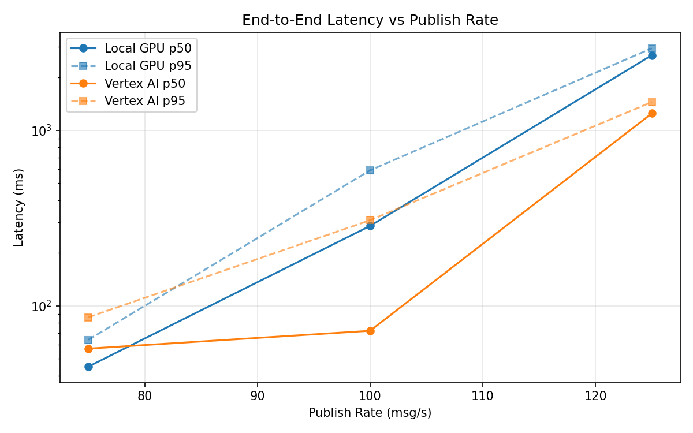
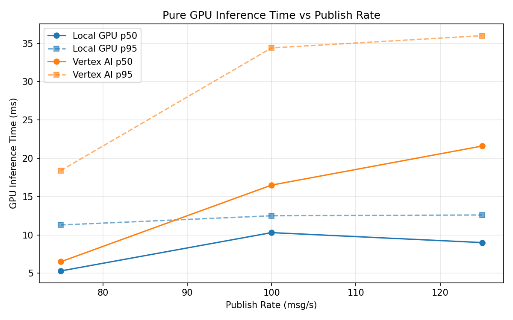
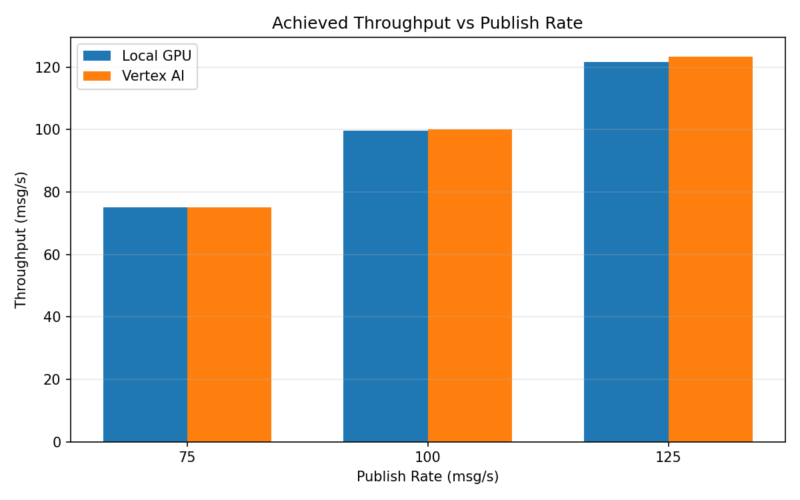

# Benchmark Report

Generated: 2026-03-08 07:00:24

## Configuration

| Parameter | Value |
|---|---|
| Messages per phase | 100s per phase |
| Rates (msg/s) | 75, 100, 125 |
| Experiments | Local GPU, Vertex AI |

## Throughput

| Rate (msg/s) | Local GPU | Vertex AI |
|---|---|---|
| 75 | 75.0 | 75.0 |
| 100 | 99.7 | 100.0 |
| 125 | 121.7 | 123.4 |

## End-to-End Latency (ms)

| Rate | Percentile | Local GPU | Vertex AI |
|---|---|---|---|
| 75 | p50 | 45.0 | 57.0 |
| 75 | p95 | 64.0 | 86.0 |
| 75 | p99 | 133.0 | 464.0 |
| 100 | p50 | 285.0 | 72.0 |
| 100 | p95 | 591.1 | 307.1 |
| 100 | p99 | 943.0 | 883.0 |
| 125 | p50 | 2677.0 | 1247.0 |
| 125 | p95 | 2933.0 | 1448.0 |
| 125 | p99 | 3011.0 | 1496.0 |

## GPU Inference Time (ms)

| Rate | Percentile | Local GPU | Vertex AI |
|---|---|---|---|
| 75 | p50 | 5.3 | 6.5 |
| 75 | p95 | 11.3 | 18.4 |
| 75 | p99 | 12.1 | 31.9 |
| 100 | p50 | 10.3 | 16.5 |
| 100 | p95 | 12.5 | 34.4 |
| 100 | p99 | 13.5 | 45.3 |
| 125 | p50 | 9.0 | 21.6 |
| 125 | p95 | 12.6 | 36.0 |
| 125 | p99 | 13.8 | 45.6 |

## Charts

### Latency vs Publish Rate

### GPU Inference Time vs Publish Rate

### Throughput vs Publish Rate

