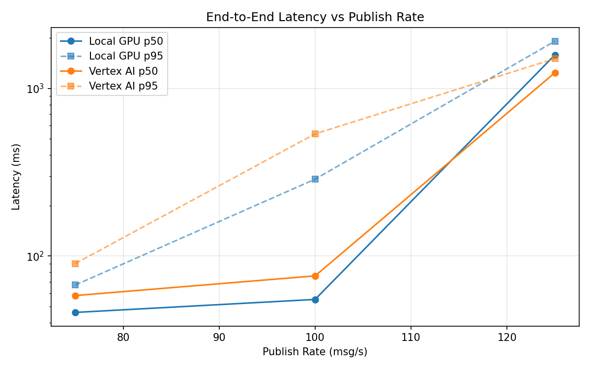
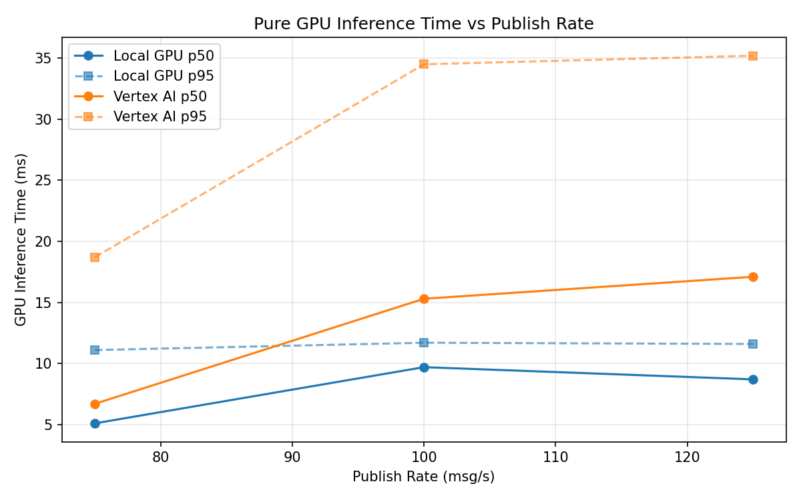

# Benchmark Report

Generated: 2026-03-08 07:13:22

## Configuration

| Parameter | Value |
|---|---|
| Messages per phase | 100s per phase |
| Rates (msg/s) | 75, 100, 125 |
| Experiments | Local GPU, Vertex AI |

## Throughput

| Rate (msg/s) | Local GPU | Vertex AI |
|---|---|---|
| 75 | 75.0 | 75.0 |
| 100 | 99.9 | 99.9 |
| 125 | 122.6 | 123.2 |

## End-to-End Latency (ms)

| Rate | Percentile | Local GPU | Vertex AI |
|---|---|---|---|
| 75 | p50 | 46.0 | 58.0 |
| 75 | p95 | 67.0 | 90.0 |
| 75 | p99 | 482.1 | 545.0 |
| 100 | p50 | 55.0 | 76.0 |
| 100 | p95 | 287.0 | 535.0 |
| 100 | p99 | 724.0 | 1130.0 |
| 125 | p50 | 1584.0 | 1241.0 |
| 125 | p95 | 1914.0 | 1505.0 |
| 125 | p99 | 1972.0 | 1569.0 |

## GPU Inference Time (ms)

| Rate | Percentile | Local GPU | Vertex AI |
|---|---|---|---|
| 75 | p50 | 5.1 | 6.7 |
| 75 | p95 | 11.1 | 18.7 |
| 75 | p99 | 11.9 | 31.6 |
| 100 | p50 | 9.7 | 15.3 |
| 100 | p95 | 11.7 | 34.5 |
| 100 | p99 | 12.4 | 45.1 |
| 125 | p50 | 8.7 | 17.1 |
| 125 | p95 | 11.6 | 35.2 |
| 125 | p99 | 12.4 | 44.5 |

## Charts

### Latency vs Publish Rate

### GPU Inference Time vs Publish Rate

### Throughput vs Publish Rate

