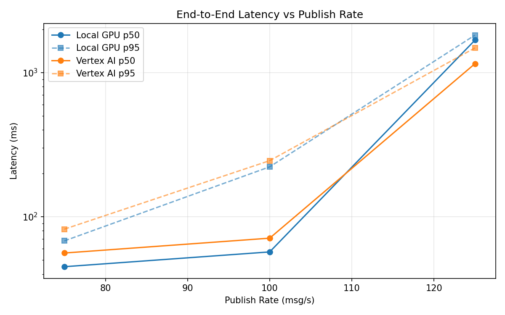
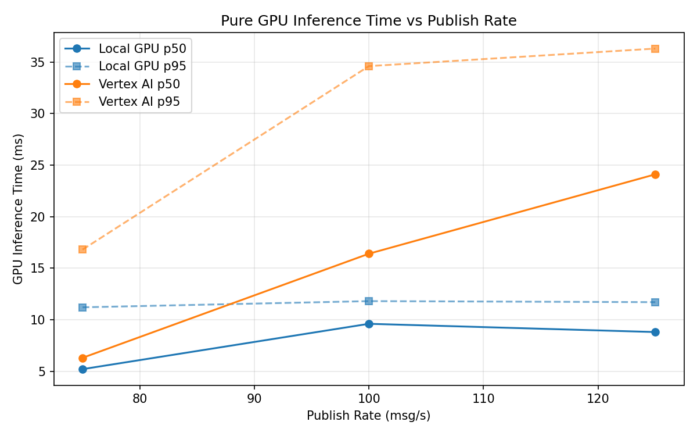
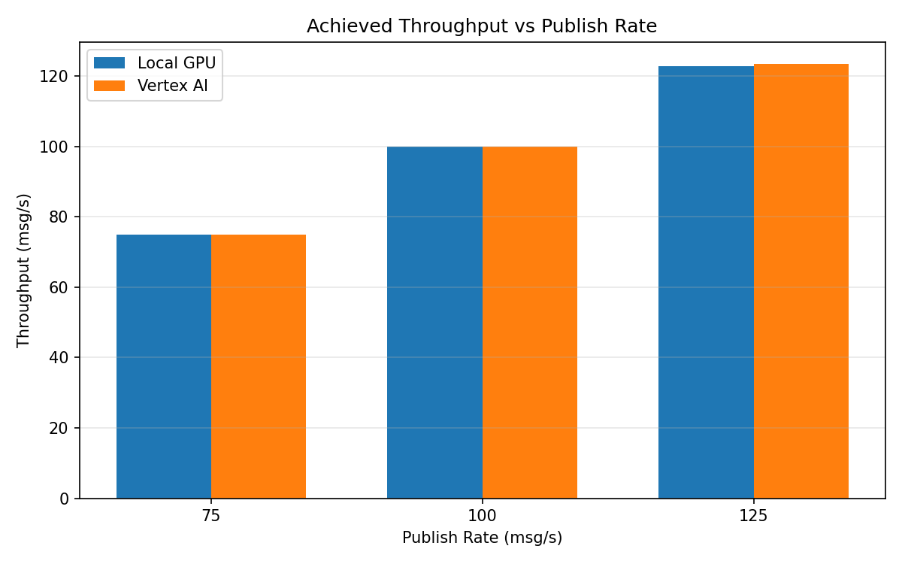

# Benchmark Report

Generated: 2026-03-08 07:25:46

## Configuration

| Parameter | Value |
|---|---|
| Messages per phase | 100s per phase |
| Rates (msg/s) | 75, 100, 125 |
| Experiments | Local GPU, Vertex AI |

## Throughput

| Rate (msg/s) | Local GPU | Vertex AI |
|---|---|---|
| 75 | 75.0 | 75.0 |
| 100 | 99.9 | 99.9 |
| 125 | 122.8 | 123.5 |

## End-to-End Latency (ms)

| Rate | Percentile | Local GPU | Vertex AI |
|---|---|---|---|
| 75 | p50 | 45.0 | 56.0 |
| 75 | p95 | 68.0 | 82.0 |
| 75 | p99 | 658.0 | 132.0 |
| 100 | p50 | 57.0 | 71.0 |
| 100 | p95 | 222.0 | 245.0 |
| 100 | p99 | 331.0 | 668.0 |
| 125 | p50 | 1682.0 | 1154.0 |
| 125 | p95 | 1822.0 | 1485.0 |
| 125 | p99 | 1849.0 | 1730.0 |

## GPU Inference Time (ms)

| Rate | Percentile | Local GPU | Vertex AI |
|---|---|---|---|
| 75 | p50 | 5.2 | 6.3 |
| 75 | p95 | 11.2 | 16.8 |
| 75 | p99 | 12.1 | 27.6 |
| 100 | p50 | 9.6 | 16.4 |
| 100 | p95 | 11.8 | 34.6 |
| 100 | p99 | 12.8 | 43.9 |
| 125 | p50 | 8.8 | 24.1 |
| 125 | p95 | 11.7 | 36.3 |
| 125 | p99 | 12.7 | 45.9 |

## Charts

### Latency vs Publish Rate

### GPU Inference Time vs Publish Rate

### Throughput vs Publish Rate

