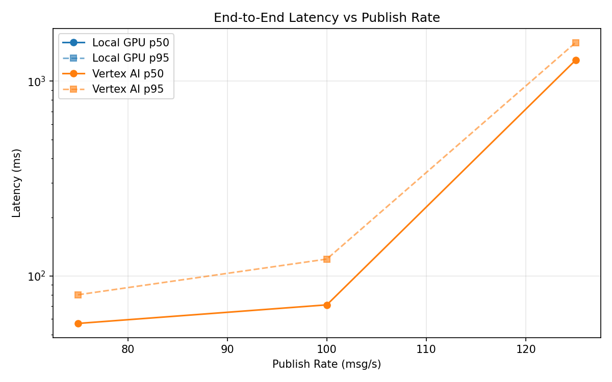
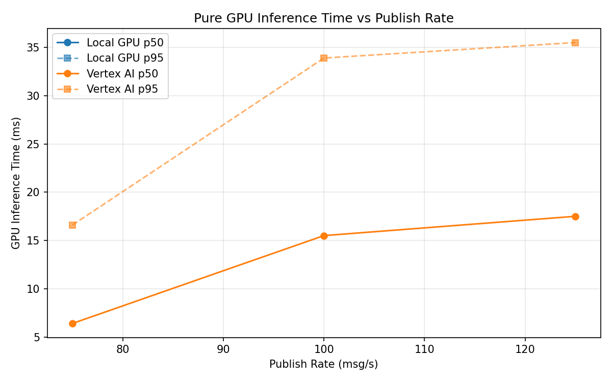
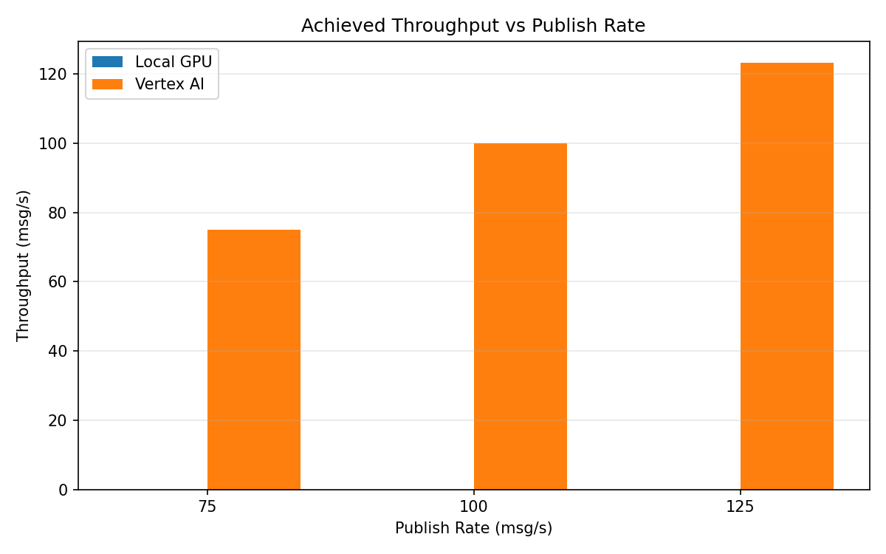

# Benchmark Report

Generated: 2026-03-08 06:18:18

## Configuration

| Parameter | Value |
|---|---|
| Messages per phase | 100s per phase |
| Rates (msg/s) | 75, 100, 125 |
| Experiments | Local GPU, Vertex AI |

## Throughput

| Rate (msg/s) | Local GPU | Vertex AI |
|---|---|---|
| 75 | — | 75.0 |
| 100 | — | 100.0 |
| 125 | — | 123.3 |

## End-to-End Latency (ms)

| Rate | Percentile | Local GPU | Vertex AI |
|---|---|---|---|
| 75 | p50 | — | 57.0 |
| 75 | p95 | — | 80.0 |
| 75 | p99 | — | 112.0 |
| 100 | p50 | — | 71.0 |
| 100 | p95 | — | 122.0 |
| 100 | p99 | — | 211.0 |
| 125 | p50 | — | 1282.0 |
| 125 | p95 | — | 1578.0 |
| 125 | p99 | — | 1643.0 |

## GPU Inference Time (ms)

| Rate | Percentile | Local GPU | Vertex AI |
|---|---|---|---|
| 75 | p50 | — | 6.4 |
| 75 | p95 | — | 16.6 |
| 75 | p99 | — | 26.0 |
| 100 | p50 | — | 15.5 |
| 100 | p95 | — | 33.9 |
| 100 | p99 | — | 43.5 |
| 125 | p50 | — | 17.5 |
| 125 | p95 | — | 35.5 |
| 125 | p99 | — | 45.3 |

## Charts

### Latency vs Publish Rate

### GPU Inference Time vs Publish Rate

### Throughput vs Publish Rate

