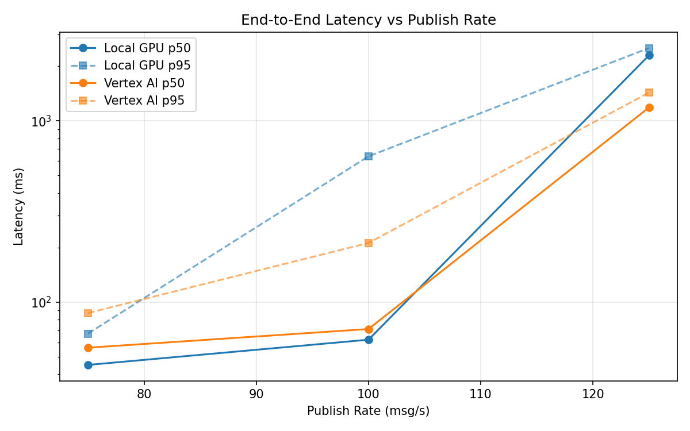
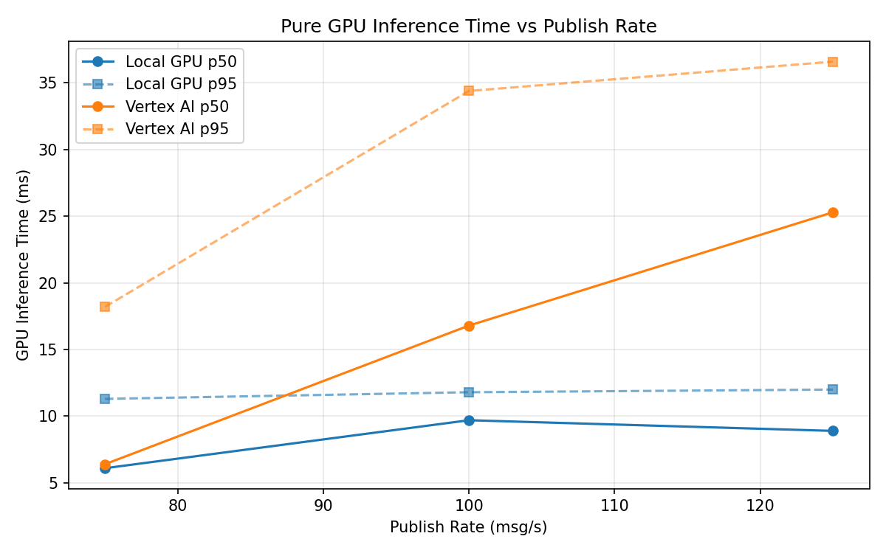
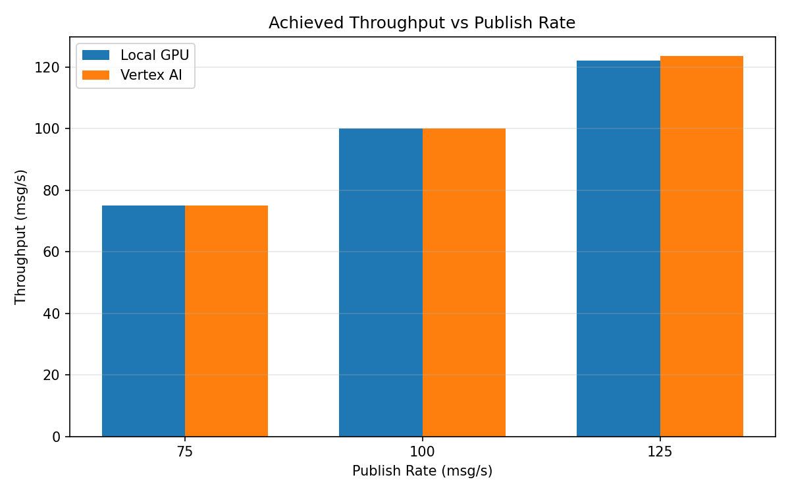

# Benchmark Report

Generated: 2026-03-08 07:38:35

## Configuration

| Parameter | Value |
|---|---|
| Messages per phase | 100s per phase |
| Rates (msg/s) | 75, 100, 125 |
| Experiments | Local GPU, Vertex AI |

## Throughput

| Rate (msg/s) | Local GPU | Vertex AI |
|---|---|---|
| 75 | 75.0 | 75.0 |
| 100 | 100.0 | 100.0 |
| 125 | 122.1 | 123.6 |

## End-to-End Latency (ms)

| Rate | Percentile | Local GPU | Vertex AI |
|---|---|---|---|
| 75 | p50 | 45.0 | 56.0 |
| 75 | p95 | 67.0 | 87.0 |
| 75 | p99 | 172.0 | 326.1 |
| 100 | p50 | 62.0 | 71.0 |
| 100 | p95 | 637.0 | 212.0 |
| 100 | p99 | 1117.0 | 447.0 |
| 125 | p50 | 2299.0 | 1186.0 |
| 125 | p95 | 2523.0 | 1433.0 |
| 125 | p99 | 2582.0 | 1508.0 |

## GPU Inference Time (ms)

| Rate | Percentile | Local GPU | Vertex AI |
|---|---|---|---|
| 75 | p50 | 6.1 | 6.4 |
| 75 | p95 | 11.3 | 18.2 |
| 75 | p99 | 12.2 | 30.8 |
| 100 | p50 | 9.7 | 16.8 |
| 100 | p95 | 11.8 | 34.4 |
| 100 | p99 | 12.7 | 44.2 |
| 125 | p50 | 8.9 | 25.3 |
| 125 | p95 | 12.0 | 36.6 |
| 125 | p99 | 13.2 | 46.8 |

## Charts

### Latency vs Publish Rate

### GPU Inference Time vs Publish Rate

### Throughput vs Publish Rate

