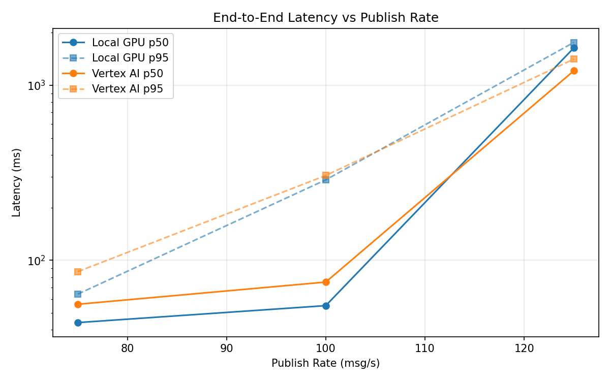
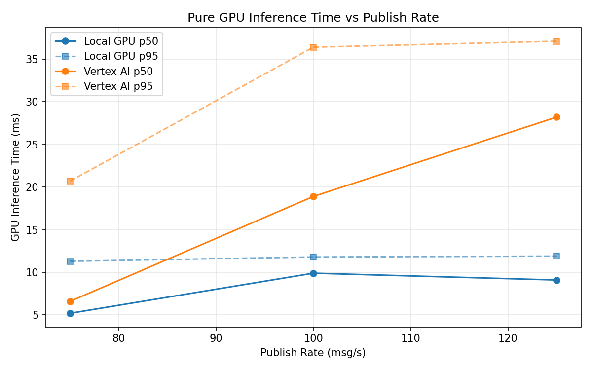
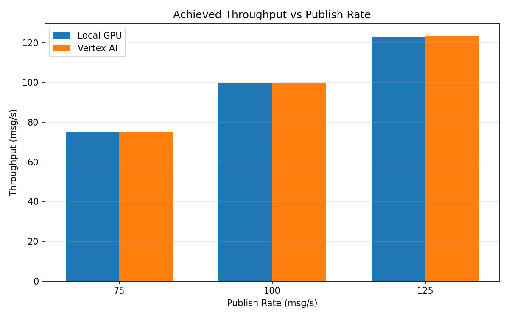

# Benchmark Report

Generated: 2026-03-08 08:16:21

## Configuration

| Parameter | Value |
|---|---|
| Messages per phase | 100s per phase |
| Rates (msg/s) | 75, 100, 125 |
| Experiments | Local GPU, Vertex AI |

## Throughput

| Rate (msg/s) | Local GPU | Vertex AI |
|---|---|---|
| 75 | 75.0 | 75.0 |
| 100 | 99.9 | 99.9 |
| 125 | 122.8 | 123.4 |

## End-to-End Latency (ms)

| Rate | Percentile | Local GPU | Vertex AI |
|---|---|---|---|
| 75 | p50 | 44.0 | 56.0 |
| 75 | p95 | 64.0 | 86.0 |
| 75 | p99 | 406.0 | 377.0 |
| 100 | p50 | 55.0 | 75.0 |
| 100 | p95 | 288.0 | 305.0 |
| 100 | p99 | 594.0 | 899.0 |
| 125 | p50 | 1634.0 | 1209.0 |
| 125 | p95 | 1757.0 | 1411.0 |
| 125 | p99 | 1786.0 | 1464.0 |

## GPU Inference Time (ms)

| Rate | Percentile | Local GPU | Vertex AI |
|---|---|---|---|
| 75 | p50 | 5.2 | 6.6 |
| 75 | p95 | 11.3 | 20.7 |
| 75 | p99 | 12.0 | 31.6 |
| 100 | p50 | 9.9 | 18.9 |
| 100 | p95 | 11.8 | 36.4 |
| 100 | p99 | 12.6 | 46.7 |
| 125 | p50 | 9.1 | 28.2 |
| 125 | p95 | 11.9 | 37.1 |
| 125 | p99 | 12.7 | 47.0 |

## Charts

### Latency vs Publish Rate

### GPU Inference Time vs Publish Rate

### Throughput vs Publish Rate

